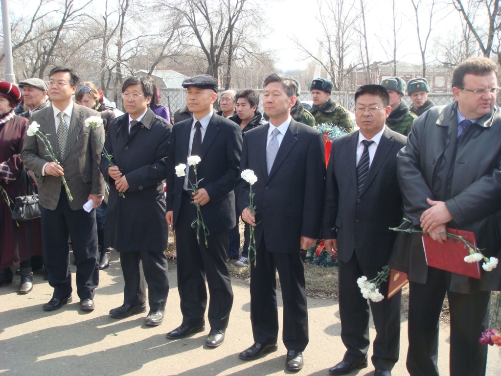
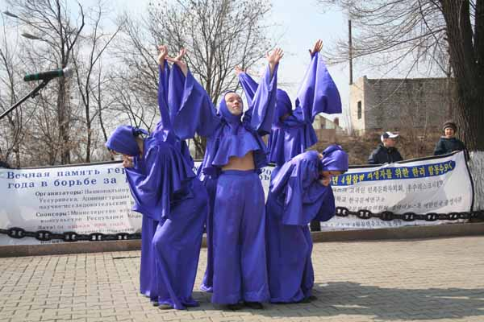
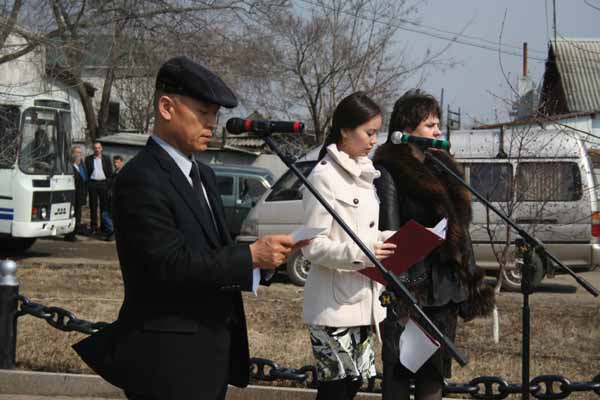
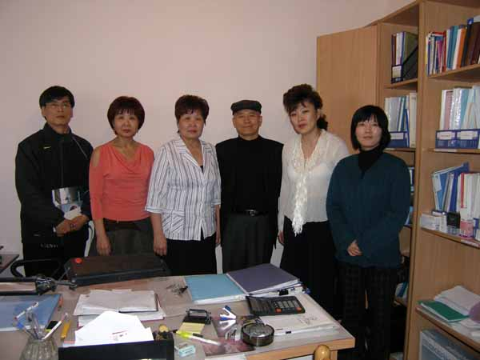
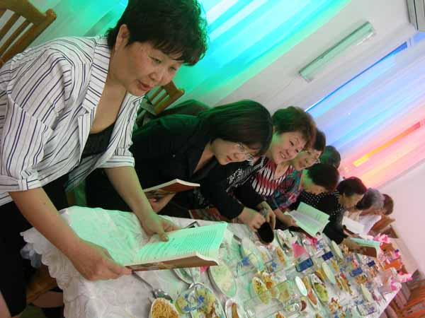

**[**조선일보 원문보기**](http://news.chosun.com/site/data/html_dir/2008/04/25/2008042501310.html)**

  

빨치산스크에서 만난 고려인, 마리아 알렉상드로 김

조규익(숭실대 국문과 교수)

연해주의 우수리스크시에서는 올해도 어김없이 한-러 양국 합동으로 ‘1920년 4월 참변’의 추모제가 열렸다. 러시아 군인들이 쏘아 올리는 조총(弔銃)의 굉음 속에서 러시아인들과 한국인들, 그리고 또 다른 한국인인 ‘고려인들(Soviet-Koreans)’이 함께 바치는 추모사와 조화들은 러시아 땅에서 진행되어온 역사의 기묘한 부조리를 함축적으로 보여주었다.

<추모식에 참여한 한-러 인사들. 좌로부터 블라디보스톡 국제교육원장, 반병률교수, 조규익, 블라디보스톡 총영사, 김니꼴라이 우수리스크 고려인 민족문화자치회 회장, 우수리스크 부시장>  

<추모식장에서 추모무용을 공연하는 러시아 무용단>  

 <추모사를 하고 있는 모습>  
러시아 땅에서 제국주의 일본은 최재형·김이직·엄주필·황경섭 등 우리 한국인들에게는 아직도 생소한 이름의 고려인 지도자들과 많은 러시아인들을 학살했다. 애당초 기아(飢餓)와 일제의 탄압을 피해 ‘유이민(流移民)’의 처지로 남의 땅 러시아에 들어갔다가 빠져나오지 못한 고려인들에게 민족해방이란 또 다른 의미를 지닌 ‘역사의 굴레’였다.  
1937년 스탈린이 20만에 달하는 고려인들을 중앙아시아로 강제 이주시킨 역사적 비극을 기억한다면, 일제의 패망을 승리로 받아들이고 있는 러시아인들과 고려인들의 입장이 결코 같을 수는 없다. 현실적으로 고려인들은 구소련 시절의 철저한 동화정책에 의해 민족의 정체성을 급속히 상실해가고 있는 70여 개 소수민족들 가운데 하나일 뿐이기 때문이다.

그런 이유로 빨치산스크에서 만난 58세의 고려인 여성 마리아 알렉상드로 김은 강제이주 이후 세대의 갈등과 문제를 함축적으로 보여주는 사례였다. 그녀는 강제이주 이후 우즈베키스탄의 페르가나에서 고려인 부모로부터 태어난 ‘유이민 3세’다. “고려 말을 아느냐”는 물음에 “고럼, 알지비!”하면서 함박웃음 짓던 그녀가 실제로 구사한 고려 말은 10%가 채 안되었다. 그것도 ‘뚜르르’ 굴러가는 러시아 말에 송두리째 잡아 먹혀, 흔적만 남은 상태였다. “손자에게 고려 말과 글자를 가르치고 싶어도 선생이 있어야지!” 통역이 전해주는 그녀의 안타까운 사정이었다. 학교에서 러시아어의 발음이 이상하면 사정없이 감점을 당하고, 대학에 진학할 수도 없었다는 지난날의 사정 또한 매우 참담했다. 왜 러시아의 고려인들이 송두리째 고려 말을 버리고 그토록 유창한 러시아어를 구사하게 되었는지, 그녀의 말속에 해답은 들어 있었다.

  <사진 왼쪽부터 곽원석박사, 마리아 알렉상드로 김의 여동생, 마리아 알렉상드로 김, 조규익, 마리아의 딸 악사나 김, 엄경희교수>  
  
지난 시절에 비해 약간의 자유를 누릴 수 있게 된 지금, 비록 주류인 러시아인들의 눈치를 살피긴 하지만, 말만 들으면 ‘완벽한 러시아인’인 그들도 잃어버린 자신들의 뿌리와 민족적 정체성에 대해서는 상당한 미련이나 애착을 갖고 있었다. ‘고려 말을 가르쳐 줄 선생이 없다’고 하소연하는 마리아 알렉상드로 김에게 ‘밥상 앞에서 당신의 손자에게 그 떠듬거리는 고려 말이라도 가르치라’고 열심히 권유했지만, ‘바이링구얼리즘(이중 언어 구사)’의 탁상공론에 사로잡힌 우리의 허상만을 적나라하게 드러냈을 뿐이다.

 <고려노래의 학습에 참여한 마리아 알렉상드로 김과 고려인 여성들>

같은 모습을 하고 있는 조상 나라 사람들과 같은 언어로 소통하고 싶어 하는 그들의 기본적 소망마저 외면할 수밖에 없는 것이 세계 11위에 올라있는 경제대국의 실상이라면, 매우 실망스런 일이다. 사실 가정 안에만 국한된 언어로는 아무런 미래도 없기 때문에 공적인 자리에서는 제국어(帝國語)를 쓰고 가정 내에서는 민족어를 쓰는 식의 이중 언어 구사가 무엇보다 기만적이라는 다나까 가쓰히코(田中克彦)의 생각은 그런 점에서 일종의 편견이다. 광대한 러시아에서 70여개 소수민족의 하나로 살아가고 있는 고려인들에게 좀 더 철저히 민족어를 가르치는 일이 그리도 어려운 일인지 우리 스스로 반문해야 할 때가 된 것이다. 띄엄띄엄 간신히 이어붙이는 우리말로 ‘선생이 필요하다’고 절규하는 고려인 여성을 상대하여 손자에게 그거라도 가르치면 취업에 도움이 된다는 말이나 반복한다면, 결국 우리는 대책 없는 자기기만의 늪으로 빠져들 수밖에 없다.                                              
  -조규익(숭실대 국문과 교수)

공유하기

게시글 관리

**백규서옥\_Blog ver.**