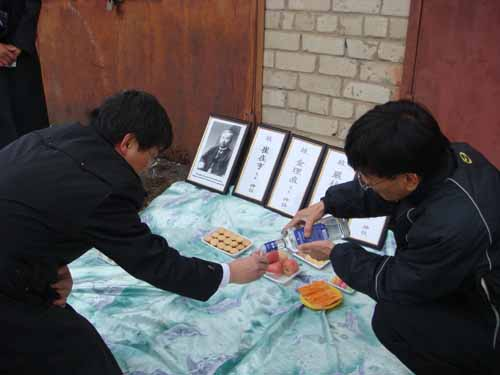
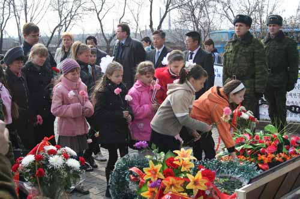
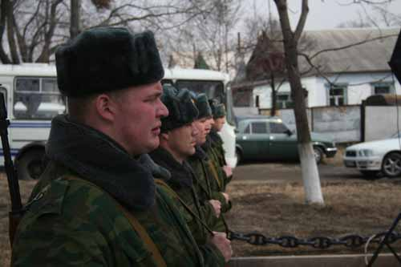
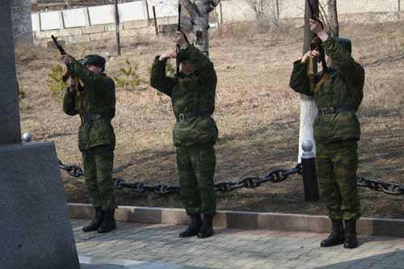
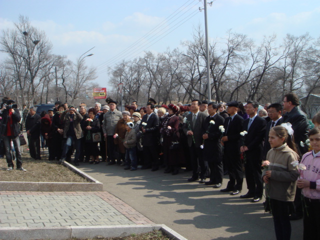
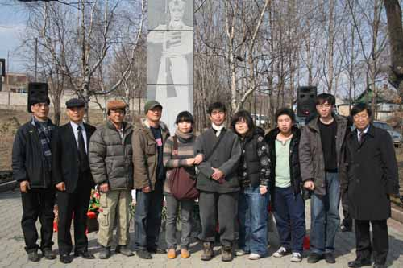
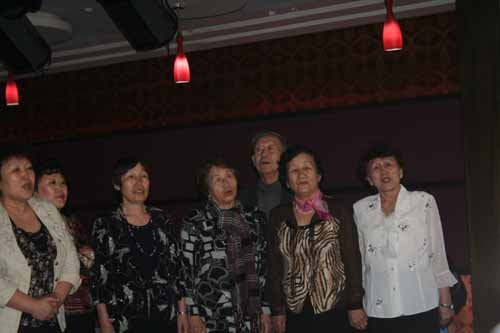
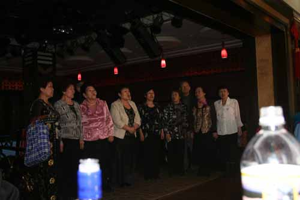
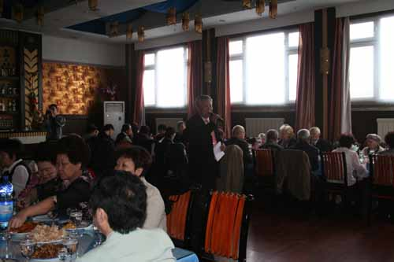

러시아 기행 2

             스러진 고려인들의 꿈이여, 열사들의 넋이여!

2008년 4월 4일, 4월 참변 당일이다. 추모식은 오후 4시에 열린다. 아침 일찍 우리는 최재형 선생들이 처형되어 묻힌 곳을 찾아 제사를 올리기로 했다. 제정 러시아 시대 감방이 있던 곳. 지금도 교도소로 사용되고 있는 으스스한 곳이었다. 그 맥그라소바 거리에서 북쪽으로 10분 쯤 30m 정도 올라간 야산 둔덕 ‘왕바산 재’. 그 언저리가 바로 네 분(최재형崔在亨, 김이직金理直, 엄주필嚴柱弼, 황경섭黃景燮)의 고려인들이 참살되어 묻혀있는 곳이다. 일본군이 이들의 시신을 묻고 흔적을 없앴기 때문에 그 정확한 장소는 알 수가 없다. 우리는 전날 마련한 간소한 제수를 땅바닥에 진설하고 제사를 올렸다.  
  

         <열사들의 영전에 헌작하는 반병률교수와 곽원석 박사>  
   
최재형 선생의 영정과 다른 세 분의 이름을 모신 다음 순서에 맞게 추모의 정을 표했다. 나는 다음과 같은 제문을 낭독했다.

2008년 4월 4일.

1920년 4월 참변을 당한 지 88년째인 오늘, 참변을 당하신 최재형․김이직․엄주필․황경섭 선생님을 비롯한 수많은 고려인 선열들의 영령 앞에 삼가 머리 숙여 고하나이다.

일제의 침탈과 만행으로 인해 나라와 고향을 잃어버린 채 이국땅에 떠돌이로 들어와 가까스로 뿌리를 내리고 살다가 다시 그들의 총칼 아래 무참히 스러져 간 민족 지도자들의 기구하신 운명을 생각하오며, 새삼 추모의 정을 금할 수 없나이다.

님들의 희생 덕택에 고국에서 혹은 이 땅에서 편안히 살아가고 있는 후손들은 님들이 뿌리신 피의 뜻을 잊지 않고 다시금 우뚝 일어서고자 노력하고 있나이다.

아, 오늘 만리 먼 고국에서 님들의 영전을 찾아 온 저희들 반병률․김보희․곽원석․조규익․엄경희 등과 이 땅에 살고 있는 발렌찐·발레리아 등은 보잘 것 없는 음식이나마 정성껏 님들 앞에 올리옵나니,

영령들이시여, 부디 이곳에 강림하시어 흠향하오소서!

          2008년 4월 4일

조규익·반병률·곽원석·김보희·엄경희 절하고 올림

우리의 제사는 간결·소박하나 엄숙했다. 땅바닥은 차갑고, 겨울 외투를 채 벗지 못한 북국의 공기는 싸늘했다. 그러나 혼령들이 감응하는 듯 왕바산 언덕의 두터운 땅거죽은 홀연 훈훈해져 왔다. 언덕 아래쪽 교도소에선 짙은 연기가 끊임없이 피어오르고 있었다.

\*\*\*

오후 4시 정각에 추모비로 나갔다. 러시아 군인들과 경찰들이 두런거리며 식장을 준비하고 있는 가운데, 많은 고려인들과 러시아인들이 몰려들었다.  

                <추모식 말미에 헌화하는 러시아 어린이들>  
   
예쁜 초등학생들도 질서정연하게 어른들을 돕고 있었다. 우수리스크 부시장을 비롯한 러시아 관리들, 블라디보스톡 한국영사관의 김무영 총영사와 이우용 교육원장, 김니꼴라이 우수리스크시 고려인민족문화자치회장, 한국에서 온 반병률 교수와 내가 중앙에 도열하자 러시아 군악대의 주악을 신호로 식은 시작되었다.

          <추모식에 도열한 러시아 군인들>

              <추모식에서 조총을 쏘아 올리는 러시아 군인들>  
  
사회는 당당하게 생긴 우수리스크 시정부의 여성 관리였고, 통역은 고려신문 편집장 엘레나였다. 추도사와 헌화가 진행되는 긴 시간, 잡담 한 마디 들려오지 않았다. 러시아인이나 고려인, 한국인들은 ‘숙연함’의 연대라도 이루어진 것일까. 숙연함은 러시아 무용단의 추모 무용에 이어 조총(弔銃)의 발사로 클라이막스에 올랐고, 사회자가 종료선언을 하자 사람들은 연기처럼 흩어져 갔다.  강렬한 햇살이 차가운 바람을 덥히는 오후였다. 언제부턴가 내 마음에 각인되어온 러시아인들은 ‘음습하고 냉랭한 이념의 노예들’이었다. 그러나 지금 추모비 앞에 모여든 그들은 선량한 이웃들이었다.

     <추모식에 참여한 러시아인들과 고려인들>  
  
 어쩌면 내가 던진 추모사가 그들에 대한 화해의 메시지일지도 모른다. 다음과 같은 내용이다.

4월 참변에 희생되신 러시아와 고려인 유가족 여러분!

1920년 4월 참변 88주년을 맞이했습니다. 이 순간 저는 혁명과 반혁명, 침략과 굴욕의 역사적 격랑이 소용돌이치던 당시 이 땅에서 자행된 일본 제국주의 세력의 무자비한 살육을 떠올립니다. 1920년 4월 4일 밤부터 이튿날 아침까지 만 하루도 안 되는 시간 동안 일본군은 연해주 지역 러시아 혁명군과 정부, 관공서와 함께 블라디보스톡의 신한촌 등을 대대적으로 공격하여 방화·가택수색·검거·학살을 저질렀습니다. 하늘과 땅이 노하고, 살아있는 모든 생령(生靈)들이 전율(戰慄)하는 만행을 저지른 것입니다.

이미 역사에 밝혀져 있듯이, 이 땅에 1917년 10월 혁명이 일어나 볼셰비키 정권이 수립되었고, 일본은 미국·영국·프랑스 등과 함께 이곳으로 출병하게 되었습니다. 그러나 볼셰비키 정권과 러시아 국민들의 완강한 저항에 부닥친 열강의 군대들이 철수하게 되자 국제적으로 고립된 일본군은 4월 참변을 일으키게 된 것입니다. 그들은 블라디보스톡과 우수리스크, 하바로프스크, 스파스크, 이만(달리네레첸스크), 포시에트 등지의 주요 도시에서 공격을 감행했습니다. 이 사건으로 인해 연해주 지역의 러시아 혁명 지도자들과 고려인 지도자들은 대거 검거되거나 학살되었습니다. 특히 우리의 분노를 자아내는 일은 그들이 정식 재판의 절차도 없이 살해되었다는 점입니다. 당시 우수리스크에서는 최재형, 김이직, 엄주필, 황경섭선생을 비롯한 한인 지도자들이 일본 헌병대에 의해 학살되었으며, 그 분들의 시신은 지금 어디에 있는지조차 알 수 없는 상황입니다.

이 땅에서 러시아 국민들과 고려인들은 일본 제국주의의 만행으로부터 혹독하게 시련을 당한 공통의 경험을 갖고 있습니다. 그러나 이제 우리는 그런 시련을 우리가 미래로 힘차게 뛰어나갈 발판으로 삼을 수 있다고 봅니다. 우리가 언제까지나 불쾌하고 불행한 과거의 일에 얽매여 있을 수는 없습니다. 국가와 민족을 위해 희생당한 두 민족의 지도자들을 추모하는 지금 우리는 과거 항일투쟁 과정에서 연대와 협력을 지속해온 역사적 교훈을 새삼 떠올리게 됩니다. 러시아와 대한민국은 미래 지향적 파트너로, 국제사회의 책임 있는 일원으로 새롭게 출발해야 합니다. 정치·경제·외교·문화계 인사들 간의 활발한 접촉과 교류를 통하여 러시아와 대한민국은 친선과 우의를 한층 단단히 다질 계기로 삼아야 할 것입니다.

오늘 1920년 4월 참변에 희생되신 양국 지도자들의 명복을 빌어드리며, 유가족과 후손 여러분께 심심한 위로의 말씀을 드립니다. 이 분들의 희생이 헛되지 않도록 우리가 더욱더 노력할 것을 다짐하면서 이상 추모의 말씀으로 대신하고자 합니다.

감사합니다.

                                      2008. 4. 4.

              대한민국 서울 숭실대학교 한국문예연구소 소장 조규익은 절하고 올립니다.

             

            <추모식이 끝난 다음 추모비 앞에 선 한국인들>

\*\*\*

5시 반. 추모식을 마친 우리는 고려인들과 러시아인들을 만찬장에서 만났다. 주석단에 자리 잡은 우리를 흘끔거리며 호기심을 보인 고려인들은 마이크를 잡으면 하나같이 유창한 러시아 말로 장강대하의 언설들을 쏟아냈다. 이미 그들은 고려 말을 깡그리 잊어버린 상태였다. 우리들의 귀에는 생소했으나 그들은 사회주의 러시아의 노래들을 쉼 없이 불러대는 것이었다. 러시아 군대에서 공을 많이 세운 듯 가슴에 훈장들을 주렁주렁 달고 나온 노인도 있었다. 어쩌다 한 번 몇몇 고려인 아줌마들은 우리를 의식한 듯 서툰 발음으로나마 조용필의 <돌아와요 부산항에>를 불러 주었고, 북한의 대중가요 <반갑습네다>를 이어서 들려주었다.

          <돌아와요 부산항에를 열창하는 고려인 할머니들>

            <반갑습네다를 열창하는 고려인 할머니들>  
  
모습은 우리네 이웃집의 자상한 아줌마들이고 아저씨들인데, 말소리를 들으면 천리만리 떨어져 사는 러시아인들이었다. 그게 현실이었다. 러시아 땅에 발을 붙이고 긴 세월 살아온 우리 동족들의 변한 모습이었다. 그들과 우리 사이에 흘러내린 모진 세월이 안쓰럽기도 하고 야속하게 느껴지기도 하는 순간이었다. 그들과 우리 사이에 ‘감정의 가교(架橋)’가 새롭게 놓여야 하는데, 지금은 시퍼런 강물만이 그득하게 우리들의 사이를 갈라놓고 있었다.

                    <추모식 후 만찬장의 모습>  
  
우리가 그 골을 메울 수 있을까? 우리와 그들 사이에 ‘정감의 다리’를 다시 놓을 수 있을까? 아쉬움과 안타까움이 교차하는 가운데 고려인들은 러시아인의 탈을 쓴 채 그들의 집으로 흩어져 가고, 우리는 이방인의 탈을 쓴 채 사회주의의 불친절을 훈장처럼 달고 있는 호텔로 돌아왔다.

공유하기

게시글 관리

**백규서옥\_Blog ver.**