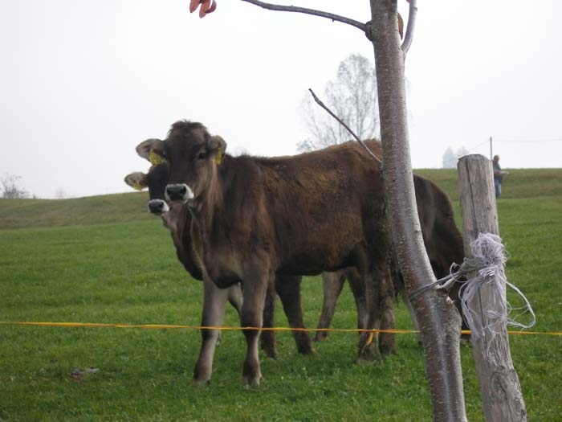
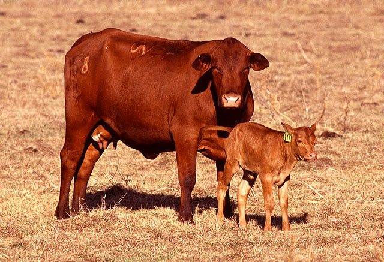

소에 관한 단상

                                                                           조규익

 미국산 쇠고기 수입 자유화에 대한 논란이 가열되고 있다. 미국이나 유럽에서 광우병이 빈발했고, 미국산 소에 광우병의 인자가 들어있을 가능성이 크다니 미상불 걱정이 아닐 수 없다. 급기야 어느 방송에서는 우리나라 사람들이 서구인들에 비해 광우병 발병 가능성이 두 배 가량 높은 유전인자를 갖고 있다는 내용의 보도까지 했다. 불난 집에 기름 부은 꼴이다. 한쪽에서는 문제없다 하고, 다른 한쪽에서는 큰일 났다 하는데, 우리 같은 서민들은 어느 장단에 춤을 추어야 할지 알 도리가 없다.  
 그 뿐 아니다. 광우병에 온통 신경을 쓰다 보니 우리나라 축산 농가들의 어려움은 뒷전이 되어 버렸다. 미국 쇠고기 들어오는데 광우병 논란만 해소되면 축산 농가들 줄 도산하는 건 큰 문제 아니라는 뜻일까. 국민 전체가 참으로 풀기 어려운 문제를 안고 끙끙대는 형국이다.                   
 미국 쇠고기에 관련된 ‘학술용어들의 복잡성’ 또한 도통 알기 어렵고, 마땅히 따져 물을 곳마저 없다. 검역주권이니 프리온 단백질이니 MM형이니, 나같이 무식한 사람들은 매우 곤혹스럽다.   이 사람 저 사람에게 귀동냥을 하는 과정에서 알게 된, 은근히 걱정되는 일 하나가 있다. 한 10년 전쯤인가. 1년 남짓 미국에 체류한 적이 있다. 그곳에서 값싼 LA갈비를 배불리 먹은 우린데, 들어보니 광우병의 잠복 기간이 10년이란다. 그간 우리 몸속에서 숨죽이며 잠복해 있던 광우병의 바이러스(?)란 놈들이 발광할 시점인데, 그렇다면 이것 참 야단 아닌가.^-^ 배고픈 동족들 몰래 미국 땅에서 허리띠 풀어놓고 갈비 뜯은 죗값을 비로소 받는 게 아닌가 하여 은근히 켕기는 나날이다.

  <2005년 독일 여행 중 알펜 가도의 한 농가 목장에서 만난 독일 소들>  
 \*\*\*

 우리 국민 전체가 광우병의 볼모가 될 판에 무슨 한가한 타령이냐고 핀잔하실 분이 계시겠지만, 그래도 소 이야기를 끄집어내지 않을 수 없다. 내 부모는 농사꾼이셨고, 나는 흙 속에서 자랐다. 그 시절 우리 가족에게 소는 반려(伴侶)로 대접받던, ‘동물 아닌 동물’이었다.  
 새벽같이 일어나시어 소죽을 끓이시던 아버지의 기침소리와, 사방으로 번져가던 구수한 소죽 냄새에 우린 덜 깬 잠을 털고 일어나야 했다. 배부름에 만족스러운 누렁이의 고삐를 거머쥔 채, 나는 온몸에 차가운 이슬을 받으며 아침마다 백사장으로 달리곤 했다. 남들보다 먼저 무성한 풀밭의 성찬을 누렁이에게 맛보이기 위해서였다.  
 길게 쇠 바(소고삐에 이어 묶은 밧줄)를 늘이고 쇠말뚝으로 고정한 다음 부리나케 달려 이십 리나 떨어진 학교로 달려가는 것이 오전 중의 내 일과였다. 학교가 끝나자마자 집으로 달려와 책보를 집어던진 다음 백사장의 누렁이에게 달려간다. 하루 종일 시달렸을 누렁이의 갈증과 허기를 풀어주기 위해서였다.  
 언덕 너머로 달랑거리며 내 작은 체구가 나타나면, 누렁이는 ‘음메~’소리를 길게 뿜으며 반가움을 표하곤 했다. 쇠말뚝을 뽑자마자 쇠 바를 서릴 사이도 없이 나와 누렁이는 언덕 너머 둠벙으로 내달렸다. 누렁이는 ‘쭈욱 쭉’ 소리를 내며 촘촘히 자라난 부들 풀 사이로 고개를 박은 채 한 배 가득 물을 마셨다. 물을 마시고 난 큰 체구의 누렁이가 초등학교 3학년 꼬마를 지긋이 바라보던, 그 촉촉한 눈망울을 지금도 잊지 못한다. 그 땐 몰랐지만, 아마도 고마움의 표시였으리라.  
  서해바다를 물들이던 황혼을 등지고 누렁이와 내가 다정한 친구처럼 앞서거니 뒤서거니 하며 소죽 끓는 집으로 돌아오면, 내 일과는 끝이었다.

  <미국(?)소와 송아지>  
\*\*\*

그렇게 그 시절 소는 우리의 가족이었다. 그는 봄철이면 논갈이와 써레질을 해야 했고, 틈틈이 밭도 갈아야 했다. 그 뿐인가. 한 해에 한 번씩 발정기가 되면 아버지는 누렁이를 이웃 동네의 수소에게 데리고 가셨다. 농사일이 끝나는 겨울이면 누렁이는 어김없이 ‘이쁜’ 송아지 한 마리씩을 우리에게 안겨주곤 했다. 누렁이가 보여주던, 일에 대한 철저함과 자식에 대한 지극한 사랑은 어린 내 눈에도 경이로웠다. 세상만사를 달관한 고행의 수도자처럼 누렁이는 땡볕에도 싫은 내색 한 번 보이지 않고 묵묵히 쟁기를 끌었다. 그의 희생 덕에 우리는 한 섬지기가 넘는 농사를 지을 수 있었고, 어려웠지만 그럭저럭 삶을 이어나올 수 있었다.

\*\*\*

그 옛날 우리네 부모들은 소를 상전으로 모셨다. 소와 함께 살아가는 한, 하루 이상의 출타는 불가능했다. 소에게 아침, 저녁으로 따뜻한 먹이를 만들어 먹이는 일이 무엇보다 중요했기 때문이다. 이제 우리의 누렁이는 가고 없다. 그의 빈자리는 경운기와 트랙터의 굉음으로 채워지게 되었다. 시원한 목장에서 맛난 풀을 뜯으며 노역(勞役)의 신산함을 잊어버린 새로운 누렁이들. 그러나 그들의 눈망울엔 새로운 불안감이 가득하다. 주인을 위해 죽도록 일하고, 마지막엔 한 점 살코기로 변해 주인의 몸으로 스며들던 우리네 누렁이들. 그러나 그들도 이젠 사람들의 잔인한 탐욕과 무절제를 어떻게든 경고할 수밖에 없으리라. 살신성인(殺身成仁)의 수도자처럼 그저 묵묵한 태도와 덤덤한 표정으로...

공유하기

게시글 관리

**백규서옥\_Blog ver.**