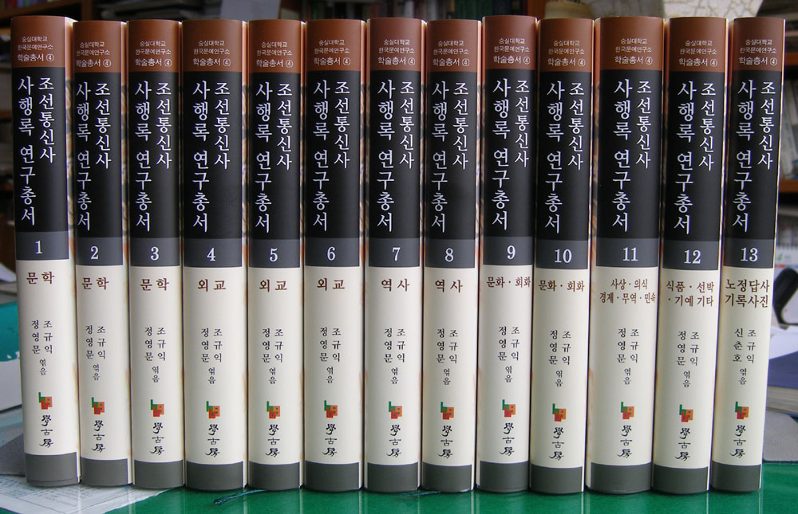
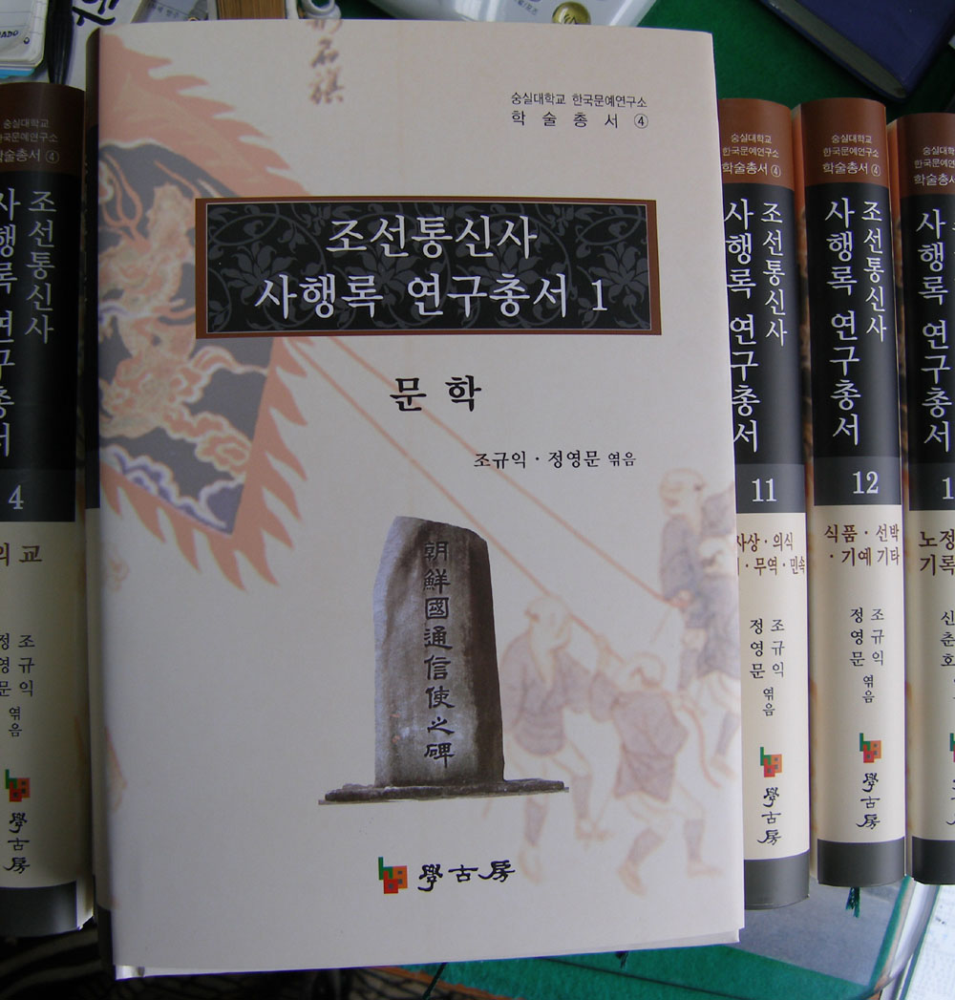

숭실대 한국문예연구소에서 『조선통신사 사행록 연구총서』(전 13권) 발간했습니다!

조선시대 대외교섭의 채널이자 수단이었던 사행(使行)은 ‘중국(中國)’과 ‘일본(日本)’을 대상으로 한 외교활동이다. 조선은 건국 직후부터 ‘왜구문제 해결’을 중요한 목표로 삼았고, 이를 위하여 일본의 막부(幕府) 및 지방의 여러 세력들과 다원적인 외교관계를 맺었다. 그러므로 이 시기의 대일사절은 외교의 대상과 목적에 따라 ‘통신사(通信使), 통신관(通信官), 회례사(回禮使), 회례관(回禮官), 보빙사(報聘使), 호송사(護送使), 수신사(修信使)’ 등 다양한 명칭으로 불렸다.

왜구문제가 해결된 15세기 중엽 이후에도 사행은 준비되었으나, 실행으로 옮겨지지는 못하였다. 조선초기의 일본사행이 왜구문제의 해결과 함께 잠정적으로 중단된 것이다. 이후 1590년 일본을 통일한 풍신수길(豊臣秀吉)이 조선에 사신파견을 요청하면서 속행된 통신사행 마저 임진왜란으로 인해 지속되지 못하였다.

임진왜란 직후의 통신사행은 ‘피로인(被虜人) 쇄환(刷還)’과 ‘회답(回答)’을 목적으로 하는 임시사행이었기 때문에, ‘통신사(通信使)’가 아니라 ‘회답겸쇄환사(回答兼刷還使)’라 불리게 되었다. 이런 까닭에 1636년(仁祖 14)이후 1811년까지 조선에서 일본 막부로 파견된 사절단을 본격적인 통신사라고 할 수 있다.

현재 고려 후기에서 조선 후기까지 약 500년 동안 일본막부가 있는 에도[江戶]로 가는 사신 행차를 통칭하여 '통신사(通信使)'라 하고 있다. 그러나 일본으로 가는 사행 전체를 ‘통신사(通信使)’라 칭할 수 있는 것은 아니다. 원래는 일본사행에 문화적 성격이 강해진 1636년 이후 1811년까지 막부를 대상으로 하던 사행을 ‘통신사(通信使)’라 할 수 있는데, 어쩌다보니 이 명칭은 일본 막부로 보내던 공식적인 사행들 모두를 의미하게 되었다.

통신사행에는 정사·부사·서장관을 포함하여 500여명의 인원이 참여하였고, 이들은 한양을 떠나 부산의 영가대, 일본의 오오사카[大阪] 등을 거쳐 막부가 있는 에도[江戶]까지 여행하였다. 6개월여의 오랜 통신사행에 참여한 구성원들이 다양했던 만큼 그들의 관심사항도 제각각 많았다. 이에 따라 얻어지는 견문도, 기록자들이 남긴 내용도 다양하였다. 통신사행이 거쳐 간 일본의 도시들은 화려함에 있어서 조선의 도시들과 달랐다. 더구나 도시에 몰려든 일본인들은 통신사들을 만날 때마다 글을 받고자 애를 썼다. 조선통신사 사행원과 일본인들 사이의 ‘글’과 ‘문화’를 매개로한 ‘상호소통’은 조선과 일본의 외교를 이루는 한 축이었다. 조규익 교수가 『조선통신사 사행록 연구총서』 머리말에서 “대부분의 연구들은 이 기록들에 대한 해석 혹은 그 체계화”라고 했을 만큼 사행록의 연구는 조선통신사 연구의 주된 부분이다.

그동안 통신사행에 대한 연구는 문학ㆍ역사ㆍ정치ㆍ외교ㆍ경제ㆍ회화ㆍ사상ㆍ민속(풍속)ㆍ제도 등 다양한 분야에서 이루어져 왔다. 그러나 이러한 다양한 분야에 대한 연구들이 각기 독립적으로 이루어져 왔기 때문에, 이를 수탐(搜探)하기 위해서는 많은 노력과 시간이 필요했다. 이런 점에 착안하여 숭실대학교 숭실대 한국문예연구소(소장 조규익 교수)에서는 그간 발표된 국내·외 연구자들의 연구논문들을 두루 수집했고, 수집한 논문들 가운데 137편을 엄선하였다. 이 논문들을 내용 및 주제별로 분류한 것이 이 총서다. 이 연구총서는 총 10권의 ‘연행록 연구총서’에 뒤이어 나온 결과물이다. ‘연행록’과 ‘조선통신사 사행록’을 아울렀다는 점에서 본 연구소는 ‘조선조 사행록’에 대한 연구결과를 망라하는 쾌거를 이룬 셈이다.   
『조선통신사 사행록 연구총서』(전 13권)에는 60여명의 학자들이 연구한 논문 137편과 자료사진이 수록되었다. 문학(1-3권), 외교(4-6권), 역사(7-8권), 문화·회화(9-10권), 사상·인식·경제·무역·민속(11-12권) 등 다방면에 걸쳐 있고, 13권에 우리나라와 일본 지역의 조선통신사 노정과 유적들을 답사하여 얻은 생생한 사진들을 엮어 넣음으로써 사행 현장을 시각적으로도 확인할 수 있도록 했다.

이번 연구총서의 발간으로 학자들은 기존 연구 자료의 수탐 및 정리에 들어가는 시간이나 노력을 절감하게 되었을 뿐만 아니라, 불필요한 연구의 중복 또한 피할 수 있게 되었다. 이를 바탕으로 이 분야의 연구는 질적·양적인 측면에서 한 단계 높아질 수 있으리라 기대한다.

  

[**관련기사 링크**](http://news.chosun.com/site/data/html_dir/2008/05/19/2008051901789.html)

공유하기

게시글 관리

**백규서옥\_Blog ver.**