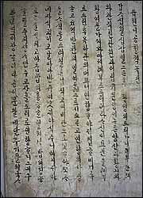
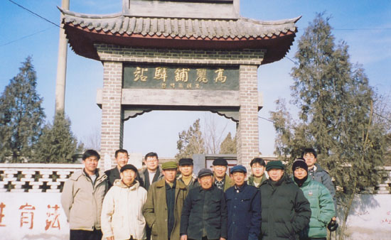

**[**시사저널 원문보기 클릭**](http://www.sisapress.com/news/articleView.html?idxno=46073#)**

  

중화주의, 그 걸러지지 않는 역사의 노폐물

                                                           조규익(숭실대 국문과 교수)

얼마 전 모 대학 교수로부터 들은 이야기 한 토막. 2005년 베이징에서 우리나라 국회의원 두 명이 탈북자 인권문제로 기자회견을 하려다 중국공안 당국으로부터 폭행을 당한 사건이 있었다. 함께 있던 우리나라 외교관들도 폭행을 당한 건 물론이다. 정당한 이유 없이 주재국 공권력에 의해 다른 나라 외교관이 폭행을 당한, 상식 이하의 사건이었다. 예상대로 당시 우리 정부는 묵묵부답, 오히려 한 발 더 나아가 피해자인 우리의 인사들을 질책하는 분위기였다. 분개한 어떤 인사가 그 사건을 들어 모 일간지에 칼럼을 썼고, 감명 받은 그 교수는 그 글을 당시 대학원에 재학하던 외국 학생들의 한국어 시험 지문으로 냈던 모양이다. 그런데 그들 가운데 끼어있던 중국 학생들이 그 내용에 반발하여 시험을 거부했다는 사실을 나중에서야 듣게 된 그 교수는 분노를 금할 수 없었다.

 중국의 저의를 분석한 다음, 잘못 된 처사에 말 한 마디 못 건네고 있는 우리 정부의 처사를 꾸짖은 글이었다. 당사자인 중국의 국민이라면 부끄러움에 고개를 들지 못하거나 반성의 빛이라도 보이는 것이 마땅한 일이었다. 학문을 배우러 이 나라를 찾아온 젊은이라면 더더욱 그랬어야 했다. 그러나 그러기는커녕 그들은 사무실로 찾아와 기세등등하게 항의를 하고 돌아갔다는 것이다. 무엇이 그들을 안하무인의 불량배로 만들었을까. 요즘 하기 좋은 말로 그들이 ‘자유분방한 인터넷 만능시대의 총아(寵兒)’라서 그랬을까. 아니면 중국에 법제화 되어 있다던 ‘독생자녀제(獨生子女制 ; 1가구 1자녀 원칙) 출신의 이른바 ‘소황제(小皇帝)들’이라서 그렇게 된 것일까. 아니다. 바로 그들의 피에 흐르고 있는 ‘중화주의’의 DNA 때문이다.

 역사에도 대사작용(代謝作用)이 있는 법. 새로운 시대사조나 발전적 비전을 받아들여 과거의 노폐물을 걸러내는 작용은 역사에도 필수적이다. 대사작용이 멈춰버린 한-중 외교사의  흐름 속에서 중화주의라는 노폐물을 걸러내지 못한 중국인들은 21세기의 시대정신을 왜곡하며 ‘자민족 우월주의’의 망상에 빠져 있다. 그러니 시험지를 들고 대학원 사무실로 항의 차 몰려온 아이들이나 이번 성화 봉송에서 집단으로 행패를 부린 그들의 행동양식은 한 틀인 셈이다. 그것은 부모나 조상들로부터 대물림 받거나 교육된 의식이거나 행동양식일 뿐이니, 말하자면 '역사의 조건화(conditioning)'라고나 할까. 자극과 자극 또는 자극과 반응 간의 연합을 통해 특정 행동이 유발되거나 학습되어지는 과정이 ‘조건화’다. 한 번도 우리나라와 선린(善隣)의 관계 설정에 나서본 적이 없는 가해자로서의 중국은 우리나라에 대한 ‘지배의식’을 대대로 학습해 물려주고 있으니, 그게 바로 ‘역사의 조건화’다.

 자기 절제를 통해 착한 이웃 혹은 세계시민으로 살아가는 방법과 태도를 교육하는 것이 현대 국가의 금도(襟度)다. 그런데 이번 일로 그들은 양식 있는 교육을 받지 못한 국민임을 만천하에 드러낸 셈이다. 그간 한-중 관계사는 외교적 상식에 비추어 유쾌하지 못한 양상으로 전개되어 왔다. 지정학적인 면에서 우리는 중국 내부의 정치적 변동에 늘 영향을 받아야 했고, 원했건 원하지 않았건 중국이 한동안 우리에게 세계를 향한 창문 노릇을 해온 것도 사실이다. 왕조가 새로 들어설 때마다 그들은 ‘강-약’과 ‘지배-피지배’의 관계를 늘 확인하고자 했고, 우리는 언제나  ‘화(和)/전(戰)’의 선택지 가운데 하나를 골라야 했다. 땅이 넓어 물산이 풍부하고, 세계와 인접해 있어 각종 문물이 다양하니 대륙의 변방인 우리로서는 그들에게 의존하지 않을 수 없었다. 조선조 내내 사신들을 줄기차게 파견한 것도 그런 까닭이다. 언제든 일어날 수 있는 저들과의 전쟁을 미연에 막아야 했고, 우리에게 부족한 물건이나 문화를 도입해야 했으며, 중국의 상징적인 힘을 국내 정치에 활용해야 했다. 우리가 저들의 속국이나 식민지라서가 아니다. 그것은 단지 척박한 환경에서 살아남기 위한 몸부림일 뿐이었다.

 그러나 우리 입장에서 비록 외교적 생존술이었다 해도, 그것은 중국인들로 하여금 그릇된 인식을 갖게 한 단초였음이 분명하다. 현실적 이익은 차치하고라도 우리의 사신 파견이 굴욕적인 일이었음은 말할 것도 없다. 명나라 때의 사신행차도 썩 유쾌한 일은 아니었는데, 하물며 우리가 오랑캐라고 질타해온 청나라 때 사신행차들의 굴욕이야 어떠했을까.

                                             <죽천 이덕형의 사행을 기록한 죽천행록>

 인조 2년(1624) 기울어져 가던 명나라에 파견한 주청사행(奏請使行)은 그 대표적인 경우였다. 서인들은 광해군을 몰아내고 반정에 성공했으나 명나라의 승인을 받지 못했다. 능양군을 인조로 옹립하여 반정에 성공한 서인정권이 자신들의 권력을 반석에 올려놓기 위해서는 명나라의 승인이라는 명분이 절실했다. 명나라로부터 고명(誥命)과 면복(冕服)을 받아오는 일이 무엇보다 다급하고 중요한 그들의 사명이었다. 그래서 당시의 주청사행은 국내정치용이었던 것이다. 정사 이덕형(李德泂)이 명나라의 관료들로부터 당한 농락과 시달림은 역사상 강대국인 중국이 약소국 조선에게 가해온 행패의 축소판이다. 예컨대 위대중이란 자는 주청사행을 괴롭힌 대표적 인물이었다. 조선이 후금의 누르하치와 같은 오랑캐 류라는 점, 인조반정은 명분이 전혀 없는 죄악임에도 ‘천자’의 조서를 받아 그 정당성을 확보하려고 하는 것은 중국 조정에 대한 기망이라는 점, 누르하치에게 먹힌 요동만 회복하면 저절로 조선의 잘못된 일이 바로잡힐 수 있으므로 그 때까지 책봉의 조서를 내리지 말아야 한다는 점 등을 주장하며 주청사행의 사명 수행을 극력 저지했다. 툭하면 시랑 정도의 관료들에게 뇌물을 바쳐야 했고, 출근하는 그들을 만나고자 추운 겨울날 새벽 길가에서 떨며 기다린 것은 물론 각로들을 만나는 자리에서 내침을 당하자 섬돌을 붙들고 울며 사정하는 노구(老軀)의 정사는 우리 민족의 일그러진 자화상일 수밖에 없다. 가까스로 고명과 면복을 받아들고 기뻐하는 정사를 상대로 마지막까지 농락하는 중국의 관료들이야말로 중화주의의 늪에 빠져 약소국을 능멸하는 불량배들의 전형이었다. 중국과 조선, 두 왕조의 외교를 담당한 것은 주로 우리 쪽에서 파견하던 사행단이었다. 연경까지 대개 비슷한 코스로 두 달 가량 걸리는, 왕복 6천리의 지겨운 길이었다. 500여명의 일행이 도보로 오가던 길. 교통편과 숙박시설이 변변할 리 없었다. 한둔하기 일쑤이던 아랫사람들보단 나았겠으나, 정사·부사·서장관 등 윗사람들이라고 크게 편안할 것도 없었다. 목욕은 감히 엄두도 내지 못했으며, 제때 옷 갈아입는 일 또한 분에 넘치는 일이었다.

                              <연행노정 답사 중 만난 하북성 노룡현의 고려포 역참에서>

 동지(冬至)·정조(正朝)·성절(聖節)·천추(千秋) 등 정례 사행단만 가는 게 아니었다. 왕비나 세자의 책봉에도, 왕의 죽음에도, 왕위를 물려주거나 선왕을 추숭할 때도 사신들을 보냈으며, 사은(謝恩)·주청(奏請)·진하(進賀)·진위(陳慰)·진향(進香) 등 임시 사행단은 수시로 파견되었다. 그런 역사가 조선조 내내 이어진 것이다. 중국인들의 뇌리에 박힌 것은 반복되어온 사행 파견의 불평등한 외교관계였다. 그렇게 역사가 왜곡되는 과정에서 청 말 황준헌(黃遵憲)이란 자의 ‘조선책략(朝鮮策略)’같은 글도 나타나게 되었다. “오늘날 조선은 중국 섬기기를 마땅히 예전보다 더욱 힘써서 천하의 사람들로 하여금 조선과 우리는 한 집안 같음을 알도록 해야 할 것”이라는 그의 언설이야말로 올림픽 성화 봉송에서 난동을 부린 중국 청년들의 ‘한국관(韓國觀)’을 정확히 적시한 내용이다. 멀쩡한 남의 나라 외교관이나 국회의원, 언론사의 특파원을 폭행하고도 정당한 법 집행이라 강변한 중국. 자국의 배가 서해상에서 골든로즈호를 침몰시키고 도주한 사건에 대하여 ‘피해 선박이 구난장비를 갖추지 않아 인명피해가 났다’고 억지 논리를 편 중국. 그것도 모자라 이제 그들은 남의 나라에 몰려와 자신들의 국기를 휘두르며 폭력까지 행사하게 되었다.

 예나 지금이나 중국은 스포츠 경기장을 제외한 그들의 영토 안에서 우리나라 사람들이 모여 우리의 국기를 흔들거나 애국가를 부르도록 내버려 둔 적이 없다. 그런 그들이 우리나라에 대해서는 수백 명의 유학생을 동원하여 자신들의 국기를 들고 수도 서울의 한복판을 누비게 만들었으니, 그 배짱은 대체 어디서 나온 것일까. ‘중국을 떠나 너희가 살 수 있느냐’고 큰 소리 치는 철없는 중국의 젊은이를 보며, 그들의 만용과 만행을 가능케 한, 비뚤어진 중화주의가 세계평화의 재앙임을 새삼 깨닫게 된다. 다시 묻건대, 이런 비극을 초래한 장본인은 우리인가 아니면 그들인가?

공유하기

게시글 관리

**백규서옥\_Blog ver.**