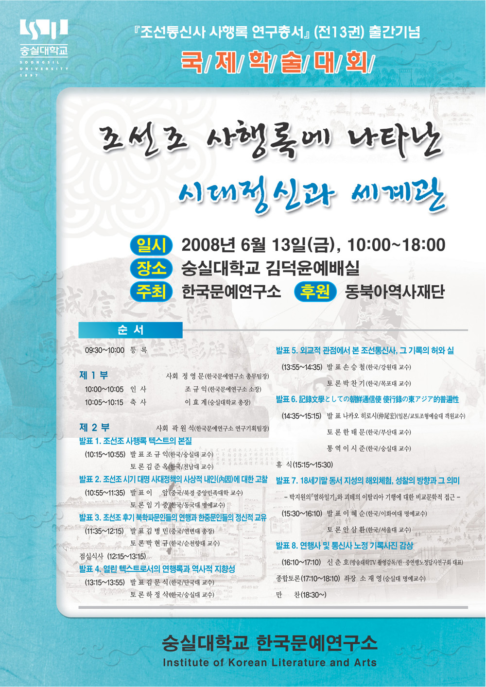

『조선통신사 사행록 연구총서』(전 13권) 출간 기념   
  
국 제 학 술 대 회   
  
모시는 말씀   
  
통합과 상호 소통의 시대,   
한·중·일이 솥발처럼 버텨온 동북아에서   
갈등의 역사, 대립의 패러다임은 청산되어야 합니다.   
  
상생(相生)과 화해(和諧)를 바탕으로   
새로운 문명과 질서를 구축하는 일,   
바로 우리의 사명입니다.   
  
이제, 그 지혜를   
연행사와 통신사 사행록에서   
찾고자 합니다.   
  
부디 오셔서   
격의 없는 담론의 장을   
빛내 주시기 바랍니다.   
  
2008. 5.   
  
한국문예연구소 소장   
조 규 익 드림   
  
1. 주제 : 조선조 사행록에 나타난 시대정신과 세계관   
2. 일시 : 2008년 6월 13일(금), 10:00~18:00   
3. 장소 : 숭실대 한경직 기념관 김덕윤 예배실   
4. 주최 : 한국문예연구소   
5. 후원 : 동북아역사재단   
  
등 록 09:30~10:00   
  
제1부 개회식 사회   정영문(한국문예연구소 총무팀장)   
  
인 사   조규익(한국문예연구소 소장) 10:00~10:05   
축 사   이효계(숭실대학교 총장) 10:05~10:15   
  
  
제2부 사회   곽원석(한국문예연구소 연구기획팀장)   
  
  
  
1. 조선조 사행록 텍스트의 본질 (10:15~10:55)   
  
발표   조규익(한국/숭실대 교수)   
토론   김준옥(한국/전남대 교수)   
  
2. 조선조 시기 대명 사대정책의 사상적 내인(內因)에 대한 고찰 (10:55~11:35)   
발표   이 암(중국/북경 중앙민족대학 교수)   
토론   임기중(한국/동국대 명예교수)   
  
  
3. 조선조 후기 북학파문인들의 연행과 한중문인들의 정신적 교유 (11:35~12:15)   
발표   김병민(중국/연변대 총장)   
토론   박현규(한국/순천향대 교수)   
  
  
  
점 심 식 사(12:15~13:15)   
  
  
4. 열린 텍스트로서의 연행록과 역사적 지향성 (13:15~13:55)   
발표   김문식(한국/단국대 교수)   
토론   하정식(한국/숭실대 교수)   
  
5. 외교적 관점에서 본 조선통신사, 그 기록의 허와 실 (13:55~14:35)   
발표   손승철(한국/강원대 교수)   
토론   박찬기(한국/목포대 교수)   
  
6. 記錄文學としての朝鮮通信使 使行錄の東アジア的普遍性 (14:35~15:15)   
발표 나카오 히로시(仲尾宏)(일본/   
교토 조형예술대 객원교수)   
토론   한태문(한국/부산대 교수)   
통역   이시준(한국/숭실대 교수)   
  
휴 식(15:15~15:30)   
  
7. 18세기말 동서 지성의 해외체험, 성찰의 방향과 그 의미 -박지원의 『열하일기』와   
괴테의 이탈리아 기행에 대한 비교문학적 접근- (15:30~16:10)   
발표   이혜순(한국/이화여대 명예교수)   
토론   안삼환(한국/서울대 교수)   
  
8. 연행사 및 통신사 노정 기록사진 감상 (16:10~17:10)   
신춘호(방송대학TV 촬영감독/한 중연행노정답사   
연구회 대표)   
  
  
  
  
토론 (17:10~18:10)   
좌장   소재영(숭실대 명예교수)   
  
만찬(18:30~)   
  
  
  
  
  
관련기사--------------------------------------------  
  
<조선시대 외교사절, 시대정신을 말하다>   
   
조선통신사 사행록 연구총서 출간기념 국제학술대회

(서울=연합뉴스) 송광호 기자 = 조선시대의 외교사절인 통신사들이 가졌던 시대정신과 세계관을 논의하기 위해 한.중.일 석학들이 만난다.

한국문예연구소가 주최하고 동북아연구재단이 후원하는 조선통신사 사행록 연구총서 출간기념 국제학술대회가 오는 13일 숭실대에서 열린다.

학술대회 주제는 '조선조 사행록에 나타난 시대정신과 세계관'.

먼저 조선조 사행록 텍스트의 본질에 대해 한국문예연구소 소장인 조규익 숭실대 교수가 발표하고, 이에 대한 토론자로는 김준옥 전남대 교수가 나선다.

또 중국 중앙민족대학의 이암 교수는 '조선조 시기 대명 사대정책의 사상적 내인(內因)에 대한 고찰'이라는 주제로 발표한다.

외교적 관점에서 본 조선통신사와 그들이 남긴 기록의 허와 실에 대해서도 강원대의 손승철 교수와 박찬기 교수가 집중 논의한다.

일본의 나카오 히로시 교토조형예술대 객원교수는 '조선통신사 사행록의 동아시아적 보편성'을 주제로 논의를 진행한다.

사절을 따라 당시 청나라의 수도 연경을 보고 돌아온 박지원과 비슷한 시기 이탈리아를 둘러본 독일의 괴테를 비교 분석하는 자리도 마련된다. 발표와 토론 주제는 '18세기 말 동서 지성의 해외체험, 성찰의 방향과 그 의미'.

조규익 교수는 "한국 중국 일본이 동북아에서 엮어온 갈등의 패러다임은 청산돼야 한다"며 "외교사절인 연행사와 통신사의 기록에서 이 같은 갈등 극복 방법을 찾고자 한다"고 학술대회 취지를 설명했다.

[buff27@yna.co.kr](mailto:buff27@yna.co.kr)  
(끝)

공유하기

게시글 관리

**백규서옥\_Blog ver.**