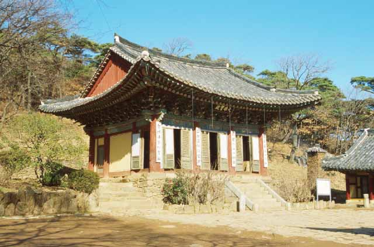

내 생애 쉰 두 번째의 단옷날이다.

분주하게 살다보면 깜빡하는 수도 있으나, 대개 하루해가 저물기 전에 단옷날임을 알게 되고, 내 젊음이 허무하게 지나가고 있음도 깨닫게 된다. 이 날만 오면 반드시 한 토막씩 행사소식이나 기사를 내 보내는 언론 매체들 덕분이다.

 어릴 적 이맘때쯤은 이른 보리 베기와 모내기가 대충 마무리되는 시점이다. 산에 들에 살진 고사리며 수리취 등이 지천으로 자라긴 하나 집집마다 쌀독들은 밑바닥을 드러내던 때이기도 했다. 이른바 보릿고개. 어른 아이 할 것 없이 사람들 얼굴에 허옇게 버짐 피어오르는 춘궁기가 바로 이 때였다. 제사 때 메를 지어 올릴 요량으로 숨겨 두었던 몇 홉들이 쌀도 죽음 문턱의 허기에는 남아날 재간이 없었다. 밥 굶지 않을 정도의 집들에서는 거칠거칠한 수수로 수수팥떡을 만들어 아이들로 하여금 생일을 기억하게 하거나, 나처럼 단옷날에 태어난 친구들은 간간이 수리취떡을 얻어먹는 수도 있었다. 가뭄이 들어 모내기를 못하는 해에는 그나마도 생략하는 게 관례였다. 지금 4, 50대 이전 세대들의 어린 시절 이야기, 호랑이 담배 피우던 시절의 이야기다.

 50의 문턱을 넘고도 작은 언덕 둘을 넘었다. ‘무정함’이 아니라 ‘무서움’으로 탓할 만한 시간의 빠름이다. 이루는 것 없이 앞뒤로 몇 번 두리번거리다 보면, 뚝딱 한 해가 저 멀리 사라지곤 한다. 읽어야 할 책들은 안두(案頭)에 쌓이는데 눈은 침침해지고, 채워야 할 원고지의 칸들은 빈 바둑판처럼 정연한데 펜 잡은 손에 힘이 빠지고 있으며, 술잔으로 챙겨야 할 친구들은 늘어서 있는데 몸의 나약함은 술을 이기지 못한다. 이기지도 못할 술을 마셔놓곤 “어허 이것 봐라 하늘이 도는구나/뱅글뱅글 물매아미같이/하늘이 돈단 말이/저 놀랍고도 새로운 천문학적 진실 위에/세대의 윤리는 성좌같이 찬연하다”고 너스레를 떤 시인 김동명.   그 역시 술의 힘을 빌려 덧없는 세월의 시름을 달랜 것이나 아니겠는가.

\*\*\*

 이번 생일엔 제자 아들의 돌잔치에 들렀다가 강화도 전등사를 찾았다. 묘한 대조였다. 터질 듯 말랑말랑한 아가의 볼은 무한한 미래를 잉태하고 있었다. 그러나 꺼칠한 내 볼은 공동체의 미래를 위해 무엇을 약속할 수 있단 말인가.

 가버린 내 청춘을 조상(弔喪)하듯, 여름 장마 같은 궂은비에 흙탕물이 튀었다. 날아갈 듯 호젓한 전등사의 대웅전은 옛날 보던 그대로였다. 세월의 때를 고스란히 보여주는 빛바랜 단청. 소박하고 솔직해서 좋았다. 그 대웅전은, 칠이 벗겨지기 시작하자마자 냅다 원색으로 덧칠해대는 우리네의 천박함과 달랐다. 이 절의 주지는 누굴까. 그는 어쩌면 그 속진(俗塵)의 굴레로부터 멀리 벗어난 존재인지도 모를 일이었다. 비 오는 날 오후여서였을까. 그 흔한 목탁소리조차 들려오지 않았다. 비에 젖어 몸을 떠는 까치들의 울부짖음만이 가끔 빗소리의 고즈넉함을 깨고 있었다.

 경내 안의 찻집을 찾았다. ‘참 좋은 인연’이라든가, 이름 한 번 그럴 듯 했다. 통나무를 어슷비슷 잘라내어 만든 다탁과 의자에는 선남선녀들이 마주앉아 속삭이고들 있었다. ‘솔바람차’를 시켰다. 그 이름은 누가 지었는지. 수면에 어렸다가 풀어지는 솔향기가 가슴을 적셨다.

 찻집의 인테리어를 뜯어보며 마음속으로 열심히 설계도를 그리는 아내. 새 집 지을 꿈에 부풀어 있으리라. 배산임수의 명당에 그림 같은 집을 짓고 토방 있는 다실(茶室)을 만들겠노라는 푸진 꿈을 솔향기 속에 갈무리하고 있었으리라. 모처럼 우리는 호사스런 백일몽을 즐길 수 있었다.

\*\*\*

 50대의 생일은 어떠해야 할까. 선배들은 50대의 생일을 어떻게들 보냈을까. 이 물음들의 해답을 찾기가 갈수록 어려워지는 것은 우리네 삶의 무게가 갈수록 더해지기 때문이다. 내가 짐 지고 걸어온 길. 자식들에겐 더 큰 짐을 지워주고 싶은 욕망. 아니 그들에게 그런 욕망을 강요하는 우리네 삶. 내 몸에 얽힌 삶의 사슬이 무자비하고, 그들의 어깨 위에 걸린 삶의 무게가 안쓰럽다. ‘훌훌 털고 가볍게 살다 가자!’고 무소유의 삶을 주창한 어느 노 선사를 아는가. 지금 과연 그는 가벼움을 즐기고 있을까. 무거운 짐들을 잔뜩 지고 길 가득 걸어가는 중생들의 땀 흘리는 얼굴을 보며, 과연 그는 홀가분함을 즐기고 있을까.

 갈수록 두 어깨의 짐은 무게를 더하고, 길의 끝 부분 저 먼 곳이 자꾸만 궁금해지는, 내 삶의 기울어버린 한낮이다. (2008. 6. 6.)

공유하기

게시글 관리

**백규서옥\_Blog ver.**