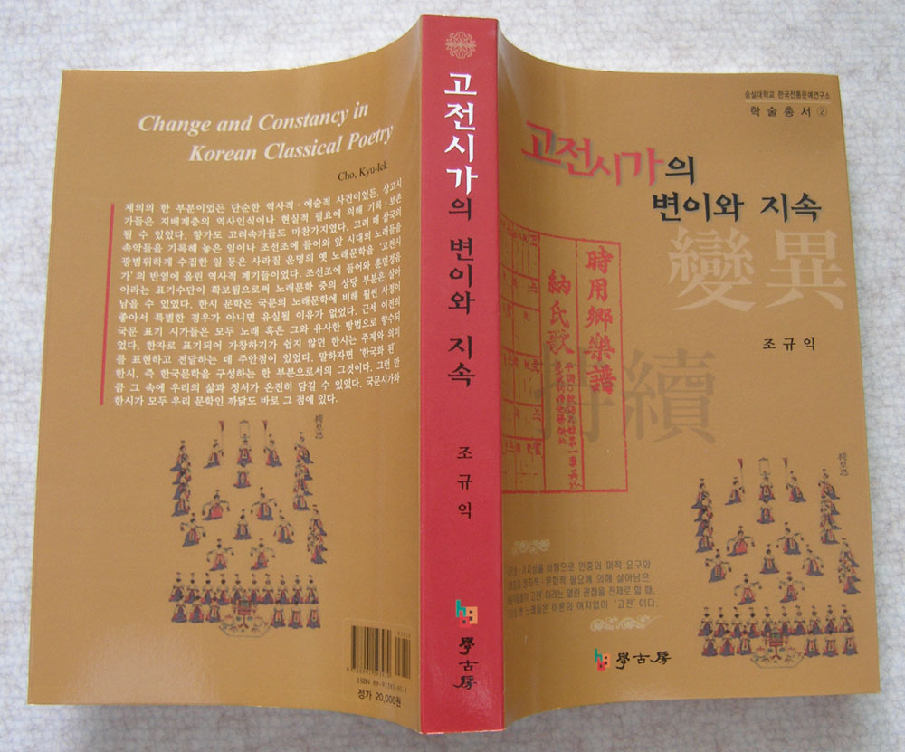

조규익 교수 의 책 <<고전시가의 변이와 지속>>(학고방, 2006)이 2008년 대한민국 학술원 "2008년 기초학문육성 우수학술도서"로 선정되었습니다.  이 책의 내용은 "고전시가의 개념, 지속양상, 그리고 변이/소재, 주제, 이념 전달 매체로서의 고전시가/고전시가의 존재양태" 등 3부로 나누어져 있습니다. 522쪽 규모의 이 책은 공시적, 통시적 측면에서 우리 고전시가의 본질을 세밀하게 파헤쳤다는 평을 듣고 있습니다. .

공유하기

게시글 관리

**백규서옥\_Blog ver.**