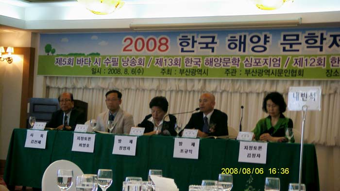

  
2008 한국해양문학제-제 13회 한국해양문학 심포지엄이 성황리에 끝났다. 조규익(숭실대) 교수는 '우리 시가문학과 어부 이미지'를, 정영자((문학평론가, 한국문협 부이사장)교수는 '한국 소설 속의 어업과 어부'를 각각 발표했으며, 조교수의 발표에는 김정자(부산대) 교수가 정교수의 발표에는 최영호(해군사관학교) 교수가 각각 토론을 맡았다.

공유하기

게시글 관리

**백규서옥\_Blog ver.**