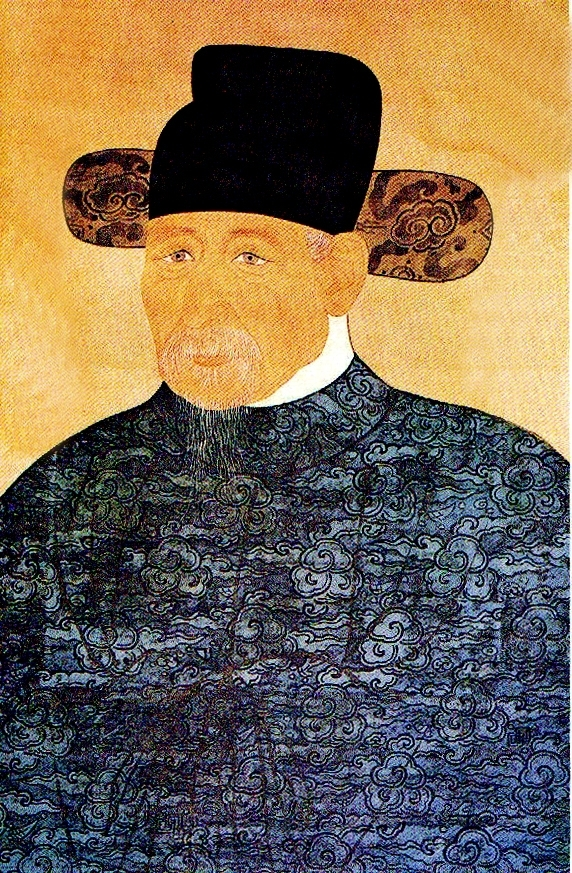
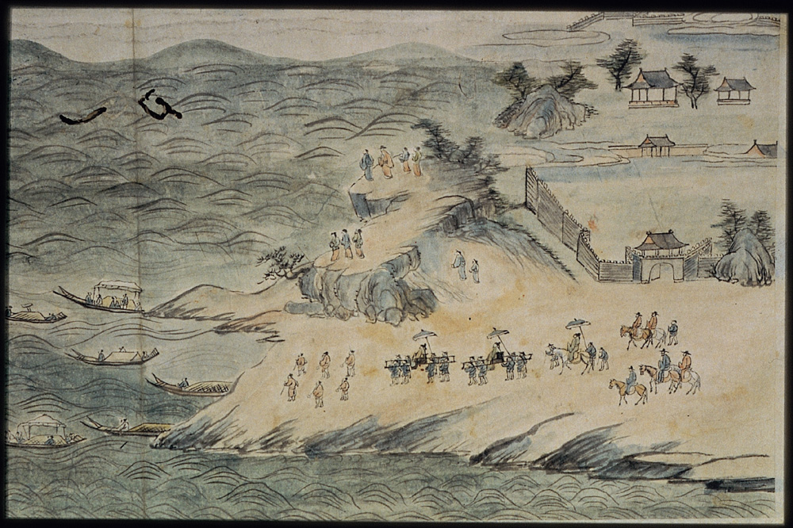
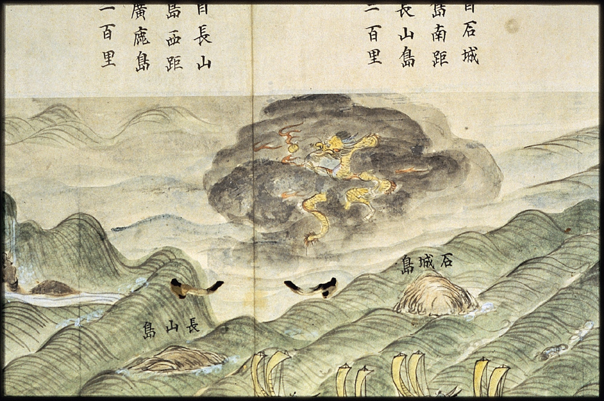
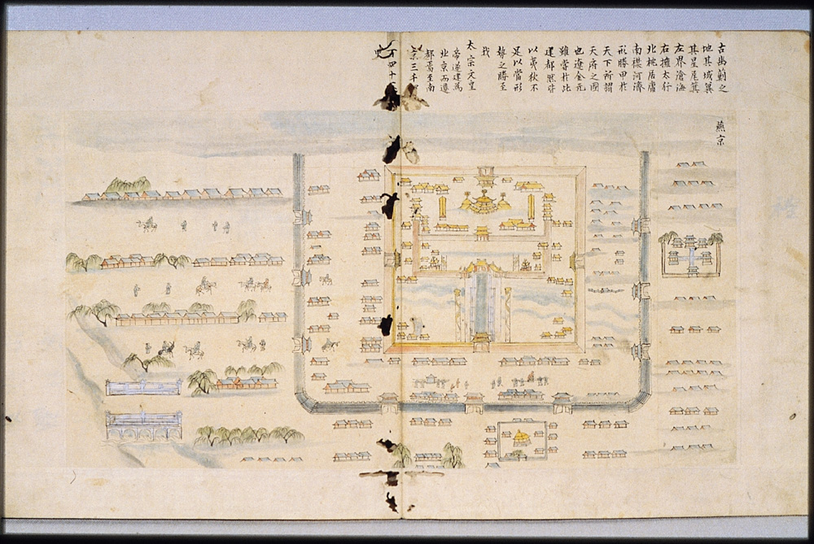
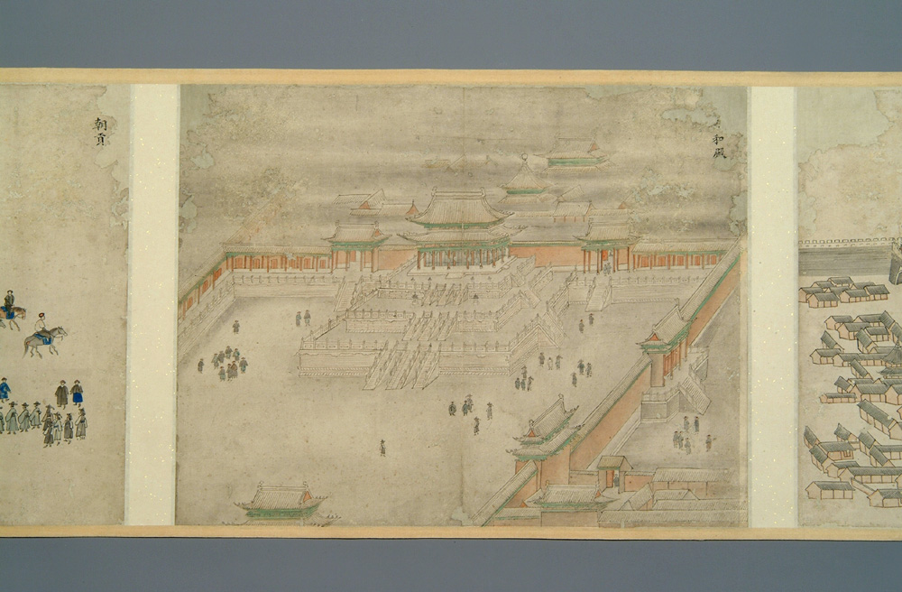
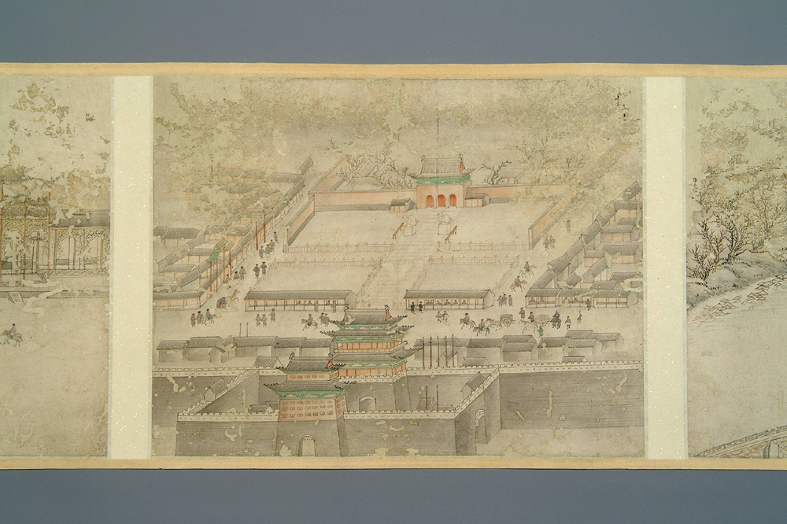

“오직 공도(公道)만을 지켜 신명(神命)을 믿노라”

-민족적 수치와 교훈의 서사미학 : 이덕형의『죽천조천록』-

xml:namespace prefix = o ns = "urn:schemas-microsoft-com:office:office" /

노구의 정사, 끔찍한 해로사행에 나서다

  
     <죽천 이덕형의 초상>

반정으로 쫓겨난 광해군을 대신하여 새 왕에 추대된 능양군 이종(李倧). 그가 바로 서인들에 의해 옹립된 인조다. 광해군과 대북정권은 현실적인 외교로 전쟁을 피하고 실리를 추구해왔으나, 서인세력은 그들의 지론인 ‘친명사대(親明事大)’를 실천에 옮기고자 했다. 중원에서 승승장구하는 후금을 적대시하고 바야흐로 꺼져가던 명나라에 빌붙고자 한 서인들에게 나라의 형편이나 전쟁으로 죽어나갈 백성들은 안중에도 없었다. 오로지 명나라의 승인을 통해 자신들이 거머쥐어야 할 정치권력만이 그들의 관심대상이었다. 망해가던 명나라로부터 인조와 정권의 정통성을 인정받는 것이 자신들의 안위에 절대적이라고 보았던 것이다. 59세의 죽천 이덕형(李德泂,1566~1645)을 주청사의 정사로 명나라 조정에 파견한 것도 그 때문이다. 사실 이덕형은 광해군 말년에 도승지로 있었고, 인조반정에 적극 가담하지 않았으며, 반정 후에도 광해군을 죽이지 말라고 주장할 정도로 강골이었다. 사명을 완수하고 돌아온 뒤 조정 대신들의 모함으로 고초를 겪은 것도 서인정권과의 거리 때문이었으리라. 그러나 인조의 지우(知遇)를 받아 말년까지 비교적 순탄한 환로(宦路)를 걸을 수 있었다.  
  

        <평안도 선사포에서 배를 타고 떠날 차비를 하는 사신들과 전별을 나온 사람들>  
  
인조 즉위 2년(1624) 6월 20일 한양을 떠나 10월 13일 북경 회동관에 숙소를 정했고, 이듬해 2월 25일 북경을 출발하여 4월 25일 복명했으니, 장장 10개월에 걸친 장도였다. 요동은 이미 누르하치가 점령하여 육로통행이 불가능했으므로, 평안도 선사포에서 산동반도의 등주에 이르는 해로가 유일한 통로였다. 이미 우참찬 유간, 이조참판 박이서, 정언 정응두 등 광해 조 때 진위사 일행이 풍랑으로 몰사한 그 길이었다. 장산도와 광록도 사이에서 만난 풍랑은 그들이 겪은 난관들 중의 하나다.   
  

       <장산도와 석성도 사이에서 만난 풍랑>

잠깐 사이에 음산한 구름이 서쪽에서 일어나 하늘색은 새까맣게 변하고 모진 회오리바람이 갑자기 일어나 큰 물결이 하늘에 닿으니 비록 옮겨 정박하고자 하나 손을 쓸 수 없어 배는 거대한 물결에 내맡겨진 바가 되었다. 백 척의 거품 끝에 곧바로 올랐다가 만 길의 심연으로 돌아 떨어지니 배 안에서 사람들은 낯빛을 잃고 서로 마주 보며 눈물을 흘릴 뿐이었다. 부사의 배가 잘못 정박하여 머문 곳에서 순식간에 널빤지가 부러져 물이 배 안에 가득 차게 되었으나 다행히 바람이 자서 전복을 면할 수 있었다.

깐깐한 유학자들이 천비낭랑, 용왕신, 소성신 등에게 제를 올려 뱃길의 안위를 기원할 정도로 발해만의 파도는 높고도 험했다. 어쩌면 그것은 중국에 들어가 수행할 사명의 어려움을 예고하는 전조였다고 할 수도 있으리라. 그렇게 그들은 바닷길을 건너고 육로를 걸어 북경에 도착했다.

명나라 말기 관료들의 부패상에 진저리를 치다

       <연경에서 외교활동을 하는 사신들의 모습>  
  
수행원 누군가에 의해 메모가 작성되었고, 귀국한 이후 또 다른 누군가에 의해 완성된 『죽천조천록』. 사행길의 견문들을 세세히 기록하지 않고, 황제로부터 고명(誥命)과 면복(冕服)을 받아내는 일에 초점을 맞춘 사실이 여타 사행록들과 다르다. 말하자면 다른 사행록들이 서술적이거나 묘사적이라면 『죽천조천록』만은 서사적(敍事的)이라는 것이다. 핵심 되는 하나의 사건이 이 기록을 관통하기 때문이다.   
  

  <연경 자금성의 모습>  
  
북경에 도착하여 4개월여 동안 부패한 명나라 관료들의 온갖 방해를 극복하고 황제로부터 고명과 면복을 받아낸 죽천은 서사체『죽천조천록』의 프로타고니스트요, 명나라의 관료들은 안타고니스트였다. 이처럼 선악의 갈등과 대립으로 압축되는 것이 그 서사체의 구도이다. 선의 입장에 서 있던 죽천은 어떻게든 황제로부터 고명과 면복을 받아 조선의 반정에 명분을 부여하고 현실정치를 안정시켜야 했다. 그것은 그들이 항상 입에 달고 다니던 ‘충(忠)’의 구체적 실천방법이기도 했다. 그러나 재물을 탐하여 그런 충의 실천을 가로막는 명나라 관료들은 부패와 악의 전형이었다. 단계마다 뇌물이 필요했고, 뇌물의 공여를 전후하여 갈등은 조성되었다. 기록자는 뇌물이 횡행하는 현실을 다음과 같이 기록했다.

옥하관에 돌아와 예부 복계를 주야로 기다리되 금일 명일 하여 동짓달이 반이 지나도 국가 대사를 이룰 기약이 없어 민망으로 지내니 각 마을 서리 이르되 “너희 나라 이 대사를 이루려 하면 인삼과 금은을 상서와 시랑에게 많이 봉송하여야 일이 될 것이요, 그렇지 아니하면 옥하관에 십년을 있어도 일을 이룰 기약이 없으리라” 하니 대저 천조(天朝) 인심이 말세 되어 탐풍(貪風)이 대작하니 대소 관원이 회뢰(賄賂)를 들이지 않는 이가 없어 대소 정사를 재리(財利)로 이루어내고 염치를 알지 못하여 봉책으로 기화를 삼아 날마다 하배로 하여금 관에 와 토물을 구하니 인삼과 은이 아니면 달피(獺皮)와 표피(豹皮)와 종이와 모시와 베와 무명이라. 아침에 수응하면 저녁에 또 달라 하여 말하기를 만일 일을 수이 이루어 주면 고기 낚을 데가 없다 하여 천연세월하여 달라기를 마지아니하고...

바리바리 마소에 등짐을 지우거나 꼬박꼬박 봇짐으로 지고 간 토산품들이 명나라 관리들에게 회뢰의 자료로 탕진되었음을 보여주는, 생생한 기록이다. 일이 이루어지는 단계마다 이런 뇌물이 오고갔으며, 뇌물의 유무나 많고 적음에 따라 적지 않은 갈등도 생겨났다. 상대하던 명나라의 관리들이 때로는 방해자가 되기도 하고 때로는 조력자가 되기도 하는 등 갖은 우여곡절을 경험하면서 죽천 일행은 천신만고 끝에 사명을 이룰 수 있었다. 조선이 요동에 출병하여 누르하치를 쳐주면 반정으로 왕위에 오른 인조를 인정하겠다는 것이 명나라의 공식적인 제의였다. 그러나 조선으로서는 그것이 현실적으로 가능한 일이 아니었고, 무엇보다 새 왕의 정통성을 인정받는 것이 급선무였다. 명나라의 관리들은 그런 약점을 지렛대 삼아 더욱 많은 물자를 뇌물로 요구한 것이었다.

무수한 수모 끝에 사명을 이루다

『죽천조천록』의 프로타고니스트 죽천 이덕형. 그가 당시 부패의 천국 명나라 관리들에게 비교적 좋은 인상을 준 건 사실이다. 그러나 그런 인상을 줌으로써 사명을 완수하기까지 인간적으로 감내하기 어려운 수모를 무수히 겪은 것도 사실이다. 수시로 바뀌는 상서와 시랑 등을 상대하며 뇌물로 그들의 환심을 사고자 하는 일이 북경에서의 일상사였던 것이다.

  
<연경 자금성의 또 다른 모습>  
  
추운 겨울날 이른 아침 각로들이 출근할 때 길거리에 서서 읍하는 자세로 그들과 접촉을 시도한 경우도 있었고, 도찰원으로 오라는 말만 듣고 찾아갔다가 “드러 내치라”는 육각로의 대갈(大喝)에 “대조(大朝)의 노야(老爺) 대인들은 적선(積善)하시라”고 사정하며 섬돌을 붙든 채 눈물을 흘린 적도 있었다. 뇌물 공여와 함께 이런 일들이 거듭되면서 명나라 관리들의 마음은 움직였고, 결국 황제로부터 고명과 면복을 받아내게 된 것이다. 그러나 마지막 순간까지 그들은 면복 아닌 엉뚱한 옷을 내줌으로써 한 번 더 죽천을 희롱하기도 했다. 즉 그들이 내준 웃옷에 호문(虎紋)과 봉문(鳳紋)이 있을 뿐 용문(龍紋)과 일월(日月)이 없음을 보고 죽천이 문제를 제기하자, 한참동안 죽천을 희롱하다가 그들 가운데 허각로란 자가 “이는 희롱함이라”하고 용포를 내어준 사건이었다. 학식과 경륜을 갖춘 59세의 정사 죽천을 상대로 그들은 어린아이를 상대하듯 희롱한 것이었다.

\*\*\*

사명을 수행하고 난 뒤 사람들이 용하다는 관상쟁이 장전천(張前川)을 데리고 오자 “인간만사를 처음 태어난 날 부여받았나니/영화와 욕을 그대와 더불어 의논할 마음이 없노라/벼슬이 재상에 이르고 이제 머리가 희어졌으니/오직 공도만을 지켜 신명을 믿노라”고 시를 지어 대꾸한 죽천. 과연 그는 그 순간에도 조선 선비로서의 꼿꼿한 기개를 잃지 않았던 것일까.

공유하기

게시글 관리

**백규서옥\_Blog ver.**