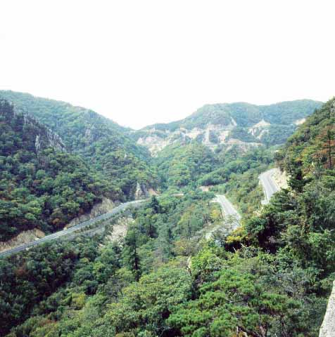

                            <나옹화상 혜근의 가송집 가운데 완주가 부분. 국립중앙도서관 소장>  
  
  
  

찰나와 영원의 경계, 그 깨달음의 미학

-나옹화상의 시가와 구원의 메시지-

xml:namespace prefix = o ns = "urn:schemas-microsoft-com:office:office" /

조규익

Ⅰ. 인간의 실존적 고뇌를 어찌 할 것인가

타인과의 관계를 전제로 자신을 인식하는 존재라는 점에서, 인간은 사회적 동물이다. 하이데거(M. Heidegger)는 ‘세계에 던져진 현존재’로서 자신을 개인적 주체로 발견하는 존재가 바로 인간이라고 했다. 이처럼 남과의 관계에서 자신을 인식하는 것이 인간이긴 하나, 남과 구별되는 개별자로서의 ‘나’는 분명 유일한 존재다. 말하자면 ‘본래의 자기’, 즉 실존적 존재가 인간이기 때문이다. 실존이 본질보다 앞선다고 보는 관점도 이런 입장에서 나왔을 것이다.

현세에서 쉽사리 벗어날 수 없는, 인간의 실존적 고뇌란 무엇인가. 바로 생로병사의 짐이다. 태어나고 죽는 일, 그 가운데 죽음은 인간이 전존재를 투사하여 알아내고자 해도 결코 만만하게 해답이 손에 잡히지 않는 문제다. 태어나 살다가 죽음에 이르는 과정을 한 인간의 일생이라 한다면, 죽음은 액면 그대로 종말이다. 존재의 무화(無化)가 죽음이기 때문에, 실존의 범주로부터 한 발짝도 벗어나지 못하는 인간에게 죽음이란 무시무시한 형벌로 인식될 수밖에 없다. 죽음으로 모든 것이 끝난다는 생각, 죽음 이후의 단계에 대한 무지 등은 인간을 벗어나기 어려운 절망감으로 몰아넣는다.

허무감을 포함한 그 절망감은 인간의 실존적 고뇌를 더욱더 심화시킨다. 그 지점에서 인간은 종교를 만난다. 그러나 종교에 귀의한다고 하여 인간의 실존적 고뇌가 사라지는 것은 아니다. 죽음에 대한 두려움이나 괴로움은 신앙의 강도(强度)에 단순히 반비례할 뿐이고, 깨달음의 단계에 이르러서야 인간은 어느 정도 실존적 고뇌를 극복할 수 있게 된다.

종교가 죽음으로부터 인간을 구원한다고 하지만, 그 구원의 정도는 깨달음의 진정성이나 강도에 달린 문제일 뿐이다. 그럴 경우 깨달음이란 무엇인가. 실존적 공간인 현실로부터 존재의 사라짐이 우주적 차원에서 그다지 엄청난 일은 아니라는 점, 존재의 사라짐이 종말이긴 하지만 어쩌면 액면 그대로의 종말이 아닐 수도 있다는 점 등을 흔들림 없이 받아들이는 것이 종교적 깨달음이다. 물론 그 깨달음은 죽음이 아니라 ‘죽음의 두려움’으로부터 인간을 구제하는 기제(機制)로 작용한다.

‘인간은 고독이 두려워 사회를 만들었고, 죽음이 두려워 종교를 만들었다’는 스펜서(Herbert Spencer)의 말처럼 인간이 종교에 상정한 가장 직접적이고 강렬한 투쟁의 대상은 죽음이다. 죽음의 두려움을 해소할 수 있는 장치가 종교 속에 내재해 있다면, 그것은 ‘삶과 죽음의 하찮음’을 깨우치는 일 그 자체일 것이다. 말하자면 실존적 고뇌로부터의 초탈만이 깨달음의 대전제일 수 있다. 존재의 육신을 굴러다니는 돌이나 나무 조각 등과 동일시할 수 있는 경지에 올라야 비로소 그 깨달음은 인간 실존으로 하여금 현실적 얽매임에서 초탈하게 만들 수 있는 것이다.

대부분의 범부들은 실존적 고뇌의 억압으로부터 자유롭지 못하다. 탁월한 근기의 존재들만이 실존적 고뇌와 맞서 싸울 수 있는 것이다. 맞서 싸운다고 모두 승리하는 것은 아니지만, 싸우는 자만이 어떤 형태로든 깨달음을 얻을 수 있게 된다. 그 깨달음이란 실존적 고뇌에 대한 처절한 투쟁과 성찰의 결과다.

『아함경』의 65(『관찰경(觀察經)』)는 ‘관찰’의 중요성을 설한 내용이다. ‘항상 방편을 써서 선정을 닦아 익혀 안으로 그 마음을 고요히 하면 참답게 관찰할 수 있’는데, 제대로 관찰하지 못하므로 느낌을 즐겨 하고 집착한다고 했다. 집착을 인연하여 ‘존재’가 있고, 존재를 인연하여 태어남이 있으며, 생을 인연하여 늙음과 앓음, 죽음과 걱정, 슬픔과 번민, 괴로움 등이 생겨난다는 것이다. 그 모두가 실존적 고뇌들이다. 비구가 선정에 들어 안으로 그 마음을 고요히 하면서 꾸준히 힘쓰고 방편을 쓰면 참답게 관찰할 수 있다고 했다. 여기서 ‘참다운 관찰’이란 깨달음의 전제조건이다. 실존적 고뇌에 대한 참다운 관찰을 통해 깨달음을 얻은 자만이 깨닫지 못한 무명(無明) 속의 대중을 이끌 자격이 있는 것이다. 그런 점에서, 선을 통해 노래를 통해 대중을 구제하려 애쓴 나옹화상(懶翁和尙)이야말로 시대를 뛰어넘은 불교계의 진정한 지도자라고 할 수 있다.

Ⅱ. 나옹, 진여자성(眞如自性)을 깨닫다

나옹화상의 깨달음 역시 실존적 고뇌로부터 출발했다. 채 피어나지도 않은 21살에 이웃 친구의 죽음을 보았고, 그 사건을 계기로 출가를 결행한 그였다. 사고(四苦)의 현장을 목격한 후 출가를 결행한 싯다르타와 같은 행적을 보여준 것이다. 출가하여 묘적암의 요연선사(了然禪師)로부터 게를 받고 여러 사찰을 순력하며 정진하다가 결국 원나라에 들어간 나옹화상은 지공화상(指空和尙)·평산처림(平山處林)·천암원장(千巖元長)·요당화상(了堂和尙)·박암화상(泊菴和尙) 등을 차례로 만나 도의 경지를 높였다. 그러나 그에게 결정적으로 영향을 끼친 스승은 지공화상과 평산처림이었는데, 훗날 회암사에 지공의 유골과 사리를 모신 것도 그 인연 때문이었다.

평산으로부터 임제선(臨濟禪)을 심수(心受)한 그가 주력한 것은 간화선(看話禪)이었다. 즉 옛 선사들의 공안(公案)을 참구(參究)하여 깨달음의 경지에 들어가는 참선법이 바로 그것이다. 임제종은 조계(曹溪)의 6조 혜능(慧能)으로부터 남악(南嶽)·마조(馬祖)·백장(百丈)·황벽(黃檗) 등을 거쳐 임제 의현(義玄)에 이르러 확립되었다. 원래 우리나라의 선풍은 임제종풍이었는데, 태고화상 보우(普愚)와 나옹 이후에 그것은 더욱 확고해졌다.

그렇다면 과연 나옹은 무엇을 깨달았으며, 대중들에게 무엇을 깨우치고자 했을까. 무엇보다 그가 갖고 있던 의문의 핵심은 ‘나란 무엇인가’에 있었다. 그는 젊은 시절에 친구의 죽음을 보며 실존적 고뇌를 느꼈을 것이고, 인간의 본질적인 면에 대한 탐구의 욕망 또한 갖게 되었을 것이다. 다음 시문은 깨치기 전의 나옹이 지은 게송이다.

선불장(選佛場) 안에 앉아

정신 차리고 자세히 보라

보고 듣는 것 다른 물건 아니요

원래 그것은 옛 주인이다

<김달진 역>

나옹이 스승 요연을 하직하고 여러 절들을 배회하다가 회암사에 와서 대중들에게 내렸다는 게송이 바로 이것이다. 출가한 후 보고 듣고 참구한 그것이 출가하기 이전의 그것과 다르지 않다는 사실, 선방에 앉아 참되게 관찰한 결과 그 모든 것들이 나이며 내가 곧 내 주인이라는 사실 등을 강조한 내용이다. 나옹은 이 게송을 내린 뒤 4년을 부지런히 수도하다가 홀연히 도를 깨쳤고, 그 길로 중국에 가서 여러 스승들을 찾아 더 높은 도를 구했다.

그는 원나라에서 각처를 떠돌다가 스승 지공을 만났으며, 그에게서 임제선을 받았다. 그 스승에게 올린 깨달음의 게송은 다음과 같다.

산과 물과 대지는 눈앞의 꽃이요

삼라만상도 또한 그러하도다

자성(自性)은 원래 청정한 줄 비로소 알았나니

티끌마다 세계마다가 다 법왕신(法王身)이네

<김달진 역>

비로소 그는 깨달음의 경지를 노래할 수 있었다. 눈에 보이는 객관세계는 이미 존재하고 있으나, 본래 주관적 의식 즉 자성으로 관조하니 온갖 삼라만상이 청정한 법신임을 깨닫게 되었다는 것이다. 앞의 게송에서 강조되던 ‘나’는 대상을 만나면서 대상에 내재된 본래의 면목을 발견하게 되었다는, 깨달음의 기쁨을 노래하고 있는 것이다.

이런 단계를 넘어서면서 깨닫기 이전과 깨달은 이후의 경지가 비로소 합일을 보게 된다는 내용이 지공에게 올린 다음의 게송에 나타난다.

모르면 산이나 강이 경계가 되고

깨치면 티끌마다 바로 온몸이네

모름과 깨침을 모두 다 쳐부쉈나니

닭은 아침마다 오경(五更)을 향해 우네

<김달진 역>

미(迷)와 오(悟)의 다름과 양자의 통합을 노래함으로써 ‘깨닫지 못함’ 뿐 아니라 ‘깨달음’ 자체도 뛰어넘는 경지로 나아갈 것을 강조하고 있는 것이 이 노래의 내용적 핵심이다. 깨달으면 온 세상만물에 자아의 본래면목 혹은 본지풍광이 그대로 현출(現出)한다는 말이다. 그러나 그것만으로 그친다면, ‘깨우치지 못함’과 ‘깨우침’은 분리된 채 모순의 평행선을 그을 수밖에 없다. 따라서 양자는 ‘쳐부숨’을 통해 하나로 통합되어야 한다는 뜻이 3행에 나타나 있고, 그러한 통합을 이루었다는 사실이 이 부분에서 강조되고 있는 것이다. ‘닭이 아침마다 오경을 향해 우는’ 일이야말로 ‘불립문자(不立文字)’의 경지이며, 피-아의 구분이 허물어진 합일의 세계를 감각적으로 보여준 표현이라 할 수 있다.

이 노래에 이어 ‘나도 아침마다 징소리를 듣는다’고 대답한 지공의 말은 피-아의 구분을 허문 경지, 아니 오히려 ‘피-아의 구분을 허문’ 일 자체도 뛰어넘는 경지를 노래한 것이나 아닐까.

그 뒤에도 나옹은 각지의 스승들을 찾아다니며 자신의 도력을 높이는데 진력함으로써 우리나라 선맥의 큰 봉우리를 이룰 수 있었다. 그러나 자신의 성도(成道)에만 주력할 수 없었던 것은 주변에 널린 불쌍한 중생들 때문이었다. 말하자면 나옹화상은 두 번의 깨달음을 얻은 셈인데, 진여자성(眞如自性)의 깨달음이 그 첫 번째이고, 자성의 깨달음을 얻지 못해 고뇌의 바다에서 헤매는 중생들의 실존에 대한 깨달음이 그 두 번째 것이다.

Ⅲ. 고해의 중생들을 노래로 인도하다

작자 문제로 학자들 간에 견해의 차이를 보이긴 하나, 나옹은 <서왕가>·<낙도가>·<승원가>·<참선곡> 등 네 편의 가사를 지은 것으로 되어 있다. 이 작품들은 수도자의 신앙고백이자 무명에 갇혀있는 고해 중생들을 권면하여 깨달음의 세계로 인도하려는 선지식(善知識)의 호소라 할 수 있다.

일찍이 나옹은 방황과 수행, 참선을 통해 진여자성을 깨달았다. 그런데『법화문구4』에서는 ‘보리(菩提)의 도를 유익하게 하는 사람을 선지식’이라 했다. 보리를 추구하는 대중들에게 부처 말씀의 진리를 설하여 올바른 깨달음의 길로 들어서게 하는 것. 나옹의 뜻도 바로 거기에 있었다. 근기가 높은 대상만이 터득할 수 있는 선문답보다 일상적인 말 문학으로서의 가사가 대중의 근기에 맞는다고 판단한 것이 나옹이었다. 그것은 고해 중생들에 대한 사랑의 발로였다.

그가 활약하던 당시의 고려는 내우외환으로 깊이 병들어가고 있는 중이었다. 밖으로는 홍건적과 왜구들이 수시로 침입하고, 안으로는 원나라 지배하의 권문세족들이 종교와 결탁하여 국가의 부와 권력을 독점함으로써 백성들은 도탄에 빠져 있었다. 신흥 사대부 계층이 등장하여 불교 이념의 대안을 모색하고 있는 현실도 위기의식을 부채질했을 것이다. 그러나 무엇보다 불교계의 선봉에 선 지도자 나옹은 사면초가에 빠진 불쌍한 백성들의 현실을 외면할 수 없었다. 예로부터 불교계에는 참선을 통해 깨달음을 얻는 것으로 자족하는 인사들이 많았다. 이기적이고 소승적인 구도행각의 전형이 바로 그것이다. 그러나 자신보다 대중을 먼저 구제하는 것이 귀하다고 믿고 실천함으로써 깨달음을 완성시킨 경우도 드물지 않았다. 나옹도 그런 범주에 속한다.

그는 중생들에게 ‘열심히 도를 닦아 서방정토로 가자’고 권면했다. 그 권유의 말이 가사형태로 결구되어 <서왕가>가 된 것이다. 내용 상 이 노래는 여섯 부분으로 나뉜다. ①‘나도 이럴망정~죽은 후에 속절없다’, ②‘저근 덧 생각하야~삼계바다 건네리라’, ③‘염불중생 실어두고~지옥은 갓갑도쇠’, ④‘이 보시소 어로신네~어느 날에 그칠손고’, ⑤‘저근 덧 생각하야~염불소래 요요하외’, ⑥‘어와 슬프다~나무아미타불’ 등이 그것이다.

①은 서사요, ⑥은 결사이며, ②~⑤는 본사다. ①은 죽음에 의해 허무해지는 인간 존재의 유한한 본질을 제시한 부분이다. 그러한 인생무상을 극복하기 위해 감행한 출가수행의 큰 뜻을 밝힌 것이 ②이며, 세속적 욕망과 그에 대한 집착이 얼마나 부질없는 일인지를 밝힌 것이 ③이다. ④에서는 염불공덕의 위대함을, ⑤에서는 염불공덕을 통해 들어갈 수 있는 극락세계의 장엄한 아름다움을 각각 노래했으며, 염불을 적극 권유한 것이 마지막 부분이다.

사실 <서왕가>는 인생의 허망함을 깨닫고 구도에 나선 나옹 자신의 일생을 바탕으로 만들었다고 할 수 있다. 나옹은 어린 나이에 친구의 죽음을 보며 인생의 무상을 절감했다. 출가하여 공덕산 묘적암의 요연선사를 찾아간 것도 그 때문이었다. 이 내용이 바로 서사인 ①이다.

나도 이럴망정 세상에 인자(人子)러니

무상을 생각하니 다 거즛 것이로세

부모의 끼친 얼굴 죽은 후에 속절없다

나옹의 속명은 아원혜(牙元惠), 선관서령(善官署令)의 벼슬을 지낸 서구(瑞具)의 아들이었다. 부친의 벼슬이 현직은 아니었으나 세속적인 삶에 그다지 각박할 정도는 아니었을 것이다. 그보다는 오히려 절친하던 친구의 죽음이 그로 하여금 인생의 무상을 절감하게 했다고 보아야 한다. 부모가 남겨 준 자신의 얼굴도 죽음을 피해갈 수 없고, 시간의 흐름에 따라 변할 수밖에 없는 ‘살아있는 것들’의 운명적 법칙을 깨달은 것이 바로 이 부분의 주된 내용이다.

  <회암사. 경기도 양주군 회천면 회암리 천보산 소재. 1328년 지공이 인도의 나란타사를 본떠서 266칸의 대규모 사찰로 창건하여 조선 초기까지는 전국에서 규모가 가장 컸던 절. 옛 절터는 사적 제128호로 지정되었음.>

출가 후 나옹은 전국의 유명한 사찰들을 돌아다니며 수도에 전념하다가 1344년 양주의 회암사에서 크게 깨달았다. 그로부터 3년 뒤 원나라에 가서 지공을 만나 4년간 법을 배웠으며, 휴휴암(休休庵)에서 정진했고, 다시 자선사의 처림을 찾아 도를 닦았다. 그 후 육왕사에서 고목영(枯木榮)을 만나 불법을 논한 다음 복룡산의 천암장(千巖長)을 찾았다. 그 즈음 원나라 순제는 그를 연경 광제선사(廣濟禪寺)의 주지로 임명하고 금란가사를 보내주었다.

광제선사의 주지를 내놓은 그는 다시 지공을 찾았다가 1358년(공민왕 7)에 귀국하여, 오대산 상두암에 자리를 잡았다. 그 뒤 공민왕의 종용으로 신광사에 거주했고, 승과의 시관이 된 후 1361년부터 각지를 순력한 뒤 출가 후 처음으로 깨달음을 얻은 회암사의 주지가 되었다. 왕사로 봉해진 뒤 송광사에 거주하다가 다시 회암사의 주지가 되었고, 절을 중수했으며, 문수회(文殊會)를 통해 법명을 내외에 크게 떨쳤다.

대충 살펴본 그의 구도 행은 아무나 쉽게 따라갈 수 없을 만큼 종횡무진이었다. 특히 원나라에서 만난 지공과 처림은 그로 하여금 수행의 방향을 제시해 주었다는 점에서 큰 의미를 갖는 인물들이었다. 그들은 그에게 임제선을 전수함으로써 우리나라 불교계의 선맥을 형성한 계기로 작용했기 때문이다.

수도를 위한 그의 방황이나 순력은 <서왕가>의 둘째 부분에 그대로 나타난다.

적은 덧 생각하야 세사를 후리치고

부모께 하직하고 단표자 일납의로

청려장을 빗기 들고 명산을 차자들어

선지식을 친견하야 이 마음을 밝히리라

천경만론을 낫낫치 추심하야 육적을 잡으리라

허공마를 빗기 타고 마야검을 손에 들고

오온산 들어가니 제산은 첩첩하고

사상산이 더욱 높다 육근문두에 자취 없는 도적은

나며 들며 하는 중에 번뇌심을 베쳐놓고

지혜로 배를 무어 삼계바다 건너리라

‘선지식을 친견하여 마음을 밝히는 일’, ‘번뇌를 없애고 지혜로 배를 무어 삼계바다 건너는 일’ 등이 이 부분 내용의 골자이자 화자의 핵심적 의도다. 세속적 욕망에 비례하여 인생의 무상감도 늘어나기 때문에, 수도자들은 우선 그 욕망을 단진(斷盡)하고자 했다. 그러나 욕망의 단진이 말처럼 쉽지 않았으므로, 그 지혜를 찾아 많은 시간과 공력을 소비할 수밖에 없었던 것이다. 나옹이 선지식을 친견하고자 우리나라와 원나라의 많은 사찰들을 순력했고, 법력이 높은 고승들을 찾아다닌 것도 바로 그 때문이었다. 그의 목표, 즉 ‘번뇌를 없애고 지혜로 배를 무어 삼계바다 건너는 일’은 수행자들 모두가 염원하는 바였다.

그렇다면 ‘삼계바다를 건넌다’는 것은 무엇인가. 욕심이 극성을 부리는 욕계(欲界)와 욕심이 없어진 색계(色界)를 건너 영적인 정신세계인 무색계(無色界)로 나아가겠다는 것이다. 나옹이 많은 선지식들을 만나며 경험한 깨달음의 순간들이야말로 ‘삼계바다’를 건너가는 순간들의 현현(顯現)이었던 것이다.

선지식들로부터 법을 배워 자신의 욕망을 다스리고 진여자성을 회복해야겠다는 결단을 중생들에게 말해주는 것만으로 만족할 수 없었던 것이 나옹의 입장이었다. 그래서 인간의 오욕칠정이나 세속적 욕망이 얼마나 허망한가에 대하여 다시 역설할 필요가 있었다. 그 내용이 바로 <서왕가>의 세 번 째 부분에 나온다. 염불도 하지 않은 채 애욕에 잠겨 세월을 허송하고 사람마다 갖추고 있는 청정한 불성을 생각지도 못한 채 항하사같이 무수한 공덕을 내어 쓰지 못하는 중생들의 어리석음을 강조한 것이 바로 이 부분이다. 그래서 나옹은 ‘서왕’ 즉 극락세계가 멀어지고 지옥이 가깝다고 일갈한 것이다.

이렇게 어리석은 중생들을 꾸짖은 다음 염불공덕이 얼마나 크며, 그로 인해 도달하게 될 극락세계가 얼마나 장엄하고 아름다운지에 대하여 설명했다. <서왕가>의 네 번 째와 다섯 번째 부분에 나오는 것이 곧 그 내용이다.

백년 탐물은 하루아침 티끌이오

삼일 하온 염불은 백천만겁에 다함없는 보배로세

어와 이 보배 역천겁이불고하고

긍만세이 장금이리라

건곤이 넓다한들 이 마음에 미칠손가

일월이 밝다한들 이 마음에 미칠손가

삼세제불은 이 마음을 아르시고

육도중생은 이 마음을 저버릴새

삼계윤회를 어느 날에 그칠손가

⋮

화장바다 건네저어 극락세계 들어가니

칠보금지에 칠보망을 둘렀으니

구경하기 더욱 조해

구품연대에 염불소리 자자 있고

청학백학과 앵무공작과

금봉청봉은 하나니 염불일세

청풍이 건듯부니 염불소리 요요하외

‘하루살이 같은’ 인생 백년에 재물을 탐해 보아야 하루아침의 티끌만도 못하지만, 염불은 사흘 동안만 해도 백천만겁의 세월에 없어지지 않는 보배라고 했다. 또한 그 보배는 천겁을 지나도 낡지 않고 만세를 지나도 언제나 지금과 같다는 것이 화자의 확신이다. 세속의 욕심을 버리고 열심히 염불을 하면 극락에 들어갈 수 있는데, 삼세의 모든 부처들은 이 진리를 알고 있으나 육도의 중생들은 이 진리를 저버리니 안타깝다는 것이다.

중생들이 찾아가야 할 극락이란 어떤 곳인가. 칠보금지에 칠보망을 두른 곳, 아홉 종의 연꽃 대좌에 염불소리가 자자히 들리는 곳, 푸른 학·흰 학·앵무·공작새·금빛 봉황새·푸른 빛 봉황새가 염불 하는 곳이다. 불어오는 맑은 바람 속에 염불소리 아련하게 들려오는 곳이 극락이니, 세속의 욕망에 잠긴 중생들이 부지런히 염불하여 극락왕생해야 한다고 강조한 것이다.

종결 부분에서 화자는 중생들에게 열심히 염불할 것을 강하게 권유하면서 노래의 끝을 맺는다. 따라서 이 노래는 나옹 스스로 경험한 구도와 깨달음의 과정을 바탕으로 들어놓은 신앙고백이자 대중 교화의 복음이라고 할 수 있는 것이다.

Ⅳ. 욕망의 짐을 벗고 가볍게 떠나라 하다

청산은 나더러 말없이 살라 하고

창공은 나더러 티 없이 살라 하네

사랑도 미움도 벗어놓고

물같이 바람같이 살다가 가라 하네

나옹의 시문집인『나옹집』어디에도 나와 있지 않은 이 시의 작자를 사람들은 나옹화상이라 한다. 누구는 당나라 시인 한산(寒山)의 작품이라 하기도 하고, 아예 작자 미상의 작품이라 하기도 한다. <청산송>이라 명명하고 싶은 이 시를 관통하는 주제나 정서는 ‘무욕의 가벼움’이다. 그런 점에서 작자를 나옹이라 여기는 사람들이 많다는 것은 어쩌면 자연스런 일일지도 모른다. 사람들은 나옹만이 가식에서 떠나 이런 노래를 지을 수 있으리라 보았을 것이다. 아니, 나옹이라면 종당엔 이런 노래를 지었어야 한다고 본 것인지도 모른다. 그래서 몇몇 가수들은 이 시를 다음과 같이 패러프레이즈하여 대중가요로 부른 것이나 아닐까.

사랑도 부질없어 미움도 부질없어

청산은 나를 보고 말없이 살라하네

탐욕도 벗어버려 성냄도 벗어버려

하늘은 나를 보고 티 없이 살라하네

버려라 훨훨 벗어라 훨훨

사랑도 훨훨 미움도 훨훨

버려라 훨훨 벗어라 훨훨

탐욕도 훨훨 성냄도 훨훨훨훨훨훨

물같이 바람같이 살다가 가라하네

물같이 바람같이 살다가 가라하네

버려라 훨훨 벗어라 훨훨

사랑도 훨훨 미움도 훨훨

버려라 훨훨 벗어라 훨훨

탐욕도 훨훨 성냄도 훨훨훨훨훨훨

물같이 바람같이 살다가 가라하네

물같이 바람같이 살다가 가라하네

하덕규가 짓고 가수 양희은이 부른 <한계령>도 나옹의 <청산송>으로부터 나온 것이다. 양희은의 맑고 구성진 음색과 한계령의 초초함이 어울려 탈속의 분위기가 생생하게 살아나는 이 노래가 현대판 <청산송>임은 누구도 부인할 수 없으리라.

               <한계령 넘는 길>

저산은 내게 우지마라 우지마라 하고

발아래 젖은 계곡 첩첩산중

저산은 내게 잊-으라 잊어버리라 하고

내 가슴을 쓸어내리네

아- 그러나 한줄기 바람처럼 살다 가고파

이산 저산 눈물 구름 몰고 다니는 떠도는 바람처럼

저산은 내게 내려가라 내려가라 하네

지친 내 어깨를 떠미네

아- 그러나 한줄기 바람처럼 살다 가고파

이산 저산 눈물 구름 몰고 다니는 떠도는 바람처럼

저산은 내게 내려가라 내려가라 하네

지친 어깨를 떠미네

물론 양자 모두 나옹의 시에 비해 부질없이 길어진 느낌의 노래들임은 부정할 수 없다. 그러나 애욕과 물욕에 찌든 현대인들의 고뇌를 훨훨 날려줄 것 같은 힘이 느껴지는 점도 사실이다. 애당초 간결·담백했던 나옹의 서정이 700여년 세월의 강을 건너며 매우 복잡해진 사람들의 내면을 담아내느라 이토록 장황해졌으리라.

인간의 실존적 고뇌를 벗어나기 위해 출가했고, 많은 선지식들을 찾아 문제해결에 몰두한 나옹이 마지막으로 도달한 곳이 바로 ‘무욕의 가벼움’이었다. 그는 그것을 당대의 중생들 뿐 아니라 지금의 우리들에게도 사자후(獅子吼) 아닌 감미로운 발라드풍의 노래로 속삭이고 있는 것이다. 따지고 보면, ‘사랑도 미움도 모두 벗어버리고’ ‘물처럼 바람처럼’ 살다가 가는 것. 그렇게 살 수만 있다면야 극락세계가 어찌 멀리 있을 수 있겠는가.

공유하기

게시글 관리

**백규서옥\_Blog ver.**