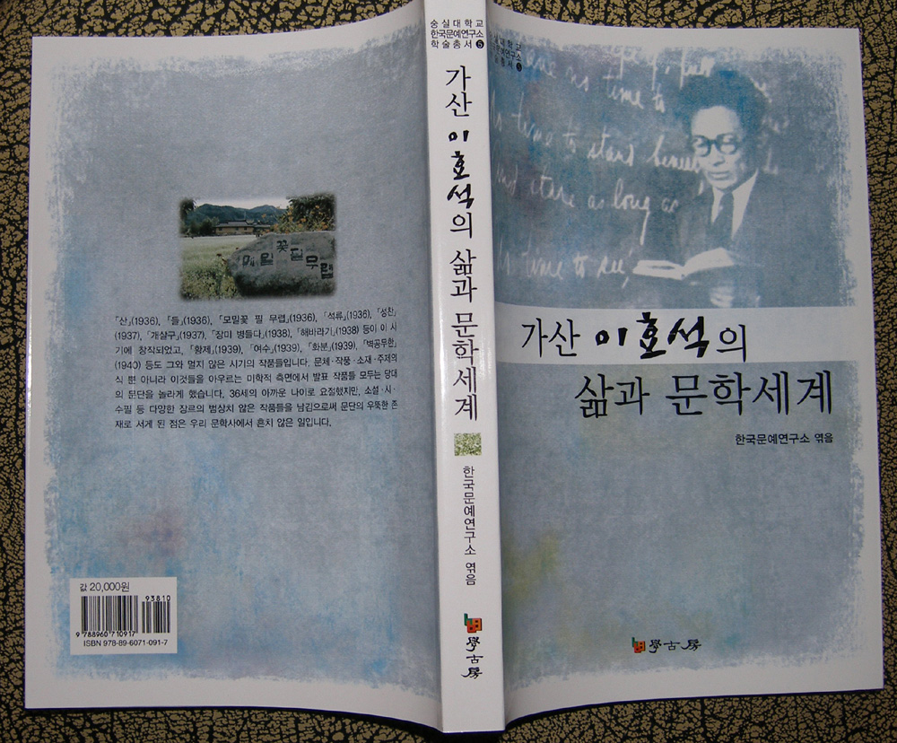

숭실대학교 한국문예연구소의 다섯 번째 학술총서인 『가산 이효석의 삶과 문학세계』가 발간되었다. 이 책은 1934년에서 1938년 폐교될 때까지 숭실에 재직하면서 출세작 대부분을 발표한 가산 이효석 선생의 삶과 문학세계를 14명의 전문 학자들이 조명한 결과다. 가산은 숭실에 있는 동안 「산」(1936),「들」(1936),「모밀꽃 필 무렵」(1936),「석류」(1936),「성찬」(1937),「개살구」(1937),「장미 병들다」(1938),「해바라기」(1938) 등을 창작했으며,「황제」(1939),「여수」(1939), 「화분」(1939),「벽공무한」(1940) 등도 그와 멀지 않은 시기의 작품들이다. 36세의 아까운 나이로 요절했지만, 소설⋅시⋅수필 등 다양한 장르의 범상치 않은 작품들을 남김으로써 문단의 우뚝한 존재로 서게 된 점은 우리 문학사에서 흔치 않은 일이다.   

  
  
이 책의 내용은 다음과 같다.

이효석의 삶과 문학세계의 변천--허명숙(숭실대)

이효석의 맑시즘 비판 논리와 원죄의식--조명기(부산대)

이효석의 미적 자의식에 관한 연구--최익현(선문대)

소설의 심미성과 생태학적 상상력--차봉준(숭실대)

이효석 소설에 나타난 성의 재해석--임은희(한양대)

이효석 소설에 나타난 자연과 성--방민화(법제처)

이효석 소설에 나타난 취미 향유적 신체의 의미--김주리(동덕여대)

이효석의 전향소설에 나타난 신체의 정치학 연구--한민주(서강대)

이효석 소설에 나타난 엑조티시즘과 향토적 서정의 긴장성--김해옥(연세대)

이효석 문학의 연속성과 시문학의 근대적 특질--이민호(서강대)

이효석의 시와 수필 연구--김미영(숭실대)

이효석 평론에 나타난 문학 정체성--엄경희(숭실대)

이효석의 평문 「죤 미링톤 씽그의 극 연구」에 대하여--장원재(경기 영어마을)

이효석 문학 연구의 현황과 전망--이금란(숭실대)

이효석 관련 논저목록--이금란(숭실대)

xml:namespace prefix = o ns = "urn:schemas-microsoft-com:office:office" /

숭실대 한국문예연구소 엮음, 『가산 이효석의 삶과 문학세계』, 학고방, 2008.

공유하기

게시글 관리

**백규서옥\_Blog ver.**