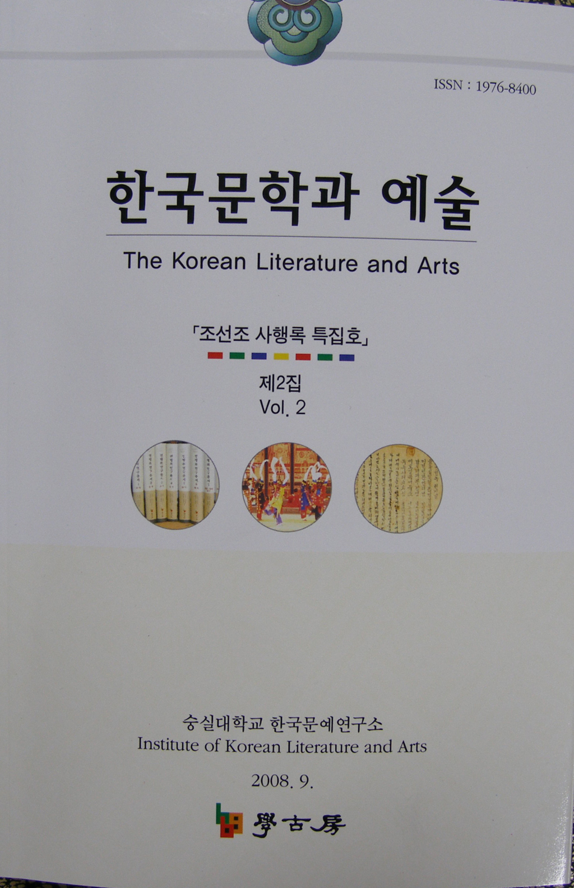

  
 한국문예연구소에서는 학술논문집 『한국문학과 예술』2집을 펴냈다.

1년에 두 번(3월말, 9월말) 펴내는 논문집의 이번 호는 ‘조선조 사행록 특집호’로 제작되었으며, 다음과 같은 글들이 실려 있다.

<논문>

조선조 사행록 텍스트의 본질---조규익(숭실대 교수)

조선조 전반기 대명 사대정책의 사상내인(內因)의 분석---이암(북경 중앙민족대 교

수)

조선조 후기 북학파 문인들의 연행과 한중문인들의 정신적 교유---김병민(연변대

총장)

열린 텍스트로서의 연행록 읽기---김문식(단국대 교수)

외교적 관점에서 바라본 조선 통신사, 그 기록의 허와 실---손승철(강원대 교수)

기록문학으로서의 조선통신사 사행록의 동아시아적 보편성---나카오 히로시(교토

조형예술대학 명예교수)

18세기 말 동서 지성의 해외체험, 성찰의 방향과 그 의미---이혜순(이화여대 명예

교수)

xml:namespace prefix = o ns = "urn:schemas-microsoft-com:office:office" /

<자료소개>

『조천록일운항해일기(朝天錄一云航海日記』

해제--조규익

자료영인

<서평>

시조문학, 이념과 풍류의 연관성-전재강의 『시조문학의 이념과 풍류』: 류해춘(성

결대 교수)

재미있고 쉽게 풀어쓴 이야기 한국음악사-송혜진의 『청소년을 위한 한국음악사』

: 문숙희(한국문예연구소 연구교수)

허위적 세계를 전복시키는 비범한 정신-류종영의 『웃음의 미학』: 엄경희(숭실대

교수)

은밀한 꿈을 길어 올리는 두레박의 시학-엄경희의 『숨은　꿈』: 김인섭(숭실대 교

수)

문학 모티프와 테마를 찾아서-이재선의 『현대소설의 서사주제학』: 김은정(성신여

대 인문과학연구소 전임연구원)

일제말 문인들의 만주인식에 대한 사적 고증의 한 걸음-민족문학연구소의 『일제

말기 문인들의 만주체험』: 차봉준(숭실대 강사)

공유하기

게시글 관리

**백규서옥\_Blog ver.**