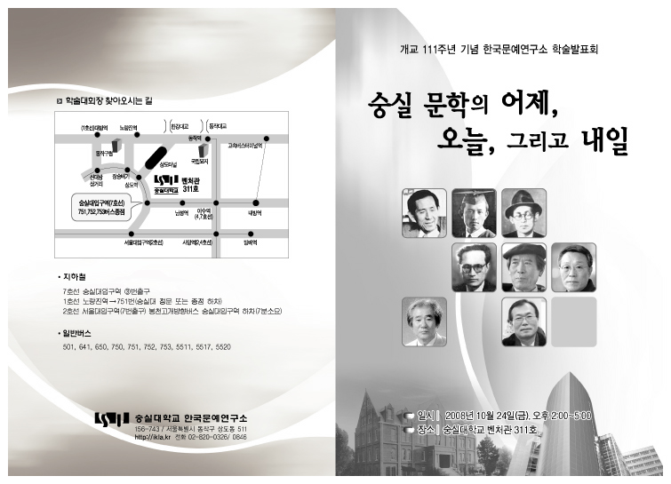
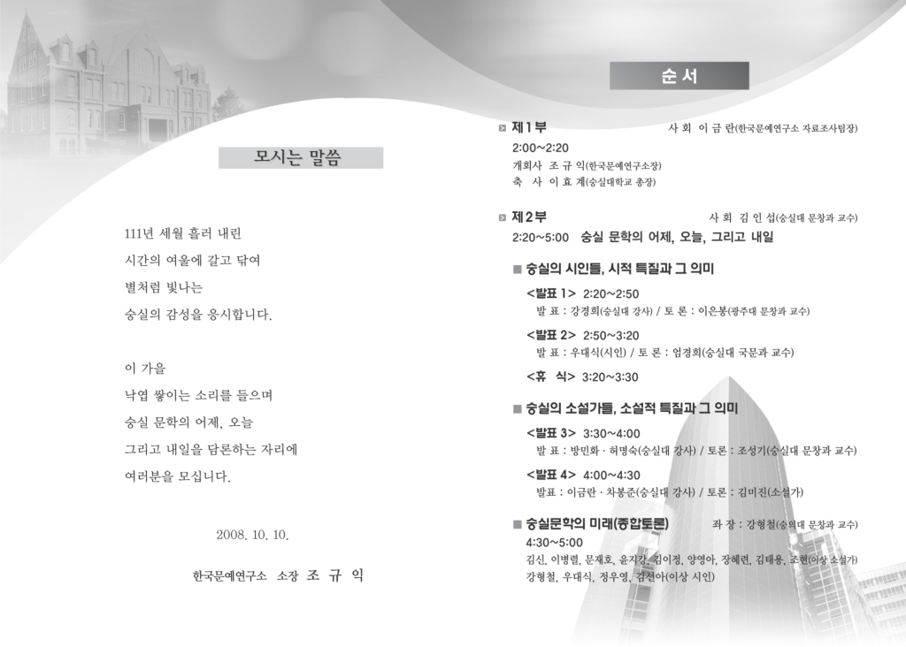

  
  
모시는 말씀  
  
한 잎 두 잎 나뭇잎은 떨어지고,   
시간의 여울도 사정없이 내닫고 있습니다.  
  
떠나는 가을이 못내 아쉬운 이 때,  
선생님을 모신 자리에서  
‘숭실 문학의 어제, 오늘, 그리고 내일’에 관해 담론하고자 합니다.  
  
지성의 전당에 살고 있다고 하면서도  
우리가 언제 함께 모여 고상한 대화를 나눈 적이 있던가요?  
양주동, 황순원, 이효석, 윤동주, 김조규, 김현승 등등...  
별처럼 빛나는 숭실의 감성을 논하는 자리입니다.  
꼭 참석하시어 자리를 빛내주시기 바랍니다.   
  
2008. 10. 21.  
  
한국문예연구소  소장  조규익 드림   
  
  
일시 : 2008년 10월 24일(금) 오후 2시~5시  
장소 : 숭실대학교 벤처관 311호  
\*기타 자세한 사항은 첨부파일 참조.

공유하기

게시글 관리

**백규서옥\_Blog ver.**