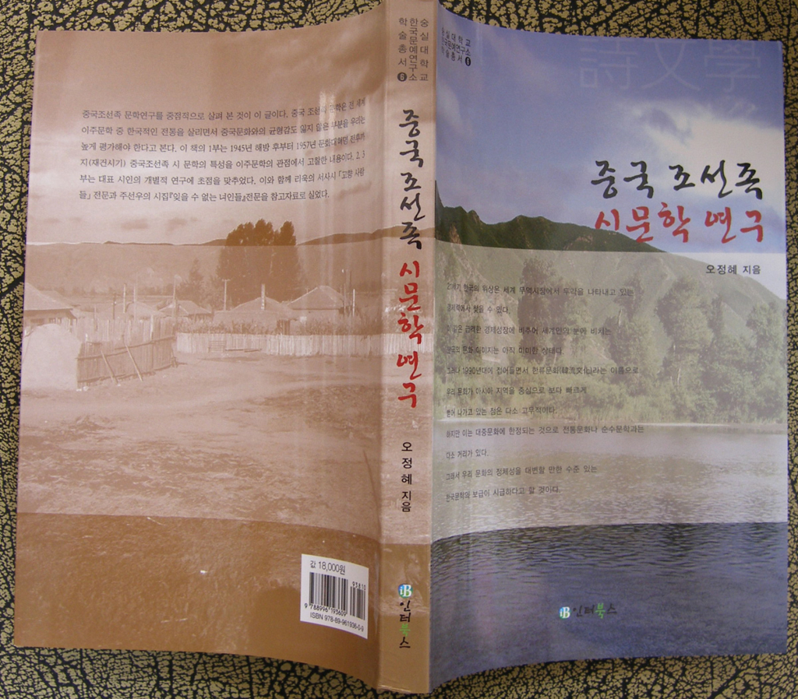

한국문예연구소 학술총서 6 발간!

xml:namespace prefix = o ns = "urn:schemas-microsoft-com:office:office" /

한국문예연구소 학술총서 6 발간!

오정혜 박사의 『중국조선족 시문학 연구』(인터북스, 2008. 12. 20.)가 한국문예연구소 학술총서 6으로 발간되었다. 중국에는 현재 200만에 가까운 조선인들이 거주하고 있으며, 4세까지 출생하여 조선족이라는 이름으로 활약하고 있다. 중국의 조선족이 다른 지역의 한인들과 구별되는 것은 다음의 이유들 때문이다.   
첫째, 한국인으로서의 정체성이 가장 견고하게 남아있다. 이민 2세나 3세들이 대부분 한국어를 유창하게 구사할 수 있고, 문인들의 작품 활동도 대부분 한국어로 이루어지고 있다.   
둘째, 조선족 문학은 중국 내에서 소수민족 문학으로서의 위상이 당당하며 그 입지가 굳다.  
셋째, 조선족 문학은 형식과 내용 면에서 독특한 이민문학으로서의 특성을 가지고 있으나 아직 집중적인 연구가 없었다.  
넷째, 그나마 있는 기존 조선족 문학 연구는 주로 중국문학사 중심으로 이루어졌기 때문에 중국문학과 관련한 양상은 두드러지나 한국문학과의 관련은 구체적으로 논의된 바가 없었다.

이상과 같은 현실적 여건을 바탕으로 이루어진 것이 이 책이다. 이 책은 3부로 꾸며졌는데, 1부(“중국 조선족 시 연구”)에서는 시간적 공간적 차원의 시 의식을 분석했고, 2부(“서사시 『고향사람들』속에 나타난 리욱의 시의식”)에서는 시인 리욱의 시를 중심으로 “이중 층위의 인물 구성에 따른 역할”, “‘고향사람들’ 속에 나타난 리욱의 시의식” 등을 분석함으로써 한국인의 디아스포라를 해명했다. 3부(“『잊을 수 없는 녀인들』에 담긴 욕망의 양상”)에서는 욕망의 구조와 의식의 양상을 중심으로 주선우의 작품들을 분석했다.   
책의 말미에는 『고향사람들』과 『잊을 수 없는 녀인들』을 자료로 들어 놓았다.   
상당수의 중국 조선족들이 국내로 들어와 각종 업무에 종사하고 있는 요즈음, 이 책은 민족적 동질성을 찾는데 큰 도움이 되리라 생각한다.   
               
                                                           인터북스 간, 값 18000원.

공유하기

게시글 관리

**백규서옥\_Blog ver.**