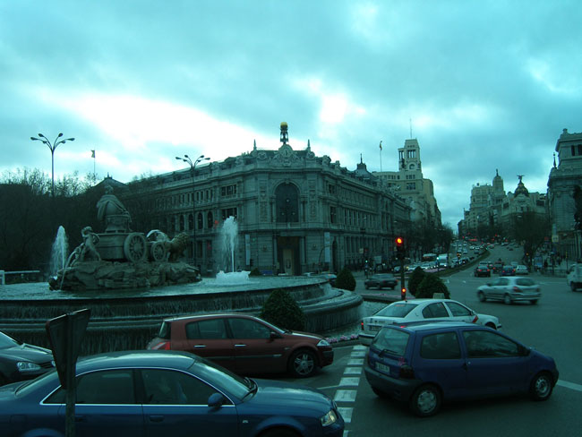
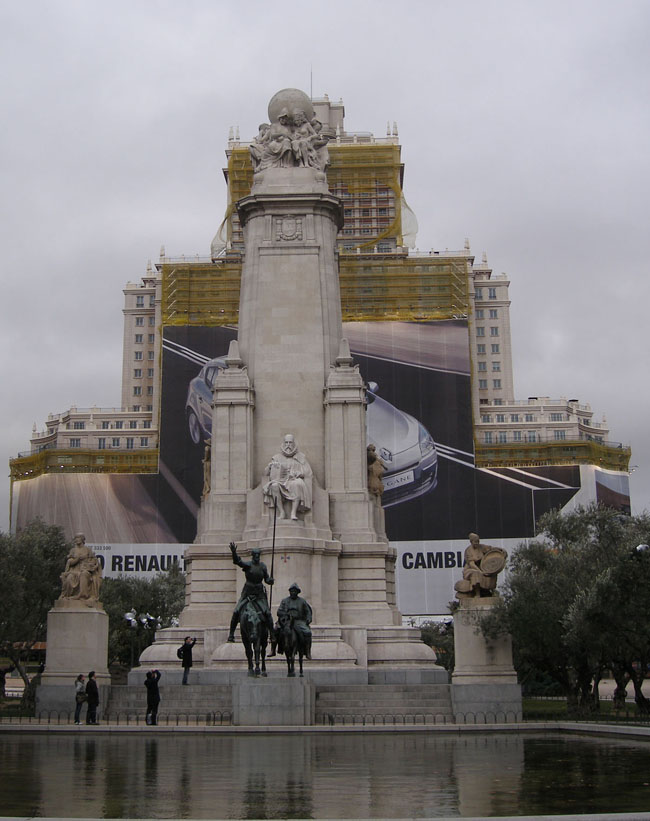
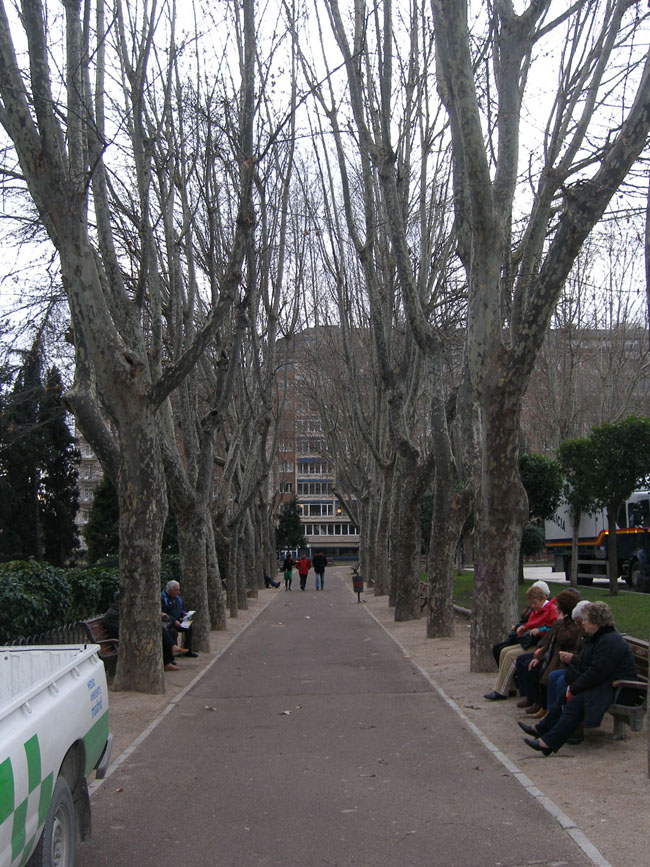

스페인과의 첫 상봉, 돈키호테를 만나다

아침 8시 40분 인천공항을 출발, 암스테르담 국제공항에 도달한 것이 유럽시각으로 오후 12시 34분. 12시간의 먼 거리였다. 2시에 암스테르담을 떠나 4시 30분에 드디어 마드리드 바라하스 국제공항에 도착했다. 서울로부터 무려 15시간이나 걸린 장도였다. 하늘은 잔뜩 흐려 있지만 바람은 매섭지 않았다. 바로 며칠 전에 눈이 쌓이고 한파가 맵게 몰아쳤다는 말을 믿을 수 없을 정도였다. 착륙 직전 비행기 창밖으로 내려다보이는 공항 주변의 마을들이 그림처럼 아름다웠다. 유럽을 돌면서 나를 주눅들게 했던 아름다운 건축들의 추억이 아프게 되살아났다. 드디어 천재 건축가 가우디의 나라에 온 것인가.

                                <어두워지기 시작한 마드리드 시가지>  
   
600만의 대도시 마드리드. 재작년 대비 35%나 감소할 만큼 경기가 바닥을 치고 있다지만, 그래도 마드리드는 문화가 살아 숨 쉬는 현장이었다. 아토차 역을 지나 프라도 미술관, 솔광장 등을 지나 사바티니 정원, 바일렌 거리를 지나 스페인 광장에 도달했다. 스페인 광장에서 산호세 교회 앞까지는 대략 1.3km에 달하는 그란비아(Gran Via), 말 그대로 ‘대로(大路)’가 펼쳐져 있었고, 이곳이 마드리드 구시가의 중심이었다.

 왕궁으로부터 멀지 않은 곳에 원형지붕을 지닌 엄청난 자태의 산프란시스코 엘 그란데 성당이 좌정하고 있었다. 바일렌 거리와 만나는 마요르 거리(Calle Mayor)를 따라가니 마드리드 시청사, 시장 관사 등으로 빽빽이 둘러싸인 광장이 나왔다. ‘마요르’란 시장(市長)을 뜻하는 ‘메이요(mayor)'에서 나온 말이나 아닐까 상상해 보았다. 톨레도 거리와 마요르 거리가 만나는 곳의 남동쪽에는 마요르 광장이 있었다. 마요르 광장에서 길을 따라 동쪽으로 가니 솔광장이 다시 나왔다. 솔광장으로부터 알카라 거리를 따라 동쪽으로 가니 왕립 산 페르난도 미술 아카데미가 등장했다. 국회의사당과 이코 미술관 등은 그로부터 멀지 않은 곳에 자리잡고 있었다. 산 페르난도 미술아카데미로부터 알카라 거리를 거쳐 약간 동쪽으로 이동하니 다시 그란비아와 합쳐지는 것이 아닌가. 그로부터 멀지 않은 곳에 시벨레스 광장도 있었다. 그러고 보니 우리는 그리 넓지 않은 곳을 한 바퀴 돈 셈이었다.

 그러나 어둑발이 들 무렵, 그란비아가 시작되는 곳의 스페인 광장은 처음 만나는 마드리드에서 무엇보다 감동적인 공간이었다. 형형한 눈빛의 돈키호테가 장창을 꼬나든 채로 날아오를 듯 기세가 등등했다. 옆엔 나귀를 탄 산초 판사가 그 반대쪽엔 연인 둘시네아가 돈키호테를 옹위한 채로 서 있었고, 돈키호테의 뒤로 세르반테스가 금방이라도 일어설 듯 앉아 있었다. 세르반테스 서거 300주년을 기념하여 제작되었다는 이 기념비는 스페인 빌딩을 배경으로 하고 있으며, 왼쪽에는 마드리드 타워가 서 있었다.

                        <스페인 광장의 세르반테스 기념탑>  
   

                          <스페인 광장 앞의 플라타너스 길과 노인들>  
  
어릴 적 만난 돈키호테는 촌놈인 내게 스페인에 대한 무한한 상상의 날개를 달아준 적이 있었다. 소에게 풀을 뜯기러 찾아간 바닷가 백사장의 햇살 따가운 모래밭에 누워서 누군가가 번역한 <<동키호테>>를 읽었다. 책장이 닳아 없어질 정도로 읽어도 읽어도 다함없는 재미가 샘솟았다. 오늘 그 스페인에 온 것이다. 3년 반 전 자동차로 유럽을 돌다가 그만 ‘초읽기’에 몰려 눈물을 머금고 포기해야 했던 스페인이다. ‘말꼬리에 붙어 천리 간다는 파리’처럼 나도 수준 높은 일행의 꽁무니에 슬그머니 붙어 만리 장도 스페인을 밟았으니, 열 두어 살 시절 촌놈의 꿈을 지금서야 이루는 셈이다.

 오늘 밤엔 꿈이나 거창하게 꾸어볼 일이다. 스페인이여, 부디 내 품에!

공유하기

게시글 관리

**백규서옥\_Blog ver.**