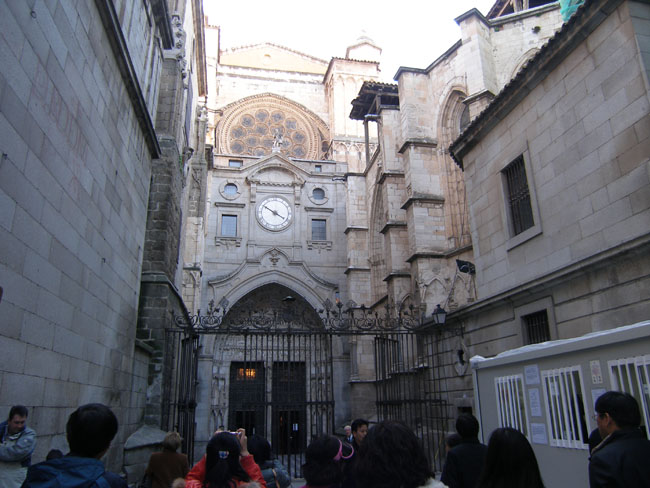
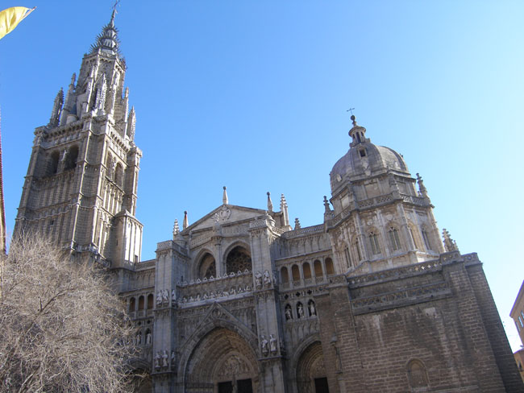
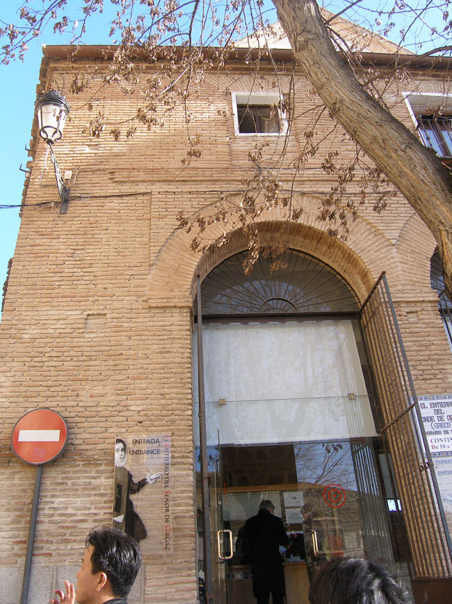
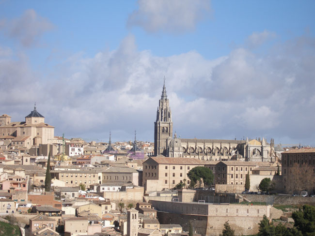
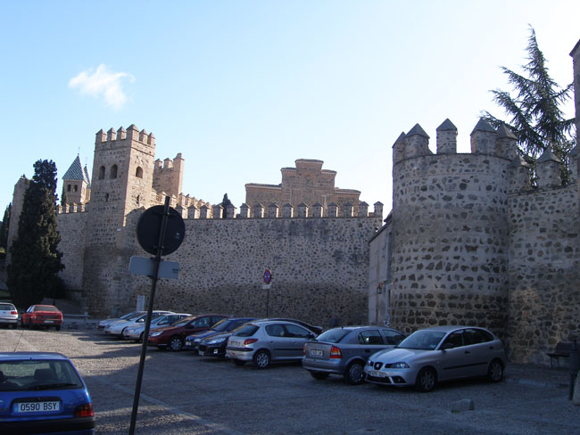
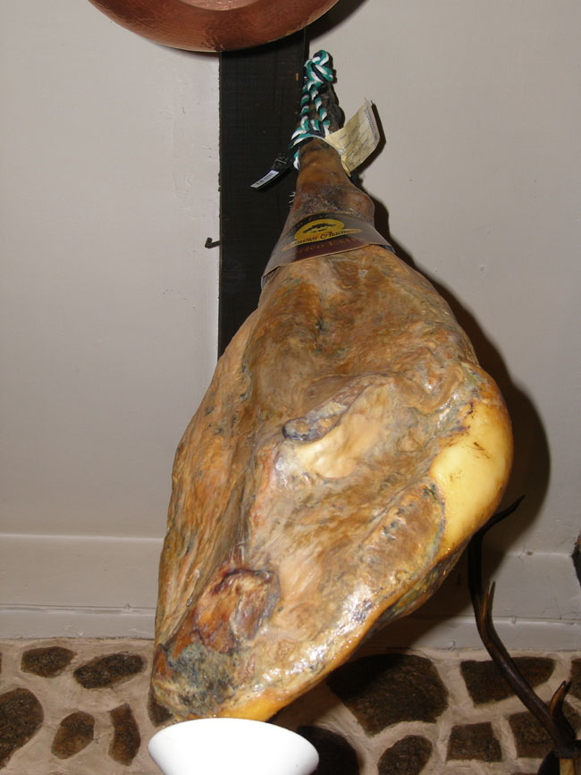

스페인 기행 2-1 : 똘레도의 감동, 그리고 질기게 따라붙는 동키호테

1월 24일. 호텔 레스토랑에서 이른 아침을 먹고 똘레도로 출발했다. 인구 6만 정도의 소도시이지만, 한때 마드리드를 위성도시로 거느리던 스페인의 수도였다. 이슬람 시절에 쌓아올린 가파른 성벽을 금대(襟帶)처럼 타호강이 에둘러 흐르고, 복잡한 시가지 안에는 고급 문화유산으로 그득했다. 스페인이 보유한 유네스코 지정 세계문화유산은 대충 헤아려도 39점이나 된다. 그 중 35점이 문화유산, 2점은 자연유산, 그리고 나머지가 복합유산이다. 이곳 똘레도는 시가지 전체가 문화유산이다.

                   <위는 똘레도 대성당의 대시계문, 아래는 정면>  
  
마드리드에서 버스에 오르니 1시간 10분 만에 똘레도의 웅장한 성채가 눈에 가득 들어왔다. 좁은 언덕길에 올라 버스에서 내리니 붉은 색 벽돌집들이 골목에 빽빽했다. 타호강은 허리띠 혹은 오그린 두 손바닥처럼 사람들의 삶과 온갖 문화유산들을 감싼 채 흐르고 있었다. 그 가운데 굵직한 것들만 꼽아도 대성당, 엘그레코 산또 토메 교회, 산후안교회, 의사당, 산타크루즈 미술관, 알카사르 요새 등등 숨이 차오를 정도. 우리가 찾은 곳은 대성당과 엘그레코 산또 토메 교회였다.

                    <엘 그레코 산토 또메 교회>  
  
 예상대로 대성당은 똘레도의 중심에 있었다. 대성당을 중심으로 광장이 이루어져 있고 그 주변에 상가와 주택가가 질서정연하게 늘어서 있는 모습은 유럽의 다른 나라들에서 확인한 대로였다. 똘레도가 이슬람의 지배로부터 벗어난 것을 기념하기 위해 1227년 페르디난도 3세가 착공하여 1493년 알폰소 8세가 완성한 전형적인 고딕식 건축물이 대성당이다. 길이 120m, 폭 60m의 어마어마한 규모에 아연할 수밖에 없었다. 정면에는 하늘을 찌를 듯이 90여m의 두 탑이 세워져 있고, 그 안에 18톤에 달하는 종이 매달려 있다 한다. 수리 중이라 들어갈 수 없는 이 탑은 스페인이 낳은 위대한 화가 엘 그레코의 아들 조르쥬 마누엘(Gorge Manuel)이 세웠고, 내부의 프레스코화나 스테인드 글라스 등은 엘 그레코와 고야 등 거장들의 작품이라고.

 수리 공사 중인 정문으로는 들어갈 수 없었고, 뒤쪽의 대시계문(Puerta del Reloj)으로 입장한 우리는 장엄한 내부에 또 한 번 놀라게 되었다. 내진(Capilla Mayor), 성가대석(Coro), 참사회 회의실(Sala Captular), 보물 보관실(Tesoro), 성구실(Sacristia), 예배당(Capilla), 회랑(Claustro) 등으로 이루어진 내부는 고전적이면서도 화려했다. 스페인 천주교의 중심인 수석 대교구 성당이 바로 이곳이었다.

 성구실에는 엘 그레코의 <성의의 박탈>, 고야의 <그리스도의 체포>, 모랄레스의 <슬픔의 성모> 등 대작들이 전시되어있어 질적으로 큰 미술관에 못지않았다. 그 옆의 의상실에는 중세 성직자들이 입었던 수직(手織)의 화려한 미사복들이 전시되어 있는데, 역사와 시간을 뛰어넘은 그 모습이 우리에게 큰 감동으로 다가왔다.

 소예배당의 보물 보관실에 전시된 성체 현시대는 또 하나의 놀라운 물건이었다. 금은보배로 장식된 구조물이 대성당에 생명을 불어넣고 있었다. 성현일에 이 성체 현시대를 둘러메고 거리를 순례하는 행사는 지금도 반복된다니, 놀라운 일이다.

 대성당을 나온 우리는 꼬불꼬불한 골목길들을 돌아 산또 토메 성당으로 갔다. 엘 그레코의 명화 <오르가스 백작의 매장>을 친견하기 위해서였다. 이 성당을 재건한 오르가스 백작. 그의 장례식에 아우구스티누스 성인과 스테파노 성인이 오르가스 백작의 시신을 안장하는 모습, 그 뒤에 배열한 참배객들의 슬픈 표정들, 정면을 응시하는 화가 자신의 모습, 그림의 뒤쪽에 천국에서 예수와 성모 마리아가 백작의 영혼을 맞이하는 모습 등 매우 인상적이며 감동적이었다. 한 사람의 죽음을 둘러싸고 천국으로부터 두 성인이 강림하고, 하늘나라에서 예수와 성모 마리아가 죽은 자의 영혼을 영접하는 모습 등은 오르가스 백작의 죽음을 둘러싸고 일종의 기적을 염원하는 독실한 신심의 발현이라 아니할 수 없었다. 오르가스 백작이 재건한 산토 또메 성당은 이 그림이 있어 생명력을 갖게 되었다고 할 수 있을까.

똘레도는 중세정신이 살아있는 보물 창고였다. 성채를 빠져나와 바라보니, 타호강 너머에 앉아있는 똘레도 자체가 하나의 요새요 금성철벽이었다. 사실 똘레도의 존재를 전투와 관련시키려면 알카사르 요새를 들지 않을 수 없다. 1538년 카를로스 1세에 의해 개축이 시작하여 1551년 요새의 원형이 이루어졌고, 1936년 스페인 내란 당시 프랑코 파의 주둔지가 되었던 곳. 프랑코파가 인민 전선군에 강하게 저항하던 곳이 바로 알카사르 요새였던 만큼 똘레도는 종교와 함께 정치, 군사적으로 의미가 큰 지역이었다. 우리는 그곳에서 스페인 역사의 영욕을 발견할 수 있었다.

점심으로 하몽(돼지 넓적다리를 염장한 식품)을 먹은 식당 라 쿠바나는 타호 강을 경계로 똘레도 요새의 맞은편에 있었다. 딱딱하고 맛깔스러운 스페인 빵과 짭짤하고 고소한 하몽 한 점으로 스페인 역사의 질곡을 맛보게 되었다면, 과장인가.

공유하기

게시글 관리

**백규서옥\_Blog ver.**