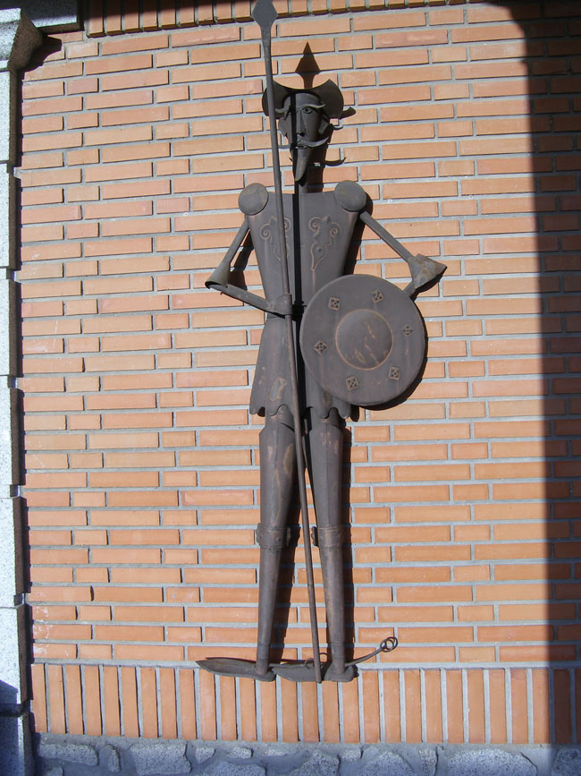
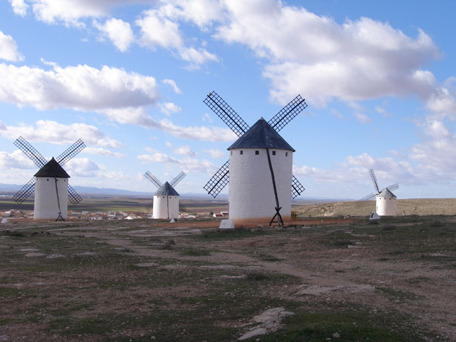
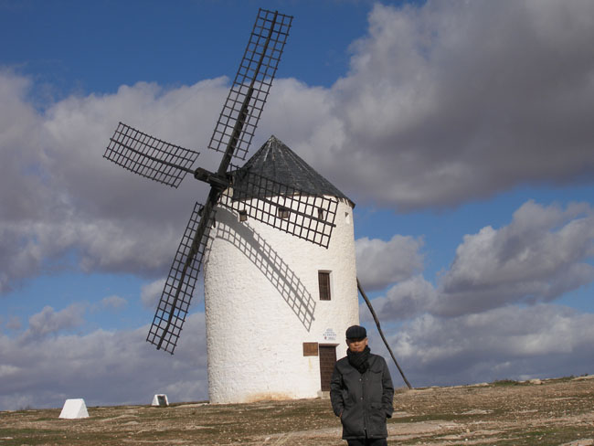
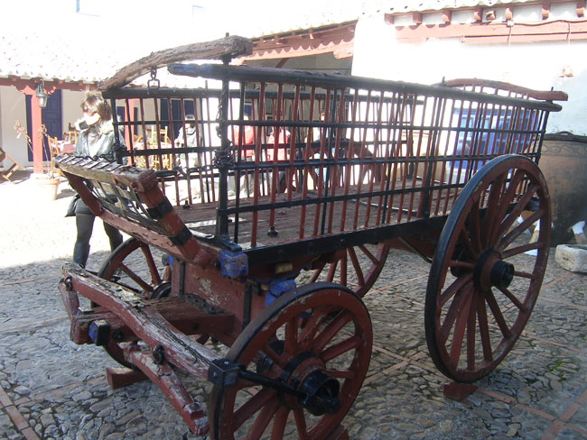

똘레도를 출발하여 그라나다로 향하는 길. 드넓은 스페인의 평원이 펼쳐지고 있었다. 가도 가도 산하나 보이지 않는 평원이었다. 들판은 정연하게 늘어선 올리브 나무들. 뿌리와 꼭지만 남아 새 계절의 발아(發芽)를 꿈꾸는 포도나무들, 장미의 농원, 그리고 푸른 보리밭이 전부였다. 과연 스페인은 농업의 대국, 풍요가 땅 전체에서 넘쳐 났다. 면적 505,955평방킬로미터, 남한 면적의 약 5배에 달하면서도 인구는 4,350만명에 불과했다. 1인당 연평균 소득 3만 5, 6천불에 이르는 부국의 기틀이 이처럼 평평하고 기름진 땅에서 이루어졌음을 깨달을 수 있었다.

 이 구역이 바로 라만차 지방. 돈키호테의 고향이었다. ‘건조한 땅’을 이르는 아라비아어 ‘라만차’. 작은 나라 대한민국 백규의 눈에는 부럽기 짝이 없었으나, 보기에 따라서는  황량할 수도 있었다. 그러나 곳곳에 심은 올리브 나무들은 이곳의 황량함을 덜어주고 있었다. 이곳을 배경으로 돈키호테라는 캐릭터를 만들어 시대와 사회에 무언가를 말하고자 한 세르반테스(1547~1616)의 의중이 라만차를 달리는 내내 내 가슴에 잔잔한 감동을 일으켰다. 그가 태어나 활약하던 시기는 이미 중세가 끝난 시점이었으나, 아직도 구체제가 남아 세력을 발휘하던 때가 아니었을까. 세르반테스로서는 새로운 질서를 갈망하는 민중들의 요구와 시대정신을 외면할 수 없었으리라. 돈키호테라는 정신 나간 인물을 등장시켜 구체제의 시대착오적 허구를 통렬히 웃어주고 싶었던 게 아닐까.

        <휴게소 벽에 붙어 있는 동키호테>  
  
 버스를 타고 지나다가 풍차마을을 만났다. 캄포 데 크립타나(Campo de Criptana)! 복잡한 마을 이름이었으나 언덕 위엔 10개 정도의 풍차들이 서 있었다. 언덕에 올랐다. 거대한 풍차였으나, 이미 맥박은 정지되어 있었다. 그러나 언덕에 불어대는 바람은 사정이 없었다. 바람은 모자를 날리고 입을 얼려, 말을 이룰 수 없었다. 아, 이 바람. 이런 바람이라면 그 옛날엔 웅웅거리며 이 거대한 풍차를 돌릴 수 있었겠다! 어둑발이 내린 평원 저쪽을 걸어오던 돈키호테에게 언덕 위에서 소리 내며 돌아가는 풍차는 아주 도전적인 존재로 등장했을 수도 있을 것이다. 그래서 장창을 비껴들고 풍차에 달려든 것 아닌가.

 바람의 등쌀을 견디지 못하고, 풍차 아래쪽의 작은 카페에 들러 커피 한 잔에 언 몸을 녹이며 라만차의 아랫마을을 내려다보았다. 옹기종기 모여 사는 그들이 정겨웠다. 저 동네 어느 골목에선가 로시난테에 몸을 맡긴 돈키호테가 산초 판사를 대동하고 뛰어나올 것만 같다. 아니나 다를까 시내에는 요소마다 돈키호테의 상이 서 있었다. 소설 <<돈키호테>>로 밥을 먹고 사는 사람들이라 해도 과언이 아닐 듯싶었다.

 캄포 데 크립타나로부터 차를 달려 30분 만에 도착한 곳이 푸에르토 라피세(Puerto Lapice). 이곳에서 ‘벤타 델 키호테’를 만났다. ‘돈키호테의 정자’로 번역되는 이름의 허름한 주막 겸 레스토랑이었다. 돈키호테가 대관식을 가진 곳이 바로 이 집이라는 것. 우물도 있고, 장창을 곧추 잡은 돈키호테도 서 있었다. 가게에는 돈키호테의 캐릭터 상품들이 그득했다. 돈키호테를 뜯어먹고(?) 사는 스페인 사람들이었다. 세르반테스와 돈키호테를 갖고 있는 스페인과 스페인 사람들이 새삼 부러웠다.

공유하기

게시글 관리

**백규서옥\_Blog ver.**