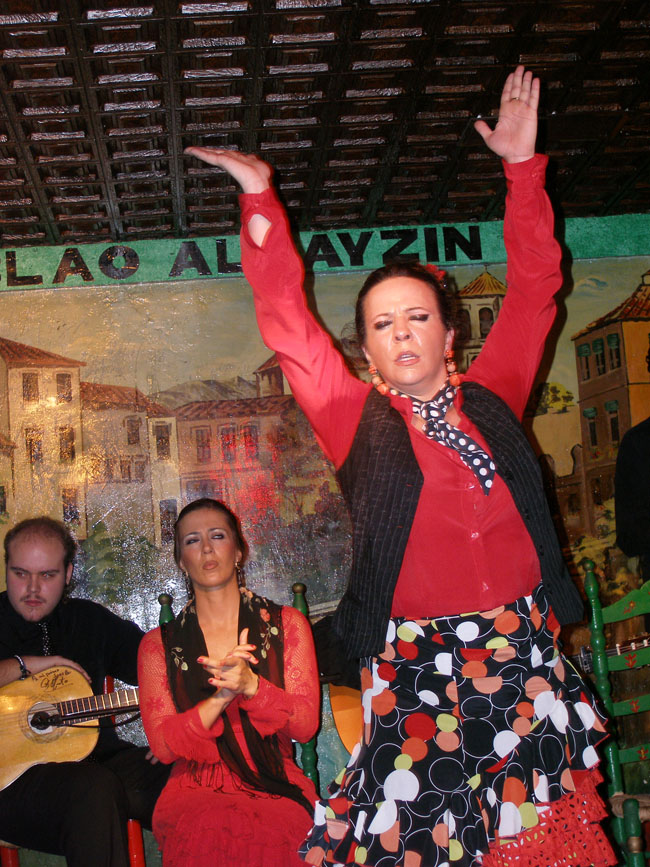

돈키호테와 작별한 우리는 끝없는 평원을 달려 시에라 네바다 산맥을 넘었다. 산맥의 정상엔 희끗희끗 눈이 덮여 있었다. 분지형의 비옥한 땅, 그라나다. 로마제국과 이슬람 왕조의 마지막 수도였던 곳이다. 시내는 화려하고 복잡했으며, 호텔에는 관광객들이 득실거렸다. 점점 지중해에 가까워지기 때문인가, 날씨도 온화했다. 여기서 밤늦게 플라멩코를 보기로 했다. 알바이신 지역의 따블라오 플라멩코 공연장을 찾았다. 200에 가까운 객석이 가득 찬 가운데 두 명의 악사와 두 명의 가수, 그리고 세 명의 무희가 등장했다. 손바닥 만한 무대에서 혼신의 힘을 다해 춤을 엮어나가는 세 여인은 말 그대로 정열의 화신이었다. 가까이서 그녀들의 땀방울을 맞아가며 추임새 ‘오레~’를 연발하는 관객들 역시 그녀들과 혼연일체가 되어 열광했다. 두 시간 동안 쉼 없이 관객들을 오르가슴의 세계로 이끌어간 무희들의 힘은 어디에서 나오는 것일까. 단순히 춤의 기교로만 설명될 것은 아니다. 무대가 파하고 흩어져 가는 사람들의 뒷모습을 보면서 비로소 자연과 인생, 역사와 전통이 함께 어우러진 예술의 정수가 바로 플라멩코임을 깨닫게 되었다. 스페인에 발을 들여 놓은 뒤 나는 처음으로 스페인 문화의 알맹이 하나를 입에 물 수 있었다.

우리의 닫힌 가슴을 열고, 오레~!!!

공유하기

게시글 관리

**백규서옥\_Blog ver.**