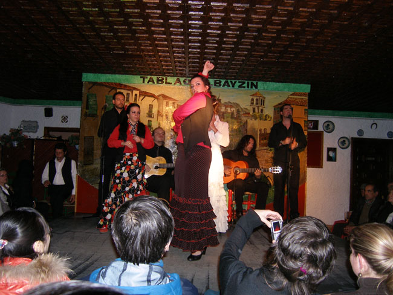
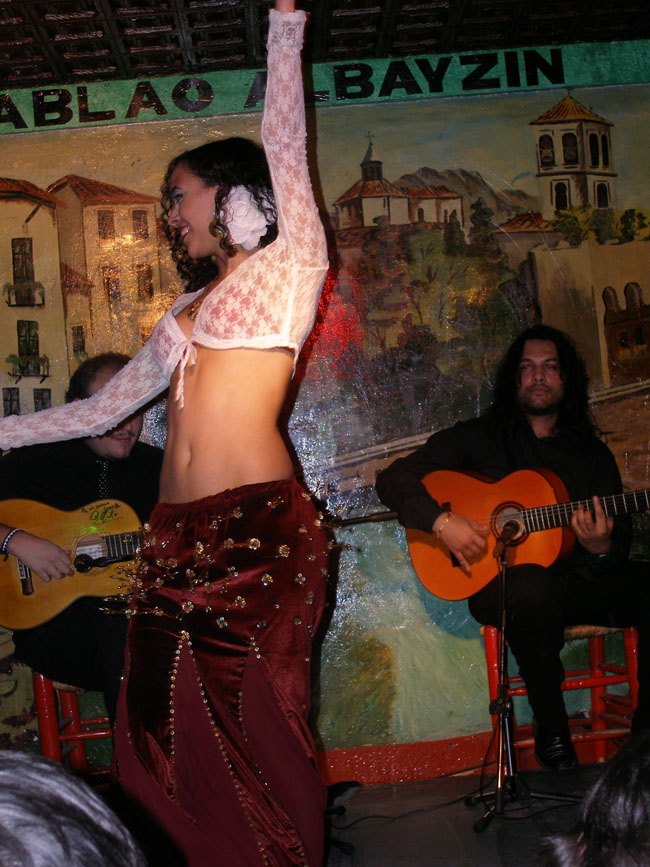

2009년 1월 24일 저녁에 도착한 그라나다. 지중해로부터 40분 정도의 거리에 위치한 이 도시는 어둠 속에서도 화려했다. 도착하자마자 호텔 식당에서 대충 저녁을 때운 우리는 플라멩코 공연장으로 직행했다. 알바이신 지역의 따블라오 공연장. 허름하고 좁좁한 공연장이 정겹긴 했으나 삐걱대는 의자가 불편했다. 그러나 바로 눈앞에 설치된 한 두 평쯤의 나무 무대, 그곳을 적시는 무희들의 열정과 땀방울은 우리를 환희의 도가니로 몰아갔다.

                <관객들을 무아지경으로 인도하는 플라멩코 무희의 정열>  
   
남성 가수 두 사람은 가늘면서도 찢어질 듯 높은 목소리로 플라멩코의 서사를 노래했고, 기타리스트 두 사람은 애절한 톤으로 쉬지 않고 현들을 뜯어댔다. 무엇보다 감동적인 것은 네 사람의 무희들. 셋은 함께 나와 번갈아가며 플라멩코를 추었고, 앳되면서도 가냘픈 동남아계 아가씨가 혼자 나와 밸리댄스를 추었다. 혼신의 힘을 다해 추는 플라멩코와 밸리댄스를 보면서 몸 속 깊은 곳에 숨어 있던 육감의 본능이 스멀스멀 살아나오는 것은 나만의 경험이 아니었으리라. 아름다운 플라멩코 무희들이 얼굴의 근육을 일그러뜨리면서 정열의 활화산을 터뜨리는 모습에 우리 모두는 전율을 금할 수 없었다. 그 춤사위에 피로가 풀리기도 하고, 또 다른 피로는 쌓여만 갔다.

       <아름다운 밸리댄스의 춤사위>

공유하기

게시글 관리

**백규서옥\_Blog ver.**