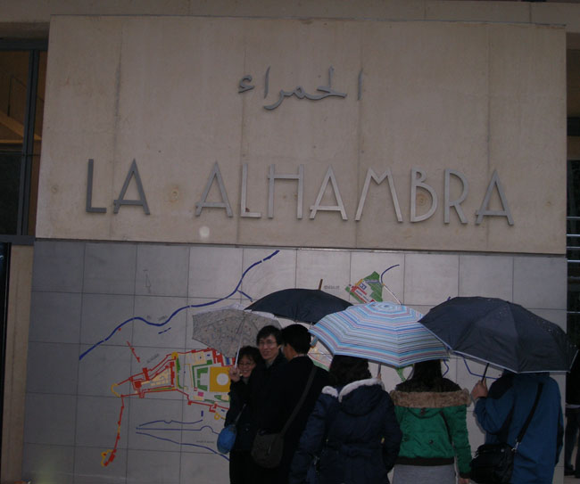
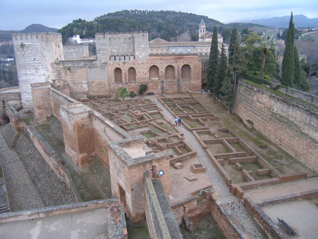
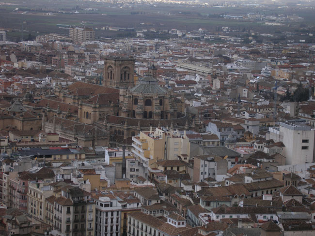
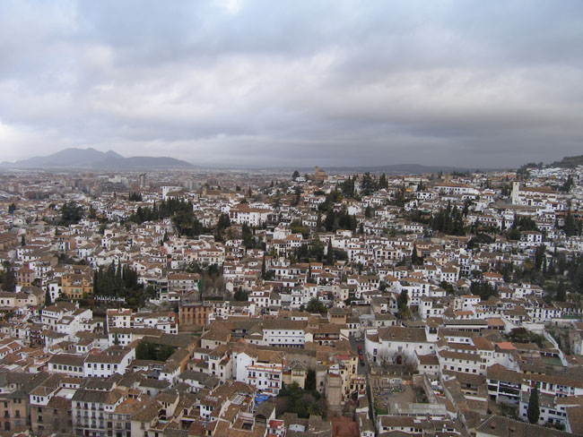

다음 날 호텔에서 이른 아침을 먹은 다음 서둘러 나간 곳이 이번 여행의 꽃인 알함브라 궁. 멀리 보이는 시에라 네바다 산맥엔 비구름이 걸려 있고, 나그네의 외투 깃으로 빗방울이 파고들었다. 과연 알함브라는 이슬람 문화의 정수였다. 가이드는 산책하는 기분으로 알함브라를 느껴보라 했지만, 알함브라에 엉겨있는 역사의 고비들이 너무 복잡하여 나그네의 마음은 편치 않았다. 워싱턴 어빙(Washington Irving)이 미국 공사관의 자격으로 마드리드에 재직하던 중 알함브라 궁에 머물면서 무어(Moor)인들의 전설을 기록한 <<알함브라 이야기(Tales of the Alhambra)>>에 넘쳐나는 낭만적 상상으로도 이미 지쳐있는 우리였다.

         <알함브라궁의 출입구에 모여선 관광객들. 이 날 비가 내리고 있었다>  
   
13세기 전반, 옛날부터 존재하던 알카사바를 확장하면서 궁궐의 건축이 시작되었고, 14세기 후반에 이르러서야 알함브라는 현재의 모습을 드러냈다. 왕궁, 카를로스 5세 궁전, 알카사바, 헤네랄리페(General Life)으로 구성된 알함브라.

        <알카사바에서 내려다 본 창고 터, 무기고 터, 군사들의 숙소 터>  
  
 우리는 전망대를 빼곤 흔적만 남은 알카사바에 맨 먼저 올랐다. 벽채의 반 이상이 날아가고, 아래쪽 흔적만 남은 공간들이 바둑판처럼 하늘을 향해 입을 벌리고 있었다. 그라나다 왕국의 무하마드 1세가 9세기에 이미 존재하던 성채를 정비․확장한 곳이다. 군인들의 막사, 식량창고, 목욕탕 등이 흔적만 남아 있었다. 아주 짧은 시간이었지만, 우리는 저 멀리로 시에라 네바다 산맥이 보이고 가까이는 민간 가옥들의 내부까지 훤히 들여다보이는 벨라탑(Torre de Vela)의 전망고 그 아름다움을 만끽했다. 시에라 네바다의 정상에 덮인 흰 눈처럼 왕궁 근처 민가들의 벽채도 모두 새햐얀 모습을 하고 있었다. 헤네랄리페~알바이신 지구, 사크로몬테 언덕, 그라나다 중심부 등이 이곳에선 한눈에 내려다 보였다.

   <촛불의 탑에서 내려다 본 그라나다 대성당>

     <촛불의 탑에서 내려다 본 그라나다 민가들>

공유하기

게시글 관리

**백규서옥\_Blog ver.**