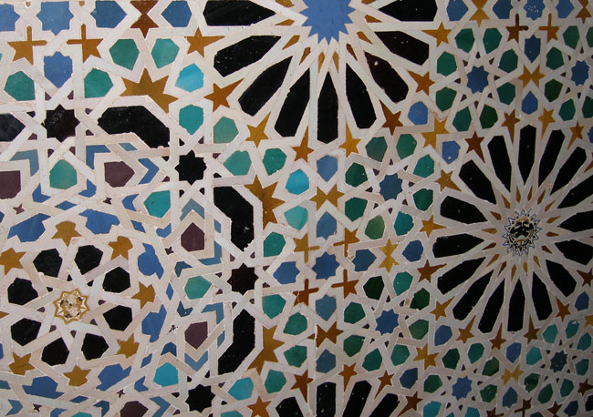
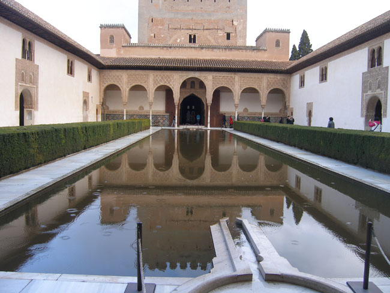
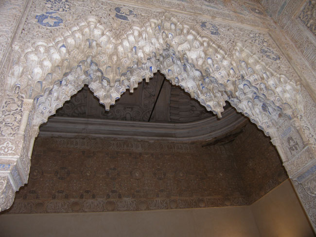
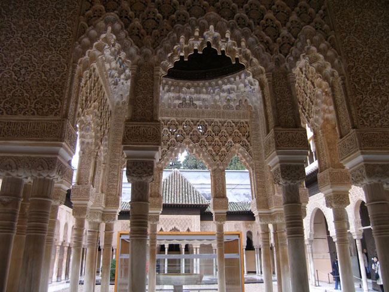
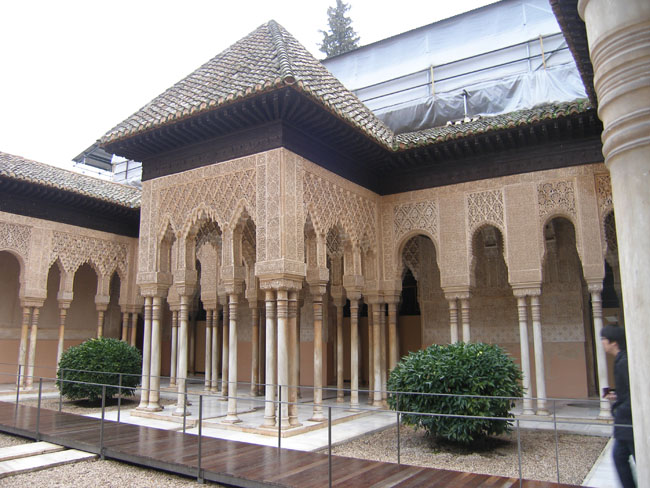
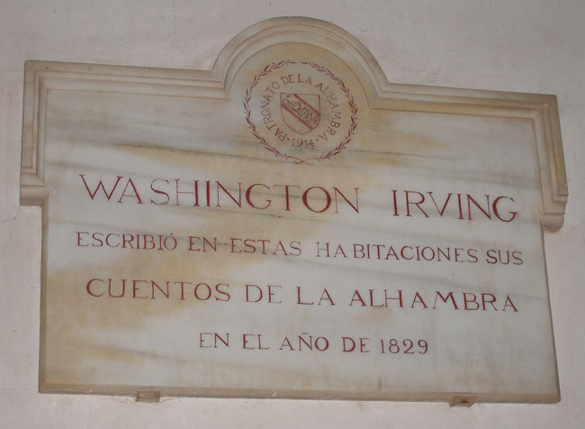

나자리 왕궁은 이슬람 문화의 정수였다. 메수아르의 방(Sala del Mexuar)을 출발하여 헤네랄리페에서 우리의 관람은 끝이 났다. 메수아르의 방은 술탄이 집무도 하고 예배도 보던 방으로 사면의 벽이나 천정이 아라비아 문양의 타일로 덮여 있었다. 이슬람 문화에서 시작되어 중국의 도자기 문화와 만나 더욱 고급화 된 것이 타일이다. 이 방에서 아라야네스 중정(Patio de los Arrayanes)으로 나가니 양 옆으로 향내 그윽한 아라야네스가 심어진 직사각형(남북 35m, 동서 7m)의 연못이 나오는데, 작은 원형의 분수가 설치되어 있었다. 이곳의 조경에는 단 한 명의 노예도 동원되지 않았을 만큼 민폐를 끼치지 않은 역사(役事)였다는 점이 이채로웠다. 타지마할 등 동서의 건축술이 만나 이루어진 것이 이 왕궁이었던 만큼 노예들의 노역(勞役)이 그다지 달갑지는 않았을 것이다. 이처럼 이곳 연못은 부와 권력의 상징이었다.

           <알함브라의 아름다운 타일 문양>  
  

     <아름다운 아라야네스 중정>  
  

     <아름다운 타일 문양>  
   
7개의 아름다운 아치 앞에는 정사각형의 공간인 대사의 방이 있었다. 술탄이 외국사절들을 알현하던 장소로서 그림 타일의 벽면, 상감 공예의 천장, 바닥 등 아라베스크 문양으로 덮인 곳이었다. 그곳에서 나가니 사자의 중정(Patio de los Leones)이 나타난다. 이곳은 술탄을 제외한 남성들의 출입이 엄격히 제한되어 있던 하렘 구역이었다. 정교한 석회세공과 유대인의 12부족을 상징하는 열두 마리의 사자가 받치고 있는 원형분수가 눈길을 잡았다. 사자의 궁전을 나서자 파르탈 정원(Jardines del Partal)이 앞길을 막아선다. 연못 주위로 꽃과 나무들이 서 있고, 연못에는 귀부인의 탑이 서 있으며, 두 자매의 방과 그 주변의 아름다운 장식들은 우리의 눈을 사로잡았다. 술탄이 가장 사랑했던 카톨릭의 두 자매를 위한 방으로, 그들의 위한 사랑의 글귀가 새겨져 있었으며, 모카라베스 양식으로 건축되어 있었다.

   <하렘 구역의 아름다운 열주들>  
  

    <하렘 구역의 아름다운 열주들>  
  

     <워싱턴 어빙 집필실의 표지판>

공유하기

게시글 관리

**백규서옥\_Blog ver.**