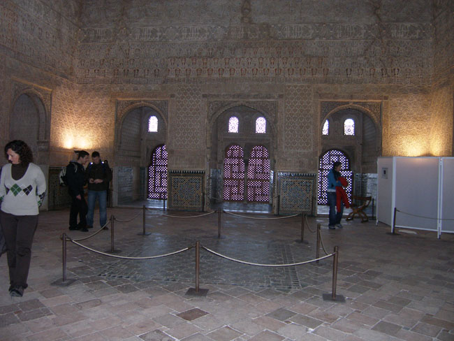
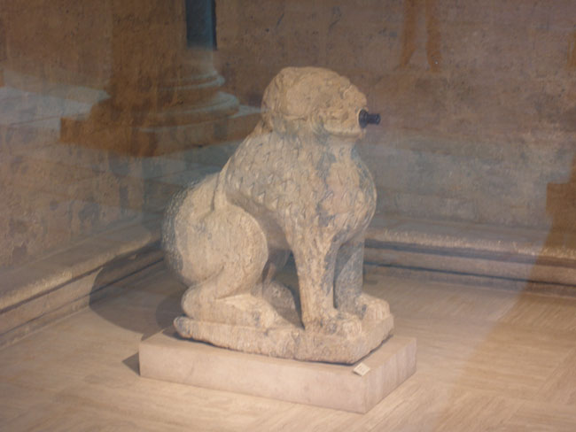
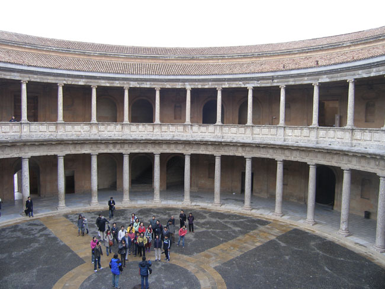

자연의 방법으로 냉․난방이 이루어지던 왕의 목욕실을 지나자 워싱톤 어빙의 집필실이 나왔고, 벽면에는 어빙의 사진이 걸려 있었다. 어빙이 이곳에 왔을 땐 모든 것이 엉망이었다 한다. 이슬람에 의해 건설된 그라나다가 기독교의 지배로 들어가면서 미처 정리되지 않았기 때문이었다. 어빙의 글 <<알함브라 이야기>>가 알함브라 복원의 당위성을 일깨워주었고, 그로부터 반복되는 복원 작업을 통해 오늘날과 같은 모습을 보여주게 되었다 한다. 말하자면 어빙은 시간의 구비 속에 함몰될 뻔한 알함브라를 구한 셈이다. 이 방을 보면서 귀국하는 대로 <<알함브라 이야기>>(정지인 옮김, 생각의 나무, 2007)를 다시 읽어야겠다는 다짐을 새롭게 했다.

   <화려한 왕궁의 내부 장식들>  
  

     <카를로스 5세 궁전에 보관, 전시중인 사자상>  
  

  <1, 2층이 다른 양식으로 건축된 카를로스 5세 궁전>  
  
왕궁의 남쪽 부분에서 미완성의 건물인 카를로스 5세 궁전을 만났다. 르네상스 양식의 정사각형 2층 건물로서 1층은 도리아식, 2층은 이오니아식의 건축양식을 보여주었다. 현재는 국제 음악회나 무용제의 공간으로 활용되고 있는 건물이었다. 훌리오 이글레시아스 같은 가수들이 야외음악회의 장소로 사용한다니 멋진 일이었다. 1층에는 이슬람 미술관, 2층에는 알함브라 공예품을 전시하는 주립 미술관으로 쓰인다고 하는데, 우리가 방문한 날은 공교롭게도 휴관일이었다. 관광객들은 울림효과가 큰 1층 공간의 한 가운데로 나아가 목소리를 가다듬고 노랫소리를 흉내 내기도 했다.

공유하기

게시글 관리

**백규서옥\_Blog ver.**