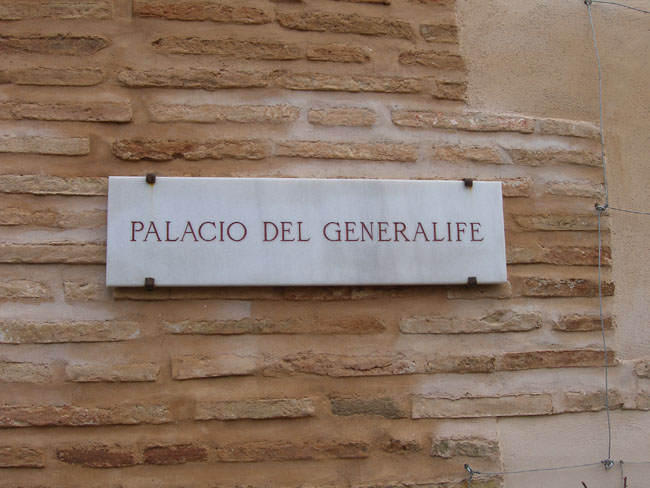
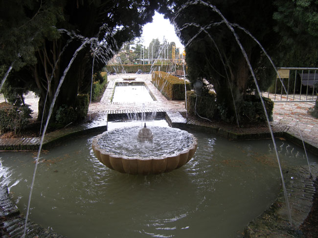
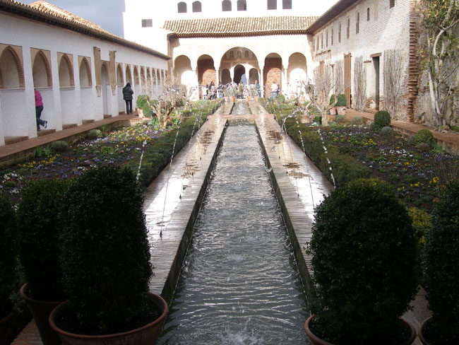
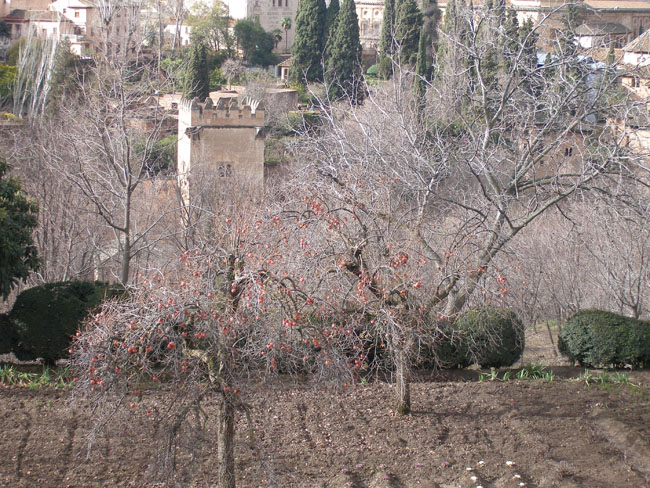

마지막으로 찾은 곳은 당시 술탄과 귀족들의 호화롭던 사생활을 훔쳐볼 수 있는 공간, 헤네랄리페였다. 14세기 초에 정비된 술탄의 여름 별궁이었다. 이 공간에서 가장 이채로운 곳은 아세키아(Acequia) 수로. 전체 길이 50m의 중앙 정원에 을 흐르게 하고 좌우에 많은 수의 분수를 설치한 곳이었다. 수로를 에워싸고 많은 꽃나무들과 정원수들이 무성하게 자라 아름다움의 극치를 이루고 있었다. 이곳이 바로 천국 아니냐고 했다는 당시 술탄과 귀족들의 말을 곱씹어 보며 정원을 산책하는 내 마음이 복잡했다. 이슬람과 가톨릭이 번갈아가며 지배하던 곳. 세월은 흘러도 그들이 누렸던 향락의 흔적은 사라지지 않고, 역사의 저변을 끊임없이 맴도는 곳. 오늘 나는 쏟아지는 햇살 아래 안달루시아의 핵심인 알함브라에서 반복되는 인간사의 영욕을 체험한다.

이제 우리는 기독교와 이슬람의 또 다른 역사를 찾으러 꼬르도바로 떠난다.

  

  

  

  

공유하기

게시글 관리

**백규서옥\_Blog ver.**