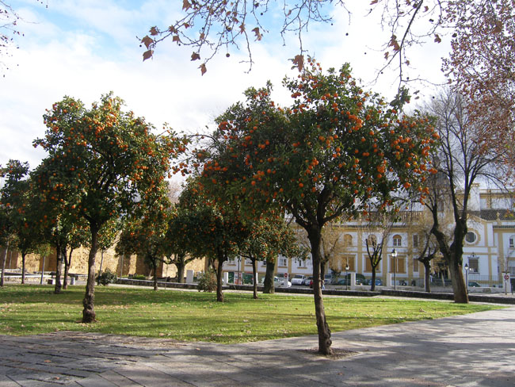
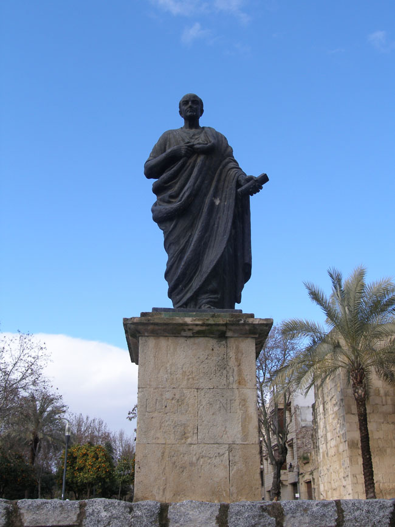

스페인 기행 4-1 : 종교 간의 불화가 빚어 만든 메스키타(Mezquita)의 조화와 부조화-꼬르도바(Cordoba)행의 감동

  <꼬르도바 거리에서 많이 볼 수 있는 오렌지 나무들>

25일 오후. 알함브라궁의 아름다움을 찬탄해 마지않은 우리는 역사 진행의 우여곡절이 빚어낸 빛과 그림자를 가슴에 담고 그라나다를 떠났다. 대략 두 시간을 이동하여 도착한 곳이 유서 깊은 문화와 역사 도시 꼬르도바. 그라나다는 지중해와 인접한 도시였으나, 꼬르도바는 대서양으로부터도 지중해로부터도 비슷하게 떨어져 있었다. 알트슈타트(Alt Stadt)의 성문 앞에는 네로 황제의 은사이자 스토아 학파에 속한 철학자 세네카(L. A. Seneca)의 동상이 지키고 있었다. 그는 바로 이곳 출신이었다. 꼬르도바가 범상치 않은 정신적 도시임을 보여주는 증좌이기도 했다.

      <세네카의 동상>  
  
 도시를 관통하여 과달키비르(Guadalquivir)강이 흐르는 이곳은 안달루시아의 관문이었다. 도시 전체가 무어족, 유대족, 기독교파 등 세 문화권으로 나뉘어 공존하거나 각축을 벌이다가 1236년 페르디난드 3세의 기독교군에 의해 정복됨으로써 이슬람 왕조는 붕괴되었다. 그 과정에서 회교문화에 기독교 문화가 덧씌워지는 양상으로 이 도시의 문화적 색채는 고정되었다.

공유하기

게시글 관리

**백규서옥\_Blog ver.**