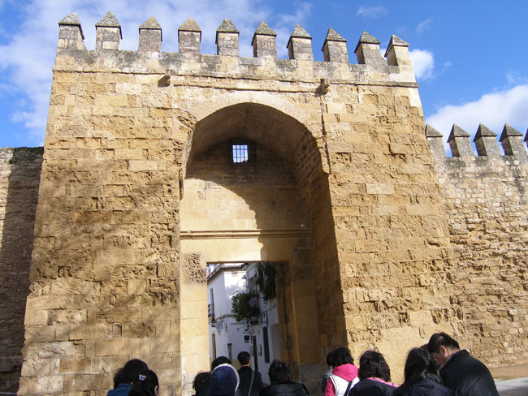
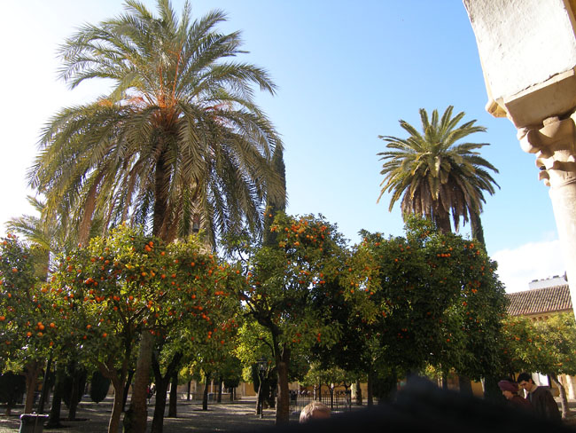
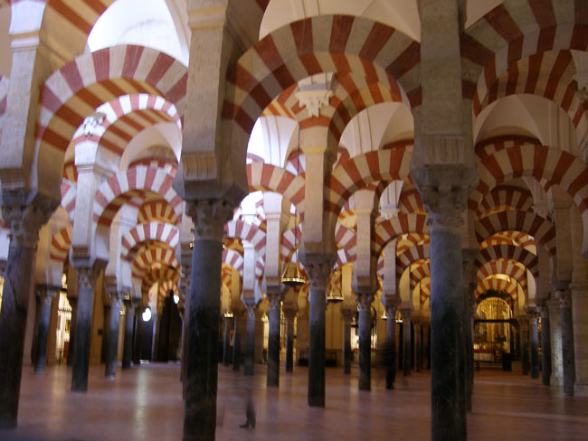
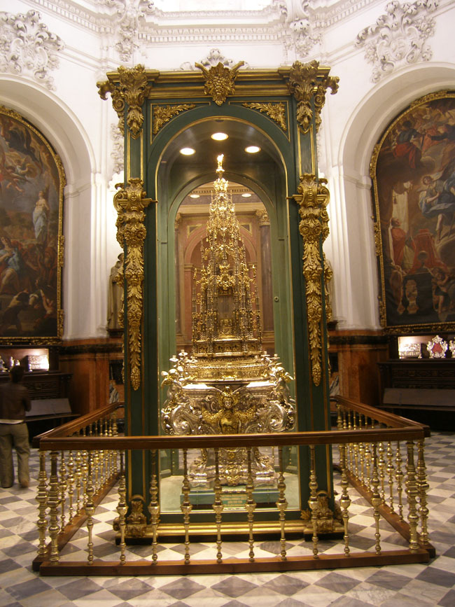
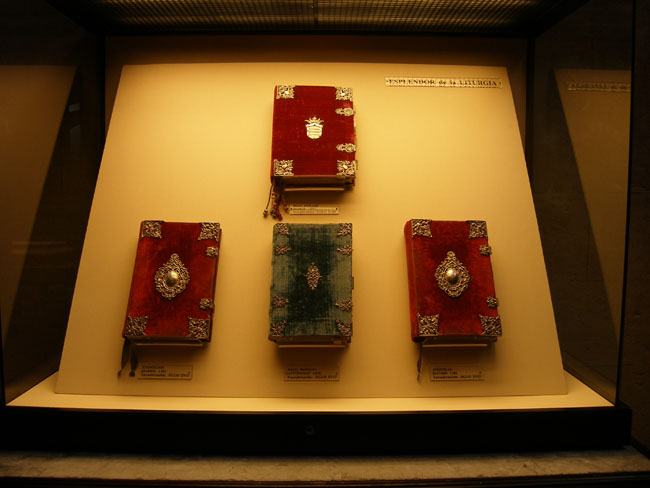
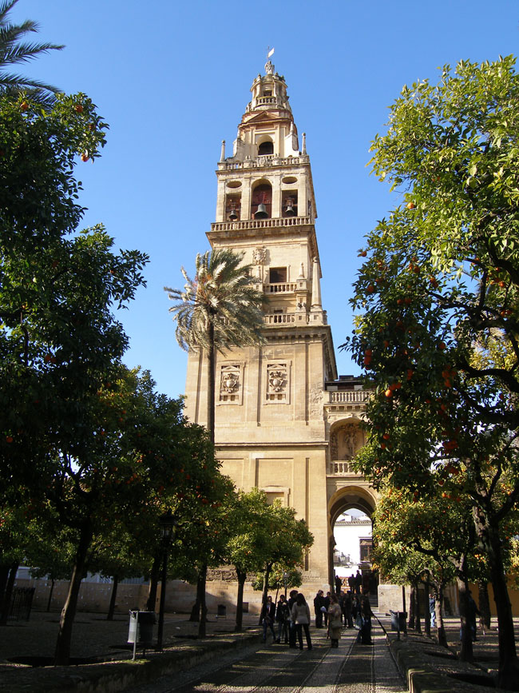

스페인 기행 4-2 : 종교 간의 불화가 빚어 만든 메스키타(Mezquita)의 조화와 부조화-꼬르도바(Cordoba)행의 감동

 정갈하고 유서 깊은 유대인 거리를 지나자 메스키타(Mezquita)[메스키타는 모스크를 지칭하는 스페인 말이다] 혹은 Cathedral-Mosque, 즉 ‘모스크 겸 성당’과 거대한 종탑이 나타났다. 술탄의 정원에 들어서니 무성하게 자란 대추야자 나무들이 우릴 반겼다. 대추야자는 그 옛날 모하멧이 살았던 곳에 흔히 자라던 나무였는데, 모스크의 지붕을 떠받치고 있는 기둥들이 그런 대추야자 나무 형상을 하고 있다는 점을 이 사원에서 비로소 확인하게 되었다.

    <꼬르도바 메스키타 입구>  
  
 원래 무어인들의 모스크였던 건물을 기독교 왕조가 접수함에 따라 안쪽 중앙에 성당이 들어서 있었다. 그러나 요소요소 이슬람 왕조 시절의 흔적을 완벽하게 지울 수는 없었던지, 대부분 모스크의 형태를 띠고 있었다.

 원래 이 건물은 780년 서고트 왕국의 교회가 있던 자리에 압둘 라흐만 1세가 세운 것이다. 그 후 세 차례에 걸친 확장공사 끝에 현재의 규모로 이루어졌다. 처음에 메카 방향의 미흐라브(Mihrab)를 향해 좌우 대칭으로 지었어야 하나 공간의 협소함으로 건물은 균형을 잃게 되었다. 대추야자 나무와 우물[모슬렘들이 기도하기 위해 몸을 정결하게 하던 연못의 흔적]이 있는 오렌지 정원과 모스크가 합쳐진 건축물이 바로 메스키타였다. 바로 이 건물의 중앙에 성당이 있었다. 기독교군이 이 건물을 접수한 다음 성직자들의 건의를 받아들여 당시의 왕 카를 5세가 지은 것이다. 그러니 이 건물을 어떻게 불러야 할까 우리는 잠깐 동안 난감했다. 그래서 생각 끝에 ‘모씨드럴(Mothedral)’이란 조어(造語)를 쓰기로 했다.

   <꼬르도바 메스키타 정원의 대추야자나무와 오렌지 나무들>  
  
 모씨드럴은 찬란했던 꼬르도바의 전성기를 상징한다. 이 성전은 24,000㎡의 거대한 공간이었다. 그리고 그것은 메디나(Medina)의 아사하라(Azahara)궁과 함께 이슬람 예술로 알려진, 세계에서 가장 중요한 사례들 가운데 하나였다. 그러나 그런 바탕 위에 기독교의 모습이 덧씌워져 묘한 조화와 부조화가 공존하는 양상을 보여 주었다. 원래 한 뿌리였던 이슬람과 기독교. 유일신을 섬긴다는 것 뿐 아니라 발생의 바탕을 공유한다는 점에서도 그렇다. 민족적․정치적 이해가 엇갈리면서 불구대천의 원수로 변했을 따름이다.

  
  <대추야자나무의 모양을 본떠 만든 메스키타 내부의 열주들>  
  

  
  <꼬르도바 메스키타 내부 성당의 성체>  
  

  
  <메스키타 내부 성당에 진열된 성서들>  
  

  
 <메스키타 정원의 종탑>

공유하기

게시글 관리

**백규서옥\_Blog ver.**