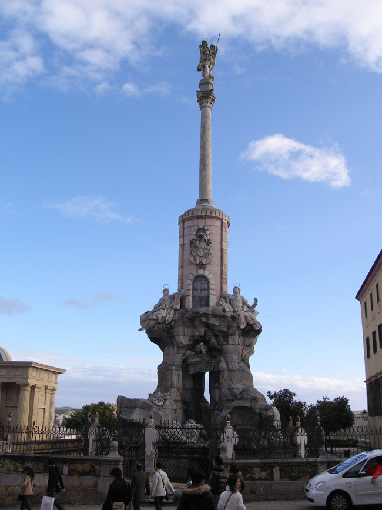

스페인 기행 4-3 : 종교 간의 불화가 빚어 만든 메스키타(Mezquita)의 조화와 부조화-꼬르도바(Cordoba)의 감동

 메스키타로부터 100m쯤 떨어진 남쪽 거리의 유대인 거리를 걸었다. 서유럽의 어딜 가나 마찬가지이지만, 이 거리도 전체가 깔끔하고 단정했다. 비좁긴 하나 ‘꽃의 거리’는 겨울임에도 아름다웠다. 흰 벽의 양쪽 창틀에 놓인 화분들도 다가올 꽃의 계절을 기다리고 있었다. 똘레도에 있는 두 곳을 포함, 스페인 전역에 세 곳밖에 없다는 시나고그( Synagogue)가 이곳 꼬르도바에도 있었다. 그 시나고그와 ‘유대인 잔혹사 박물관’만 쓰디쓴 그 민족의 과거를 말해줄 뿐, 더 이상 치욕과 고통의 역사를 말해주는 증거물을 찾을 수는 없었다. 그곳으로부터 좀 더 걸어 강가로 나가니 꼬르도바의 수호자 라파엘 성인의 탑이 도시를 굽어보고 있었다. 강물에 반사되는 석양이 겨울의 쌀쌀한 정적을 깨고 도시에 생기를 불어넣고 있었다.

    <꼬르도바 유대인 꽃의 거리>  
  

     <꼬르도바의 수호자 라파엘 성인의 탑>   
  
종교 간의 불화는 종족 간의 불화, 정치적 불화를 내포한 역사진행의 노폐물이다. 물론 ‘모씨드럴’이라는 특이한 문화적 산물로 남을 수는 있었지만, 그 부조화는 언젠가 조화의 이상적 경지로 상승되어야 할 당위성을 내포하고 있었다.

이제 우리는 피카소의 고향 말라가(Malaga)로 달려간다.

공유하기

게시글 관리

**백규서옥\_Blog ver.**