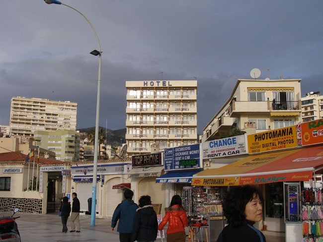
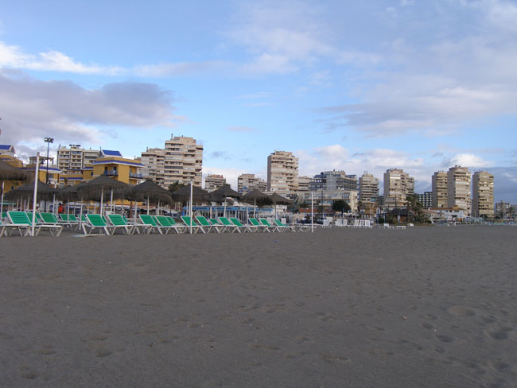
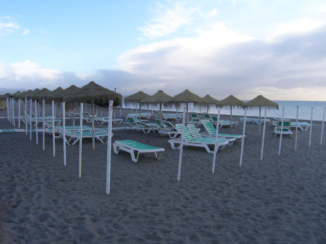
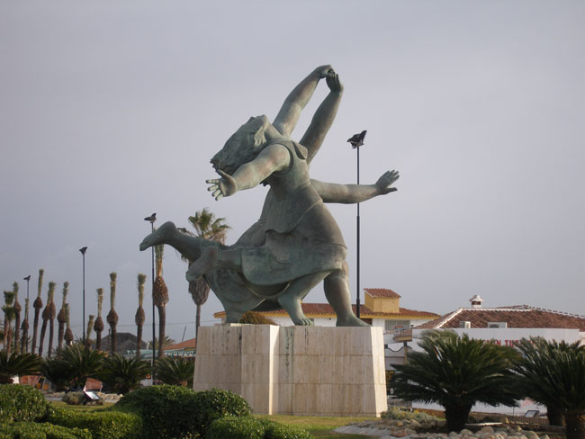
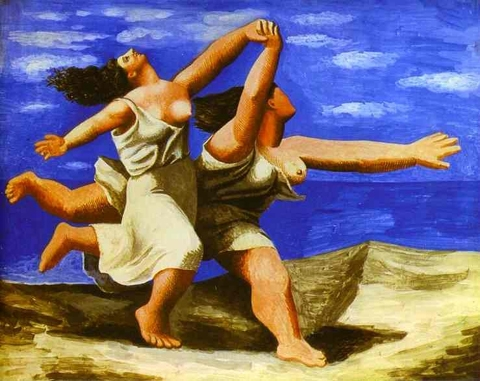
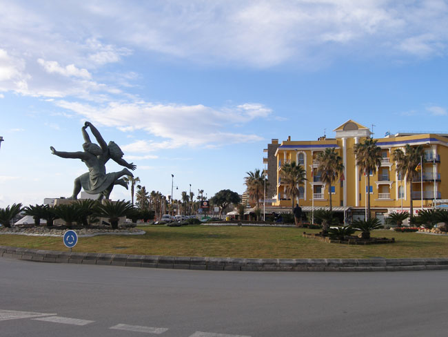

스페인 기행 5-1 : 깔끔한 백색과 지중해의 만남, 그 청아한 미학 - 말라가, 미하스, 론다의 정열과 신선함

1월 26일. 말라가(Malaga)의 엘 삐나르(El Pinar)호텔에서 1박을 하고 난 우리는 아침 일찍 지중해의 물 내음을 맡기 위해 해변으로 달렸다. 말라가는 꼬스타 델 솔(Costa del sol) 즉 태양의 해변으로 가는 관문. 시간에 쫓기는 나그네들이라 태양의 해변에서 지중해의 맛을 음미한다거나 피카소의 고향인 이곳에서 그의 붓놀림을 상상하고 있을 여유 또한 없었지만, 허파 가득 바닷바람이라도 담아가야 한다는 의무감 비슷한 것을 공유하고 있었다.

       <지중해쪽에서 바라본 말라가 주택가>  
  
 지중해가 요동치던 시절부터 푀니키아, 로마, 이슬람의 지배를 받은 말라가. 1487년 기독교 왕국이 이슬람의 그라나다 왕국으로부터 지배권을 회복함으로써 이 도시에 굴곡진 역사의 나이테를 더하게 된 것이다. 대성당이나 성터 등 시내 요소요소에 남아있는 역사 유적들은 변화무상하게 진행되어온 이 지역 역사의 살아있는 증좌였다.

        <지중해 쪽에서 바라본 말라가의 원경>  
   
무엇보다 이곳이 피카소의 고향으로서 그의 생가가 남아있고, 피카소 미술관도 있다는데, 가이드의 재촉으로 점만 찍은 다음 우리는 새로운 여정을 향해 사정없이 달려야 했다. 그래도 어찌 지중해의 바닷물과 피카소의 흔적을 모른 척 할 수 있단 말인가. 1881년 10월 25일 이곳 말라가에서 태어난 피카소는 미술교사였던 아버지의 영향으로 어려서부터 붓을 잡았으며, 천재성 또한 발휘했다. 그는 프랑코 독재체제를 벗어나 프랑스로 망명했고, 대부분 프랑스에서 작품 활동을 했다. 그는 미술을 통해 시국의 부조리에 저항했다. 공화국 정부에 대항하던 프랑코를 지원하던 나치 독일이 작은 마을 게르니카를 무차별 폭격하여 무수한 양민을 죽인 사건에 분노하여 그려낸 <게르니카>는 그 대표적인 예다. 망명한 후 공식적으로 그가 고향을 다니러 온 적은 없었다. 그러나 실제로는 1년에 한 차례씩 몰래몰래 고향을 다녀가곤 했다는 것이다. 독재정권의 정보력이 어찌 그 점을 몰랐겠는가. 알면서도 모른 척 한 것은 세계적으로 유명한 대 화가를 건드려서 득 될 것 없다는 현실적 판단과 동족으로서 피카소에 대하여 갖고 있던 자부심 때문이었으리라.

    <말라가의 텅 빈 백사장>  
   
2005년도 파리의 피카소 박물관을 방문한 적이 있었다. 그곳에서 ‘해변을 달리는 여인들(Women Running on the Beach)’이란 제목의 유화를 본 기억이 생생했다. 분명 지중해 어느 해변을 배경으로 한 그림이라고 생각했는데, 혹 여기서 그런 여인들을 만날 순 없을까. 망상에 가까운 상상을 하는 가운데 버스는 도로공사 중인 해변 가 로터리에 우리를 풀어 놓았다. 창밖을 내다보던 나는 순간 경악했다. 로터리 한 복판에 젖통과 허벅지를 드러낸 두 여인이 머리를 하늘로 향하고 힘껏 달려가는 동상이 그곳에 서 있는 게 아닌가. 아, 그렇군. 파리의 피카소 박물관에 전시되어 있던 그 유화가 이곳에는 동상으로 바뀐 채 싱싱하게 살아 숨 쉬고 있었던 것이다. 시퍼런 지중해의 물속으로 막 뛰어들려는 포즈였다. 파리 피카소 박물관의 그 그림에는 ‘<푸른 기차> 발레 막의 디자인’이란 설명이 붙어 있었다. 한때 무대 미술가로 활약했던 피카소였으므로, <푸른 기차>란 제목의 발레에 맞는 이미지를 여인들의 육감적인 몸매로 표현해내려 했을 것은 당연하다.

  <말라가 해변에 서 있는 동상-해변을 달리는 여인들>  
  

           <파리 피카소 박물관에 소장된 해변을 달리는 여인들, 유화, 1922년작>   
  

   <말라가 해변의 해변을 달리는 여인들과 시가지>  
  
 지중해변 말라가의 해변에서 피카소의 ‘해변을 달리는 여인들’을 친견한 이상, 이 도시에서 더 무엇을 볼 필요가 있을까. 동상의 앞 뒤 양 옆을 돌면서 십 수 컷의 사진을 박은 다음 버스로 돌아왔다. 여름철 내내 이 해변에 가득했을 풍만한 비키니 여인들을 생각하며...

공유하기

게시글 관리

**백규서옥\_Blog ver.**