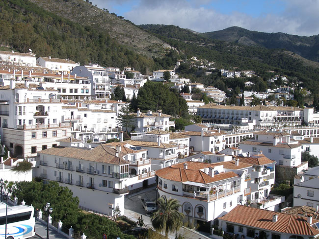
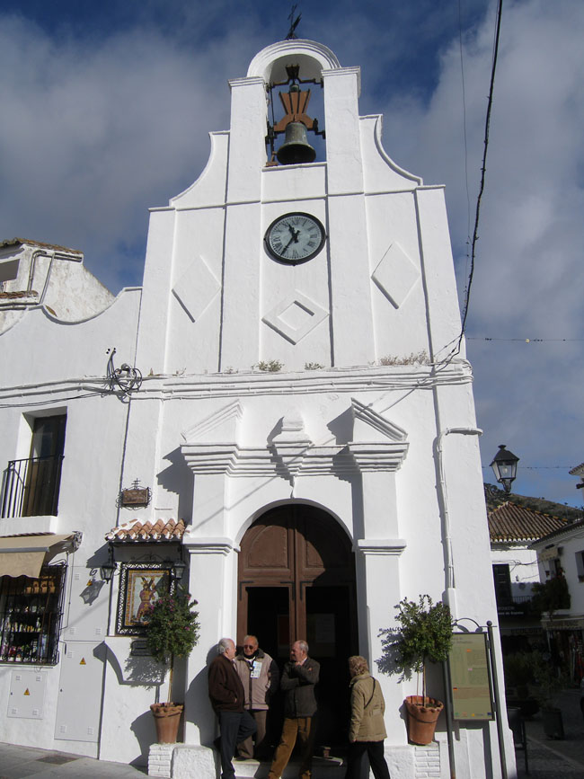
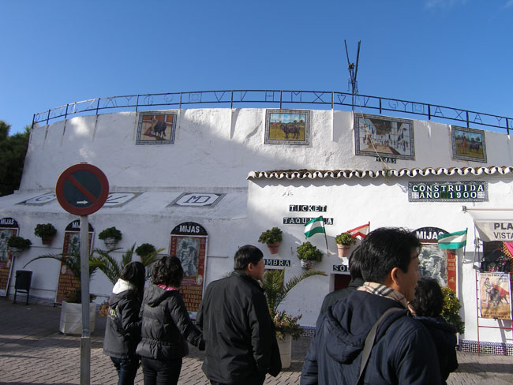
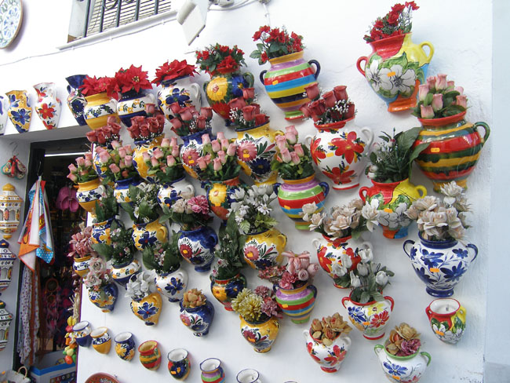

스페인 기행 5-2 : 깔끔한 백색과 지중해의 만남, 그 청아한 미학 : 말라가, 미하스, 론다의 정열과 신선함

말라가로부터 고지대를 향해 30분쯤 달렸을까. 온통 하얀색의 마을이 신선한 충격으로 다가왔다. 어쩌자고 이 마을 사람들은 이리도 벽마다 순백의 붓질을 해댄 것일까. 거리는 좁좁 했으나 아기자기 예뻤다. 각종 선물가게, 성당, 레스토랑들 사이 골목길로 오가는 사람들도 관광객을 빼곤 대본에 따라 움직이는 배역들처럼 이채로웠다. 마을의 가장 높은 곳엔 바위를 뚫고 만든 성당 혹은 신전이 있었다. 비르헨 데 라 페냐(Virgen de la Pena)란 이름의 성당으로, 이 마을의 수호 성녀인 긴 머리의 여성상이 모셔져 있었다.

  <미하스 주택들의 순백색>  
  

  <미하스의 비르헨 데 라 페냐>  
   
사각형 모양의 앙증스런 투우장도, 미니어처 박물관도 있었고, 말과 나귀들은 정류장에 우두커니 서서 관광객들을 기다리고 있었다. 미하스의 순백과 지중해의 에메랄드 빛은 햇빛과 어울려 묘한 조화를 이루고 있었다. 토로스 광장, 라 꼰스티누씨온 광장, 비르헨 데 라 뻬냐 광장, 라 인마꿀라다 가톨릭 용품점, 아마폴라 기념품점, 에네 기념품점, 초 세라믹 상점, 엘 빠드라스트로 레스토랑, 뽀라스 커피숍, 미하스 호텔, 미하스 박물관, 산 세바스티안 교회, 깔바리오 교회 등등 작은 마을엔 두루 꼽기에도 숨찰 만큼의 멋진 건물들이 많았다.

      <미하스 산 세바스티안 성당>  
  

  
   <미하스 투우장>  
  

  <미하스 선물가게 바깥 벽>

공유하기

게시글 관리

**백규서옥\_Blog ver.**