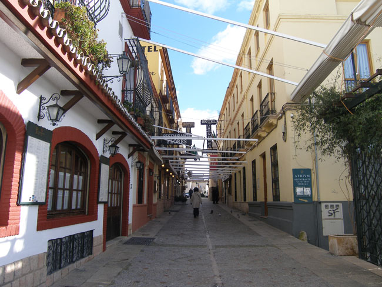
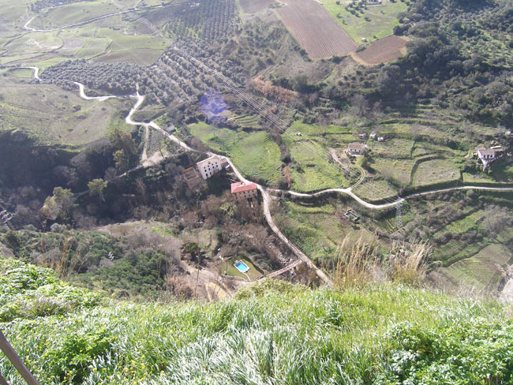
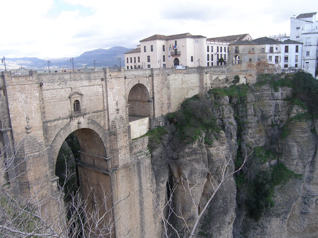
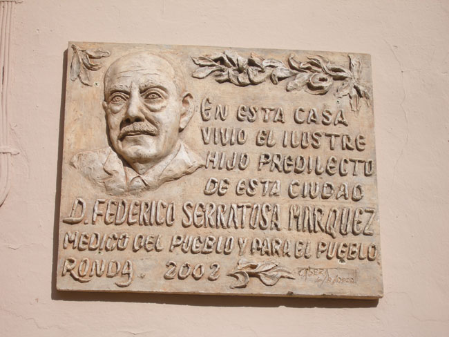
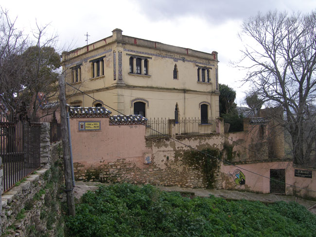
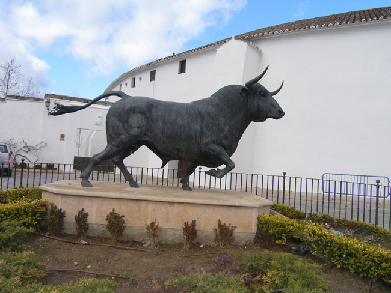
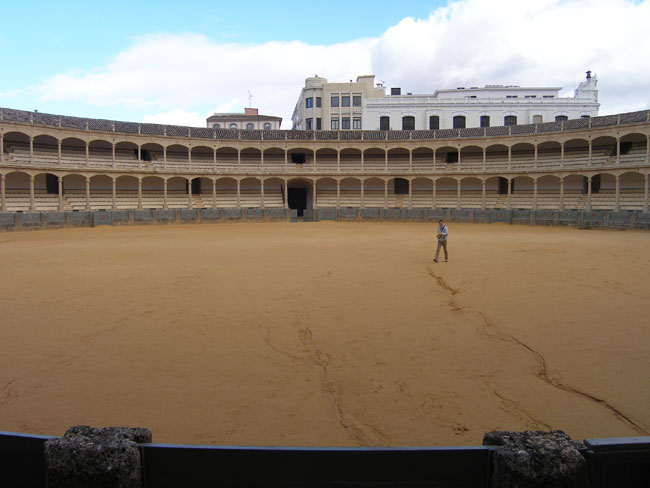

스페인 기행 5-3 : 깔끔한 백색과 지중해의 만남, 그 청아한 미학 - 말라가, 미하스, 론다의 정열과 신선함

미하스에서 두 시간 남짓 달려 도착한 곳은 인구 3만여명의 아담한 도시 론다(Ronda). 투우와 협곡의 도시였다. 버스에서 내려 잠시 공원을 가로지르니 절벽이 나타나고, 절벽 아래로 한 줄기 강이 흐른다. 과달레빈강(Rio Guadalevin)은 협곡 타호(Tajo)를 만들었고, 론다는 협곡 사이의 바위산에 위치해 있었다. 어디를 둘러봐도 절경이었다. 협곡을 사이에 두고 시가지는 둘로 나뉘어 있었다. 구시가와 신시가를 연결하는 것은 뿌엔떼 누에보(Puente Nuevo), 즉 새 다리였다. 과연 장관이었다. 1793년에 만들어진 다리의 높이는 90~100m에 달하고, 교각에는 감옥으로 쓰인 공간들도 보였다. 내려다보기에도 아찔한 이런 규모의 다리를 18세기에 건설했다니 놀라운 일이다. 다리 앞의 스페인 광장에는 레스토랑과 까페 등이 있어 협곡을 감상할 만한 곳들이 즐비했다. 다리를 건너 헤밍웨이가 잠시 거처하던 집을 구경했다. 그곳으로 가는 길에 <천년의 고독>의 작가 마르께스의 생가를 만나기도 했다. 가는 곳마다 문화와 역사가 서려 향기를 내뿜는 곳이 론다였다.

   <론다 구 시가지 일부>  
  

  <론다에서 내려다 본 협곡 아랫 마을>  
  

  <론다의 신 구시가지를 이어주는 푸엔테 누에보>  
  

  <마르께스 생가 표지판>  
  

  <헤밍웨이가 잠시 머물던 집>

 다리를 건너 구시가인 시우다드(La Ciudad)로 오니 15세기 후반까지 이어진 이슬람 왕조 지배의 흔적이 도처에 남아 있었다. 마르께스 살바티에라 궁전, 이슬람 목욕탕인 바뇨스 아라베스 등이 있고, 산타 마리아 라 마요르 성당도 보였으며, 옛날 성벽도 일부나마 남아 있었다. 협곡 아래에 남아 있는 로마시대의 유적들도 우리로 하여금 시간의 흐름을 다시금 생각하게 했다.

 그러나 무엇보다 인상적인 사실은 론다가 투우의 본산지라는 것. 스페인에서 가장 오래 된 바로크 양식의 투우장과 투우박물관이 있었다. 이곳이 바로 근대 투우의 발상지였다. 동상으로 세워져 지금도 추앙을 받고 있는 로메로와 그 일가를 비롯한 많은 투우사들이 이곳 출신이었다. 투우박물관에는 스페인의 걸출한 화가 고야(Goya)가 그린 투우그림도 전시되어 있었다.

    <투우장 앞 황소 한 마리>  
  

  <투우장 내부>  
  
 협곡 사이 바위산에 세워진 작은 도시 론다. 그러나 그 도시는 아름다웠고 역사와 전통의 숨결 또한 단순치 않았다. 옛날 것들은 그것들대로, 지금의 것들은 그것들대로 존재의 의미를 마음껏 발산하고 있는 도시가 바로 론다였다. 역사의 갈피마다 사소한 것들도 그냥 흘려버리지 않고, 소중하게 가꾸는 도시가 바로 론다였다. 시간의 흐름에 등떠밀려 떠나야 하는 우리의 마음에 론다가 강렬하게 각인되는 것도 바로 그 때문이었다.

 이제 우리는 또 다른 문화와 역사의 도시 세비야로 간다.

공유하기

게시글 관리

**백규서옥\_Blog ver.**