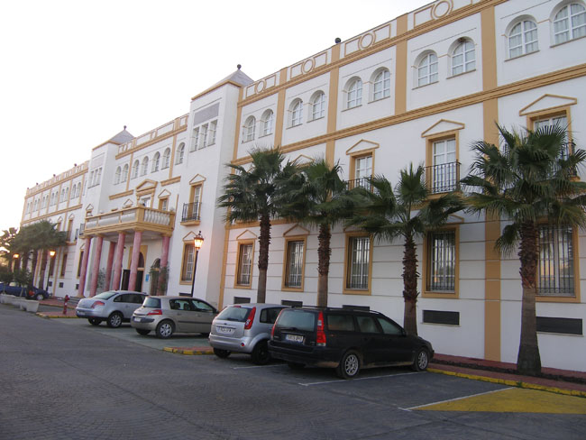
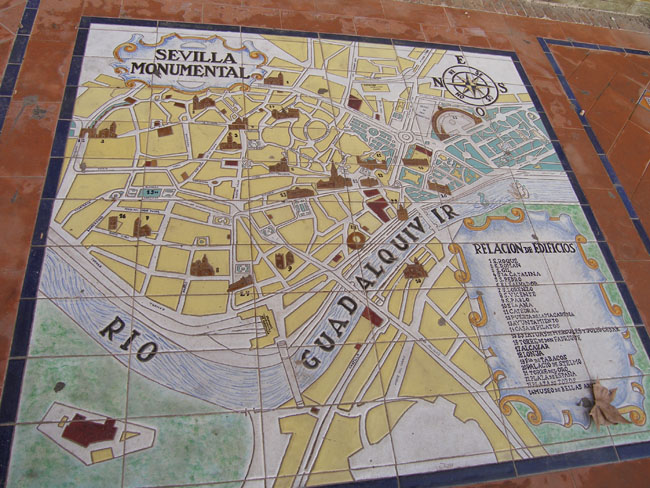
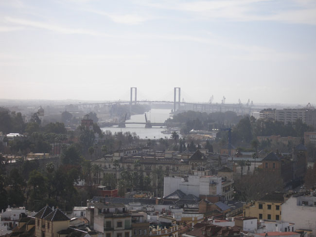
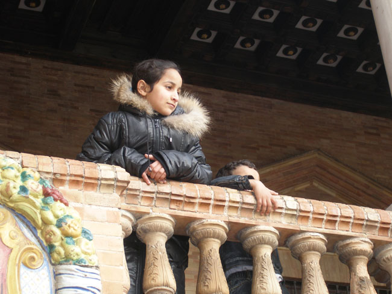

1월 27일. 세비야의 하늘은 맑았고, 간밤에 뿌린 비 때문인가 거리는 젖어 있었다. 로마제국이 지배하던 시기부터 번창했고, 서고트 왕국의 수도였던 세비야는 안달루시아의 중심도시 답게 화려했다. 도시의 중심을 뚫고 흐르는 과달키비르(Guadalquivir)강은 수심이 깊고 수량이 풍부한 듯 큰 배들이 드나들었다. 대항해 시대의 무역항이자 아메리카 여행의 출발지로서, 1519년 마젤란이 세계일주의 닻을 올린 곳도 바로 이곳이었다.

 모차르트의〈돈 조반니 Don Giovanni〉, 비제의 <카르멘>과 로시니의 <세비야의 이발사> 등의 무대였던 세비야. 수르바란, 무리요, 발데스 레알, 벨라스케스, 마르티네스 몬타네스 등의 뛰어난 화가들과 후안 데 메사 등 조각가가 불후의 명작들을 남긴 예술의 고향 세비야. 스페인의 3대 축제들 가운데 하나인 광란의 페리아(Feria)와, 부활절 직전에 열리는 세마나 산타 축제 등이 유명한 세비야.

 1248년 이곳을 이슬람세력으로부터 탈환함으로써 새로운 발전의 기틀을 마련한 카스티야 왕 페르난도 3세의 자취가 도처에 남아 있었다. 이슬람시대인 12세기 말에 세워진 히랄다 탑은 세비야의 랜드마크 역할을 하고 있으며, 카테드랄, 알카사르, 투우장, 이베로 아메리카 만국 박람회장 등이 넓은 도시에 그득하게 자리잡고 있었다.   
  

  

  
<사진 위로부터 세비야에서 1박을 한 호텔 CIUDAD, 이베로 아메리카 만국박람회장의 세비야 지도, 히랄다탑에서 바라본 과달키비르강과 다리, 이베로 아메리카 만국박람회장에서 만난 스페인소녀>

공유하기

게시글 관리

**백규서옥\_Blog ver.**