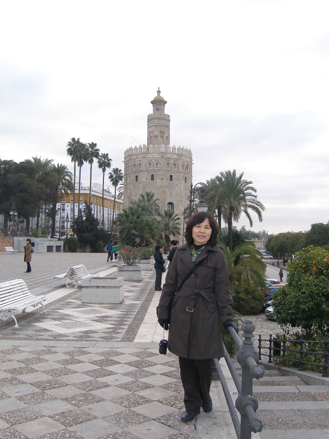
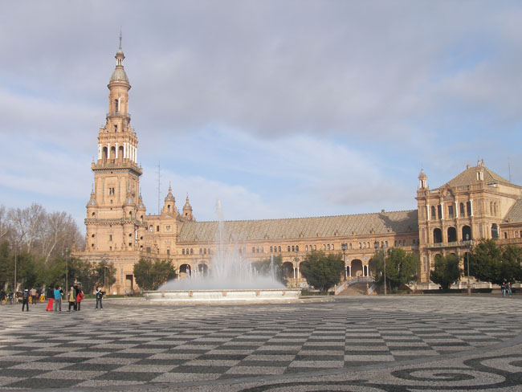
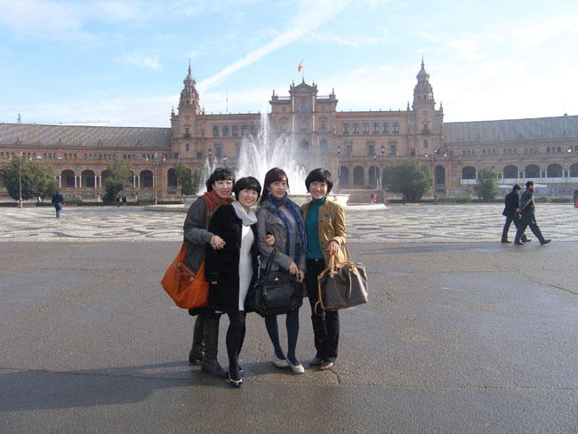
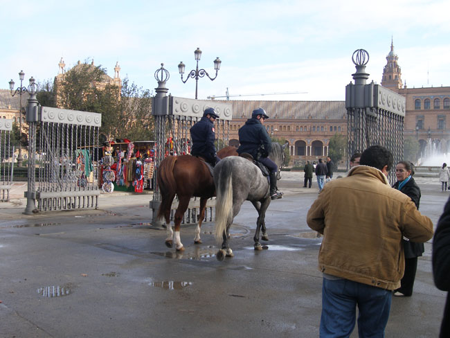
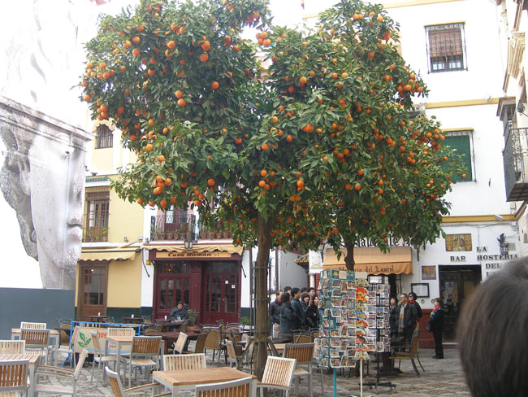
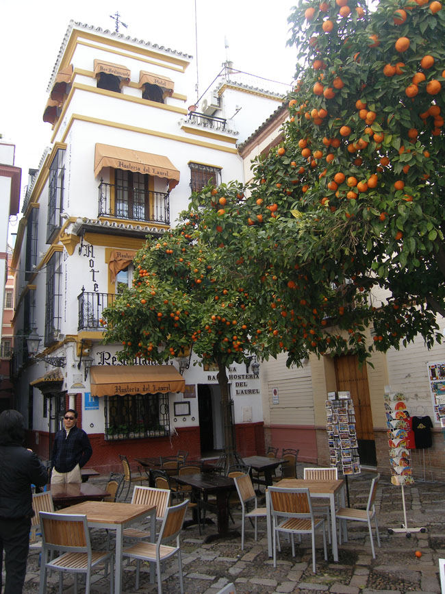
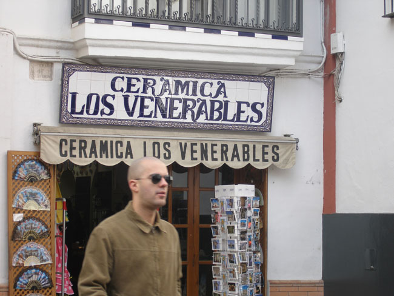
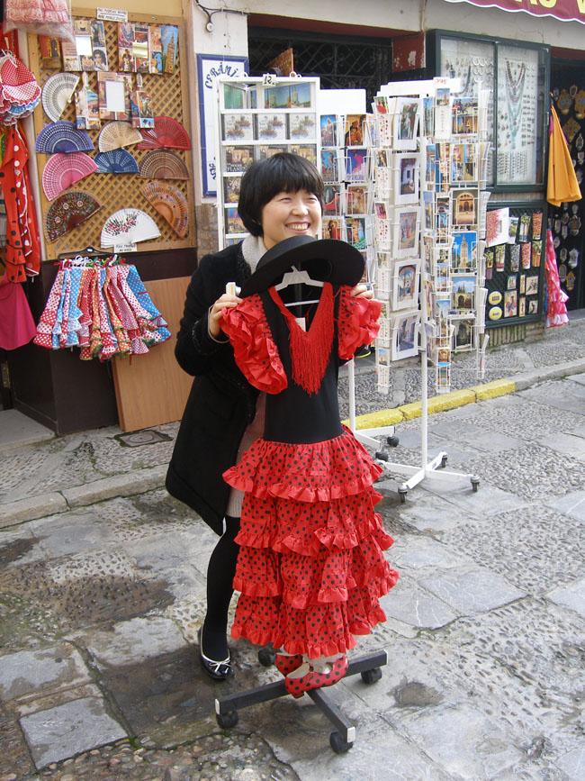
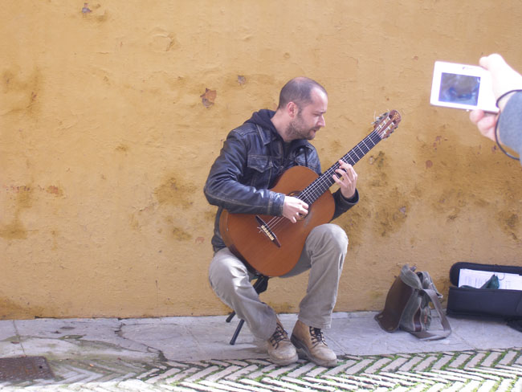
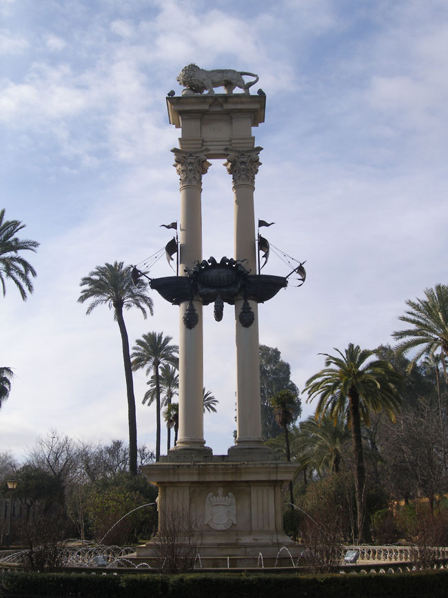

과달키비르 강 가에 도착한 우리는 화려한 박람회장으로 둘러싸인 스페인 광장에서 세비야 탐색을 시작했다. 아니발 곤살레스가 설계하여 10년에 걸쳐 완공했다는 박람회장은 규모와 아름다움의 면에서 주변을 압도했다. 스페인 전역의 광역 자치주와 문화적․역사적 상징을 형상한 타일그림이 인상적이었다.

 분수가 압권인 스페인 광장에서 나와 산타크루즈거리를 걸었다. 각종 기념물이나 건축, 길가의 나무들이 잘 어울려 아름다운 모습을 연출하는 공간이었다. 가끔 기마경찰과 마차가 길을 오고가는데, 융통성 없는 사람을 가리켜 “세비야의 말 같은 놈”이란 말이 속담을 떠올릴만한 거리였다. 콜럼버스 기념탑을 돌아가니 알카사르 왕궁의 담벽을 따라 아름다운 거리가 펼쳐졌다. 세비야 사람들은 현재와 같은 세비야의 번영을 가져다 준 장본인으로 콜럼버스를 꼽는다고 한다. 그만큼 스페인의 어딜 가나 콜럼버스의 동상을 만나는 것은 어렵지 않았다. 원래 이태리 제노아 출신의 콜럼버스가 스페인에서 추앙받는 현실을 보며, 출신지보다 활동한 곳이나 활약상으로 인물을 평가하는 유럽인들의 진면목을 확인할 수 있었다.

 산타크루즈 거리를 돌다가 돈 후안의 무대로 알려진 작은 광장을 만났다. 그곳엔 그가 묵고 있었다는 작은 여관과 식당이 있었고, 광장의 오렌지 나무엔 황금색 오렌지들이 주렁주렁 달려 있었다. 돈 후안은 민간의 전설에 등장하는 인물로서, 스페인의 극작가 티르소 데 몰리나의 비극 <세비야의 호색한>(1630)에서 처음으로 문학작품에 등장한 인물일 뿐인데, 후대인들은 그가 사용했을 것으로 생각하는 여관이나 식당까지 고안하여 관광 상품으로 활용하니 대단한 호들갑이라 할 만하다.

  
<사진 위로부터 황금의 탑, 스페인 광장, 이베로 아메리카 만국박람회장, 스페인 광장 밖 거리, 돈후안의 가상무대1, 돈후안의 가상무대 2, 돈후안의 가상무대와 스페인 남자, 산타크루즈 투어 도중에, 산타크루즈에서 만난 거리의 악사, 산타크루즈의 콜럼버스 기념탑>

공유하기

게시글 관리

**백규서옥\_Blog ver.**