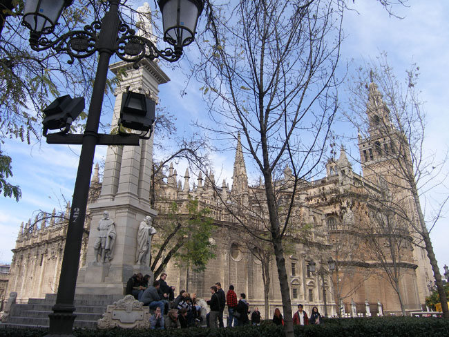
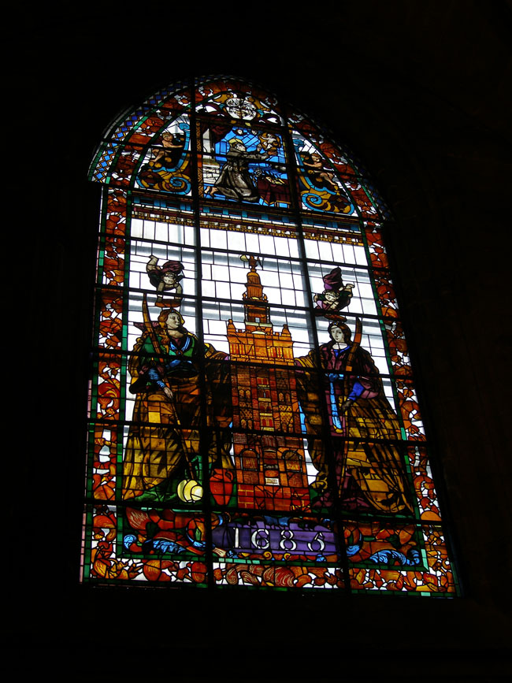
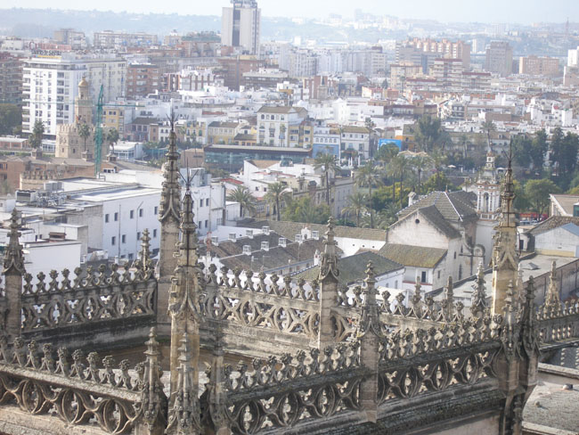
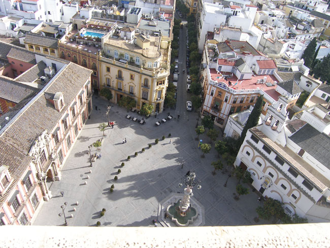
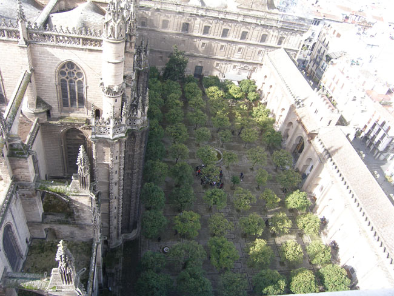
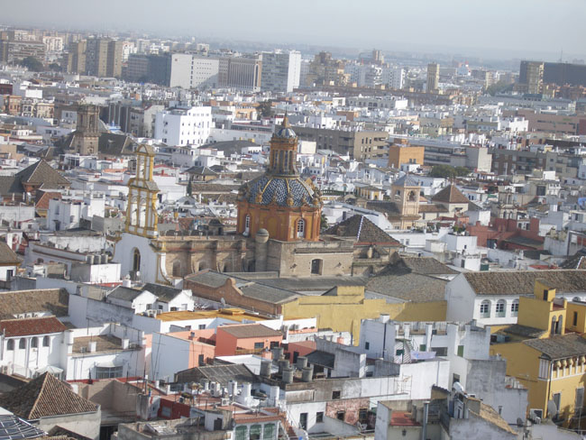

그곳으로부터 5분 정도를 걸어가서 만난 것이 스페인 최대의 세비야 대성당(Catedral)과 히랄다탑(La Giralda). 원래 있던 모스크를 부수고 1402년부터 짓기 시작하여 100년 만에 완공한 성당으로 건축양식의 중심은 고딕이었다. 폭 116m, 높이 76m로 바티칸의 베드로 대성당과 런던의 성 바오로 대성당에 이른 유럽 3위의 규모였다.

 대성당 정면의 ‘승천의 문’은 굳게 닫혀 있었으므로, 우리는 히랄다탑 옆의 리카르토문으로 들어갔다. 밖에서 추측한 것처럼 내부는 대단했다. 돌로 깎아 만든 기둥들은 입이 벌어질 만큼 대단한 규모였다. 중앙의 황금빛 목제의 제단은 세계 최대의 규모라고 하는데, 성서에 나오는 내용들이 섬세하게 조각되어 있었다. 그 안쪽의 왕실 예배당에는 알폰소 10세와 모후 베아트리스가 안치된 묘소가 있었다.

 시간에 쫓긴 우리는 잰 걸음으로 주변의 작은 예배실들, 성구실, 총회실 등을 둘러보았다. 무리요, 고야, 수르바란, 발데스 레알 등 스페인 거장들의 명화가 걸려 있어 미술관이나 박물관을 방불케 했다. 이곳에도 콜럼버스의 묘가 있었는데, 관에는 그의 유골 가루가 안치되어 있다고 한다. 사실인지 확인할 수는 없었으나, 콜럼버스의 아들 하나가 이곳 대성당의 성직자였다는 점도 콜럼버스 유해가 이곳에 안치된 사실을 뒷받침할 만한 일이었다.

 성당 안을 대충 훑어본 우리는 히랄다 탑으로 올라갔다. 92m 높이의 이 탑은 이슬람 건축. 원래 대성당이 지어지기 이전 모스크의 첨탑으로서 알모하스 왕 때 만들어졌다 한다. 밑으로부터 전망대가 있는 70m까지는 원래 이슬람 시대의 양식이고, 그 위 종루 부분은 16세기에 기독교인들이 덧붙인 것이라 한다. ‘히랄다’는 ‘hirar’ 즉 ‘돌다’에서 나온 말로, 바람의 방향을 가리키는 닭이란 뜻이다. 이것은 탑의 꼭대기에 장식된 청동의 여신상이 바람에 따라 빙글빙글 돌기 때문에 붙여진 이름이라 한다.

 탑에 오르는 길은 계단이 아니라 나사처럼 돌아가는 평탄한 길이었다. 그 옛날 술탄이 말을 탄 채 오를 수 있도록 하기 위해 그렇게 만들었다는 가이드의 설명이었다. 히랄다에서 내려다 본 세비야는 아름다웠다. 과달키비르 강이 안고 도는 시가지는 지중해로부터 불어오는 훈풍과 하늘에서 부어주는 햇살에 밝게 빛나고 있었다. 시가지 주택들의 벽은 대부분 흰색이었고, 알카사르를 채우고 있는 아름다운 건축들과 그 사이사이의 오렌지 정원은 절묘한 조화를 이루고 있었다. 전망대에서 바라보이는 황금의 탑, 마리아 루이사 공원, 마카레나 교회당, 세비야 대학, 필라토의 집, 산타크루즈 거리, 산타 파울라 수도원, 주립 미술관 등은 세비야의 역사성과 예술성을 함께 보여 주는 현장이었다.

 그러나 바쁜 나그네의 일정 상, 어찌 세비야의 속살을 낱낱이 헤집어 볼 수 있을까. 히랄다탑에서 아름다운 세비야의 전경을 가슴에 안고, 우리는 포르투갈로 향한다.    

  
 <사진 위로부터 세비야 대성당, 세비야 대성당의 스테인드 글라스, 히랄다탑에서 내려다 본 시가지1, 히랄다탑에서 내려다 본 시가지2, 히랄다탑에서 내려다 본 대성당 뒤편 광장, 히랄다탑에서 내려다 본 대성당의 오렌지 광장, 히랄다탑에서 내려다 본 시가지>

공유하기

게시글 관리

**백규서옥\_Blog ver.**