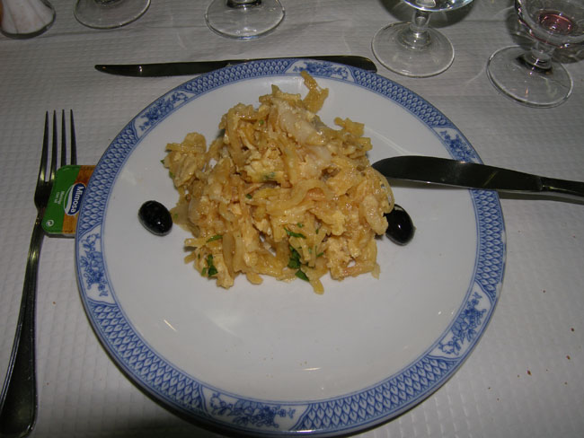
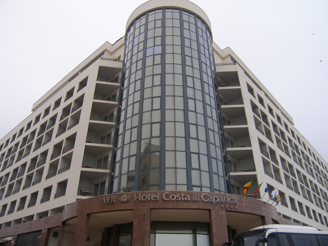

1월 27일  2시 45분, 과디아나 강에 놓인 ‘시간의 다리’를 건너 드디어 포르투갈로 들어섰다. 포르투갈의 민중가요 파두(Fado)가 발산하는 아련한 슬픔과 안타까움이 나그네의 마음을 스산하게 했다. 우리처럼 오래도록 이민족의 억압 아래 놓여 있었기 때문일까. 그들의 노래도 어쩌면 우리의 그것과 닮아있는 듯했다.

 눈을 차창 밖으로 돌리니 야산에 깔려있는 아몬드 꽃이 하얗게 눈부시다. 면적 9만 2천 평방킬로미터, 인구 1,100만 명의 소국. 면적은 우리나라보다 약간 작고, 인구는 4분의 1에 불과한 나라다. 국민 1인당 연간 소득은 18,000불로 35,000불의 스페인에 비해 반이 조금 넘는 수준. 국토는 이베리아 반도의 서쪽에 남북으로 길게 붙어 있다. 1140년 알퐁소 엔리께가 왕국을 선포하기까지 기원전 그리스, 페니키아, 로마, 게르만, 무어인 등의 지배를 거쳤으며, 무어인들로부터 국토를 회복한 이후 리스본은 이 나라의 수도가 되었다.

 국토가 좁은 대신 그들은 바다를 삶의 터전으로 삼았다. 희망봉과 인도항로, 브라질을 발견하는 등 식민지 개척을 통해 대항해 시대를 연 그들이었다. 1580년부터 1640년까지 스페인의 지배하에 놓였다가 독립한 뒤 18세기 초 식민지 브라질로부터 금을 들여와 한동안 번영을 구가하기도 했다.

 1755년 리스본 대지진, 브라질의 독립, 열강의 침입, 정파들 간의 싸움 등으로 화려했던 날들은 저물어 갔다. 1910년 선포된 공화정은 1930년대 살라자르의 독재로 막을 내리고 1974년 혁명에 의해 다시 공화정은 시작되었으며, 1986년 EU의 회원국이 되었다.

 우리의 눈에 포르투갈의 국력은 비록 약해 보였으나, 스페인에 비해 안온한 느낌이었다. 야산의 푸른 숲 사이에 조성된 마을들이 평화로워 보였고, 그 사이에 피어있는 아몬드 꽃들은 이국적인 정취를 발산했다.

 어두컴컴해서야 리스본에 들어갔다. 시내의 한 식당에 들어가 ‘바깔랴우(Bacalhau)'라는 대구 요리로 저녁을 때웠다. 이곳에서는 가장 대중적인 요리라 하나 얼큰한 대구탕이나 대구머리 요리에 익숙한 우리들의 입맛을 만족시키기는 어려웠다. 식당에서의 실망은 그대로 호텔로 이어졌다. 방이 춥고 썰렁했다. 사실 이 시기의 유럽은 어딜 가나 난방이 문제다. 뜨끈한 우리나라의 온돌은 어디에서도 찾을 수 없기 때문이다.  

  \*사진 위로부터 포르투갈 고속도로 변 휴게소의 점원 아가씨, 리스본의 식당 발렌시아에서 먹은 바깔랴우, 리스본에서 1박을 한 호텔 코스타 다 카파리카

공유하기

게시글 관리

**백규서옥\_Blog ver.**