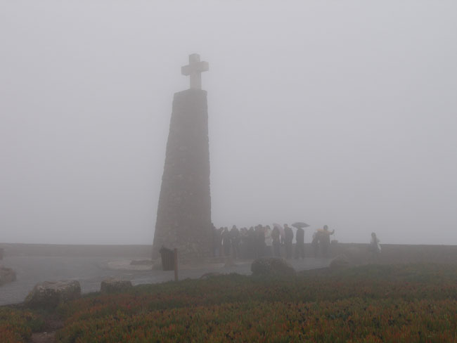
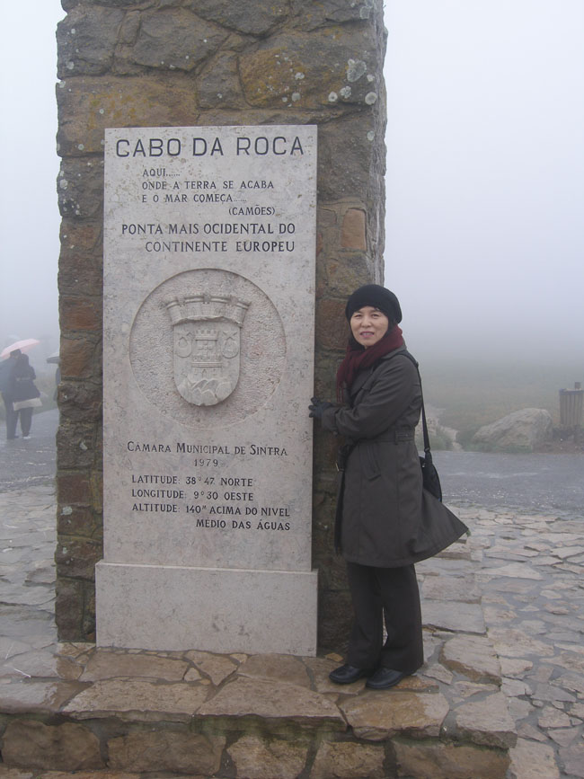
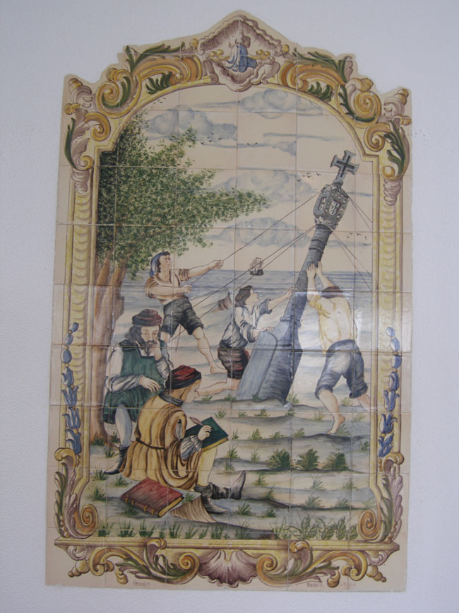
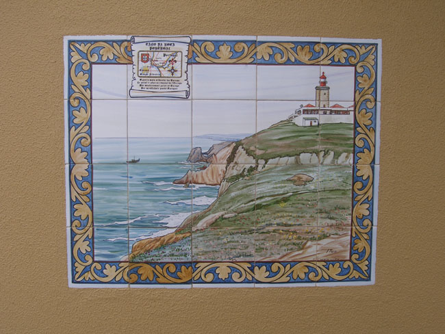
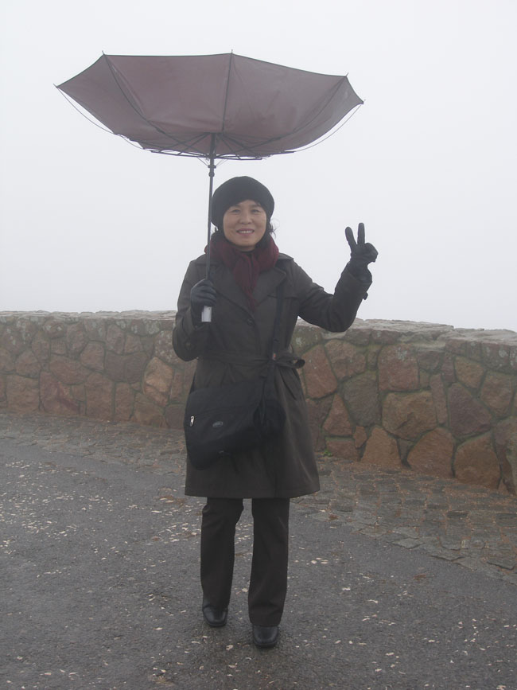
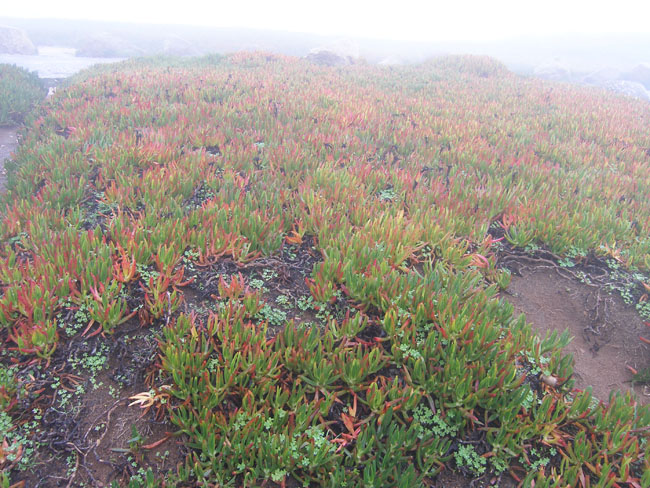
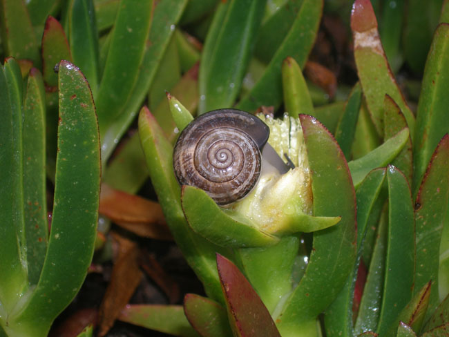

1월 28일 아침 8시 35분 호텔을 나서 대서양 쪽의 땅 끝 마을 로까 곶(Cabo da Roca)으로 출발했다. 비가 내리고 안개가 자욱했다. 한참을 달려 로까 곶에 도착했으나 그곳에도 비가 내리고 바람이 불었으며, 안개가 가득하여 바다를 볼 수 없었다. 우리나라 해남에서 밟아보는 땅 끝의 감회를 이곳에선 느껴보기 어려웠다.  
 그 옛날 대항해 시대에 세상을 향한 출발지가 되었을 이곳에서 그 장쾌한 기상을 맛보지 못하다니, 여간 서운한 게 아니었다. 그래도 바다를 향해 높이 솟은 탑이 있었다. 그 탑에 적혀있는 시구가 눈에 들어왔다. “이곳은 땅이 끝나는 곳, 그리고 바다가 시작되는 곳”이라는 내용. 바로 포르투갈의 국민 시인 까몽이스(Camões)의 시에서 따온 구절이었다. 안개에 갇혀 사방은 깜깜했으나 이 구절은 등대처럼 ‘땅의 끝, 바다의 시작’을 알려주고 있었다.

그 악천후에도 관광객들은 연신 드나들어, 대서양 쪽 땅 끝 마을은 끊임없이 북적거렸다.

  
 \*사진 위로부터 안개 자욱한 로까곶, 로까곶 표지석에서, 로까곶 휴게소 안의 그림 1, 로까곶 휴게소 안의 그림 2, 바람 부는 로까곶, 로까곶 주변의 식생, 성찬을 즐기고 있는 로까곶의 달팽이

공유하기

게시글 관리

**백규서옥\_Blog ver.**