점심 후 들른 곳이 바로 신트라(Sintra). 그 옛날부터 포르투갈의 왕족들과 영국의 귀족들이 즐겨 찾던 마을이다. 왕실에서 여름휴가를 즐기던 곳으로 별궁인 빨라씨우 레알(Palácio Real)과 뻬나 궁(Palácio de Pena)이 보석처럼 빛나고 있었다. 원래 이 도시는 영국의 시인 바이런이 에덴동산으로 일컬었을 만큼 빼어나게 아름다웠던 곳이다. 그러나 비 내리는 지금 다소 칙칙하고 음침할 뿐 화사한 신트라의 빛깔은 보이지 않았다. 한동안 바이런은 이곳에 머물며 시를 지었다는데, 그의 이름을 딴 까페도 볼 수 있었다. 우리는 까페 파리의 고풍스런 자리에 앉아 에스프레소의 진한 맛을 보며 신트라를 느꼈다.

  까페 파리에 앉아

  바이런이 노래한

  에덴동산의 흔적을 슬퍼한다

  사람은 가고

  시도 없지만

  그의 글자들은

  음침한 이곳 골목을 맴돌며

  우리의 가슴을 이리도 심란하게 하는가

  슬픈 파두의 노랫가락이 울려 퍼져

  나그네의 품 속으로 갈피갈피 파고드는 이 한낮

  자꾸만 빗방울은 굵어만 간다.

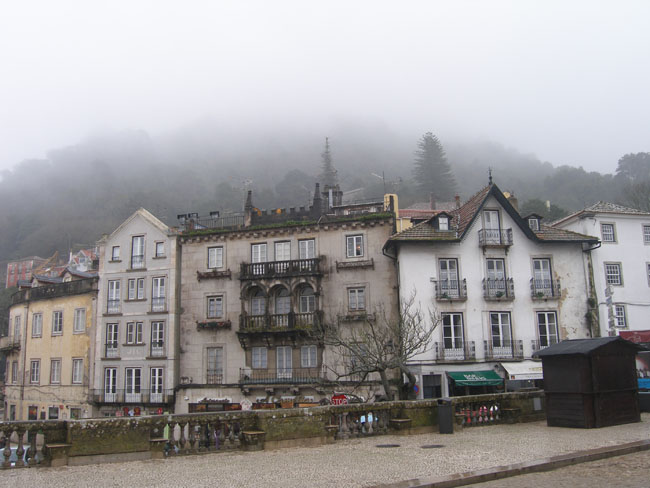

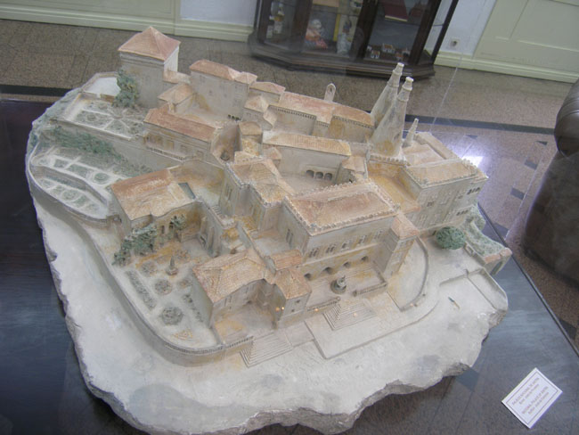

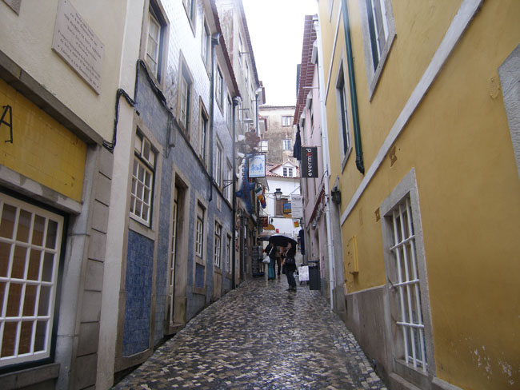

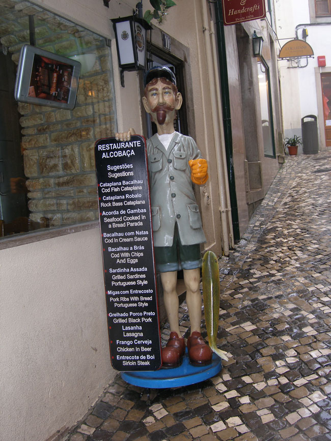

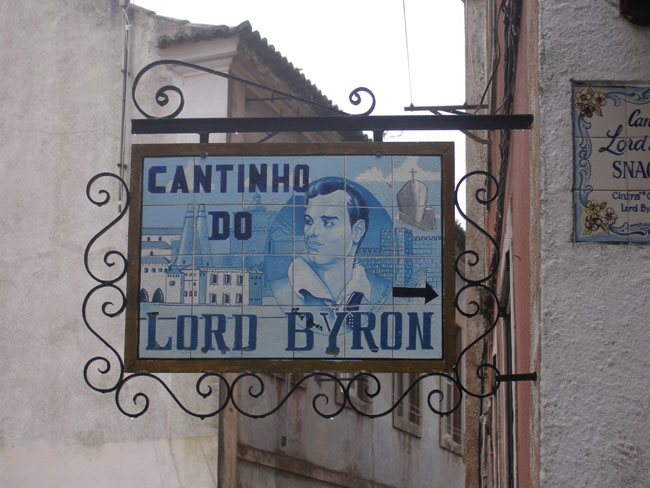

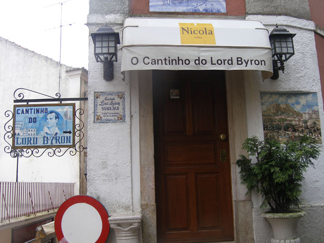

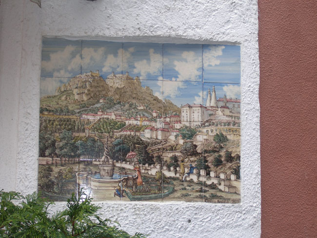

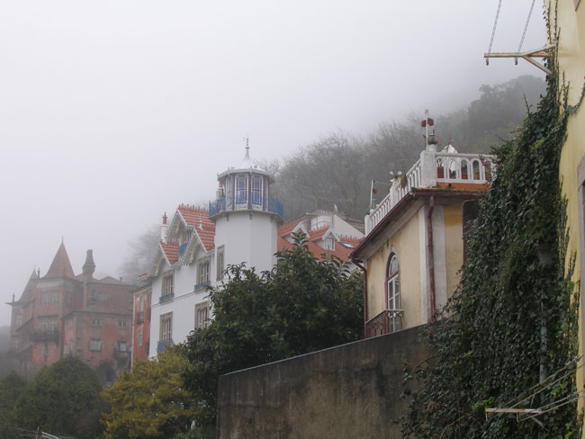

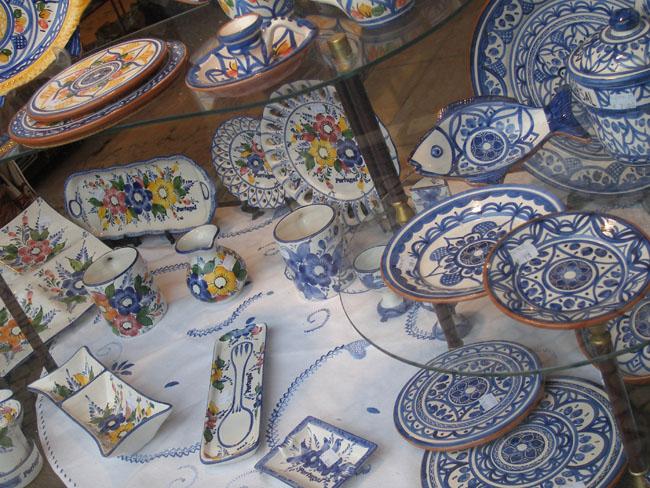

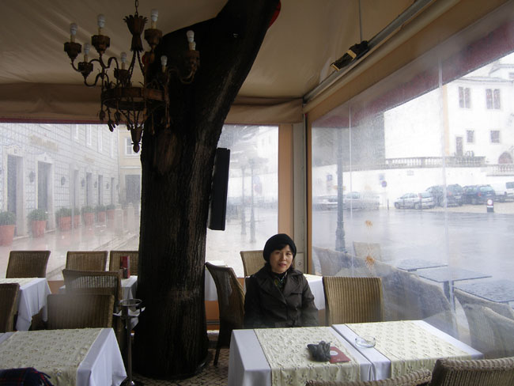

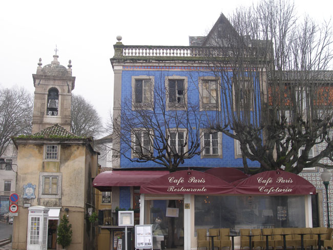

 \*사진 위로부터 안개에 젖은 신트라, 신트라성 모형, 신트라 주택가 골목, 신트라의 물고기 요릿집, 까페 바이론1, 까페 바이론 2, 까페 바이론 내부에 걸린 그림, 신트라의 주택들, 신트라의 그릇가게, 까페 파리에서, 까페 파리

공유하기

게시글 관리

**백규서옥\_Blog ver.**