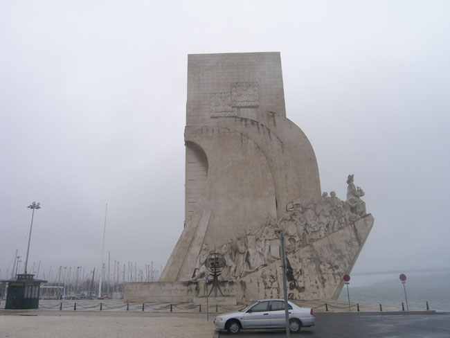
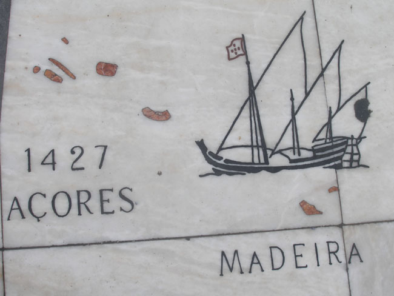
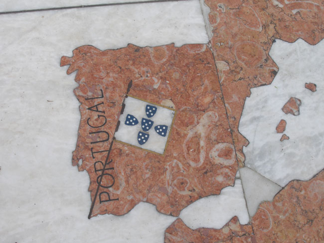
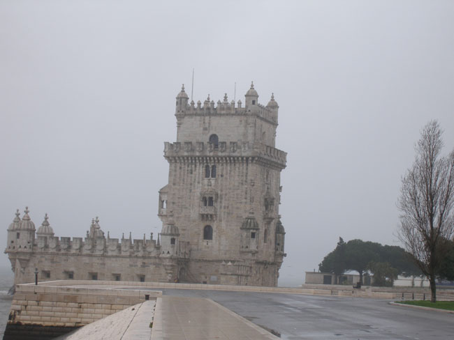

우리는 신트라를 떠나 리스본 서쪽의 벨렝 지구로 향했다. 궂은비가 내리고 떼주 강으로부터 바람이 불어왔다. 강가에는 벨렝 탑과 발견의 기념비가 웅장하면서도 도전적인 자태로 서 있었다. 대양을 향해 대항해 시대를 열어간 포르투갈 인들의 기상이 어려 있는 이 기념물들은 대로를 경계로 제로니무스 수도원과 마주하고 있었다.

 강가에 있는 기념물들이 세계를 향한 도전정신의 표현이었다면, 수도원은 이들의 안녕과 평화를 기원하는 자애로운 어머니의 이미지였다. 16세기 초에 항구를 보호할 목적으로 세워진 마누엘 양식의 건축물이 벨렝 탑이다. 포르투갈의 황금시대를 대변해주는 기념물로 콜럼버스도 이 항구를 통해 들어왔다고 한다. 겉으로 보기엔 대항해 시대에 세워진 하나의 탑이었지만, 8각의 요새는 군사적 목적으로 요긴하게 쓰였다. 대양을 향해 항해를 시작하는 사람들에겐 희망과 안식을, 항해로부터 돌아오는 사람들에겐 안식과 평온의 기쁨을 준 것이 바로 이 탑이다. 2층의 강 쪽 테라스엔 벨렝의 성모상이 무사 항해를 기원하며 서 있고, 벽면은 예수회의 십자가들로 장식되어 있었다.

 벨렝 탑으로부터 가까운 곳에 있는 것이 발견의 기념비인데, 떼주 강이 바라보이는 곳에 자리 잡고 있었다. 항해 왕자 동 엔리께의 500주기를 맞아 1960년에 세운 기념물로서 범선의 모양으로 만들어져 있었다. 상부에는 여러 인물들이 조각되어 있었는데, 맨 앞쪽이 동 엔리께였고, 선교사․선원․작가․천문학자․화가 등이 그 뒤를 따르고 있었다. 기념비 앞바닥에는 대리석에 모자이크 된 세계지도가 펼쳐져 있었다. 과연 대항해 시대의 주역다운 발상이었다.

 \*사진 위로부터 발견의 기념탑, 발견의 기념탑 앞 땅바닥의 그림1, 2, 벨렝탑

공유하기

게시글 관리

**백규서옥\_Blog ver.**