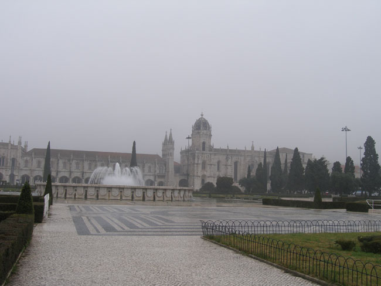
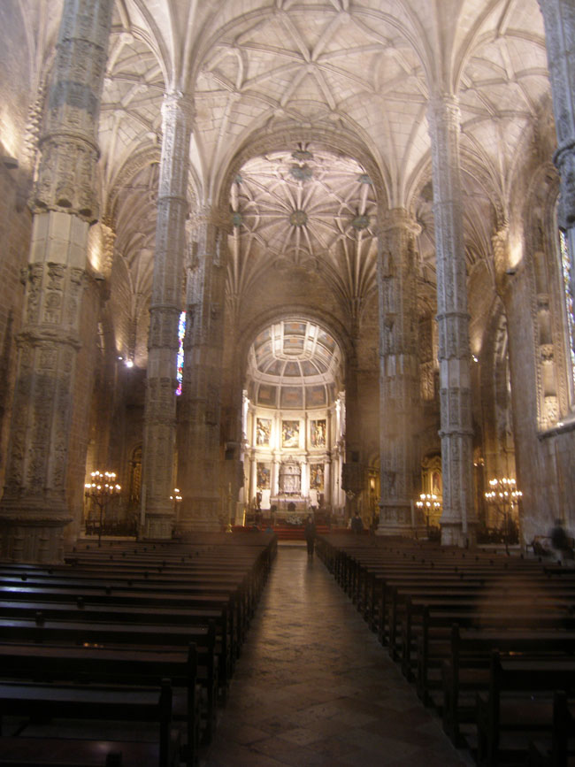
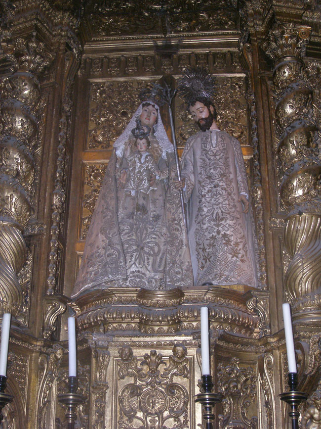
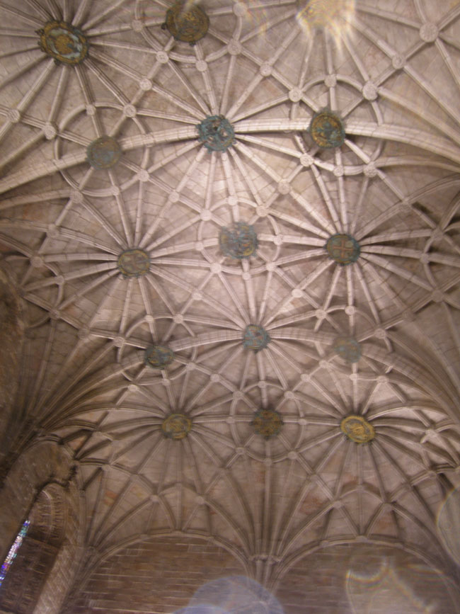

발견의 기념비를 둘러 본 다음 지하도를 통해 건너 간 곳이 제로니무스 수도원. 동 마누엘 1세가 해양을 개척하여 대항해 시대를 연 선구자들의 업적을 기념하기 위해 1502년 이곳에 세운 수도원이었다. 바스코다가마가 인도 항해를 마치고 벨렝 지구의 항구를 통해 들어온 직후였다. 수도원의 건축 양식은 고딕 후반기에 나타난 마누엘 스타일로서 대항해 시대의 풍부한 재화와 이역(異域) 문화의 수용 등을 반영한 것으로 보인다. 건물 표면, 특히 창문이나 난간 등에 자연 및 해양생활 모티프의 화려한 장식을 해 놓았는데, 동양적 양식이 두드러져 보였다. 남쪽 문으로 들어가니 성모 마리아 교회가 나왔다. 그곳에 동 마누엘 1세와 성 제로니모, 동 엔리께 등의 상들이 서 있고, 천장의 아름다운 장식이 볼 만 했다.

 \*\*\*

 벨렝 지구를 떠난 우리는 리베르다도 대로를 통하여 리스본의 중심부인 바이샤 지구로 이동했다. 에두아르두 7세 공원, 레스따우라도리스 광장, 로시우, 꼬메르씨우 광장 등을 돌아본 다음, 동부의 알파마 지구로 이동하여 성 조르지 성, 대성당 등을 둘러봄으로써 대항해 시대의 첨병 포르투갈 맛보기를 끝낼 수밖에 없었다. 비행기를 타고 스페인의 바르셀로나로 이동하여 가우디의 건축물들과 만나기 위해서였다.

  
 \*사진 위로부터 제로니무스 수도원 1, 2, 성모마리아 교회의 본당과 제대, 성모마리아 교회 안의 성가족, 성모 마리아교회의 아름다운 천장

공유하기

게시글 관리

**백규서옥\_Blog ver.**