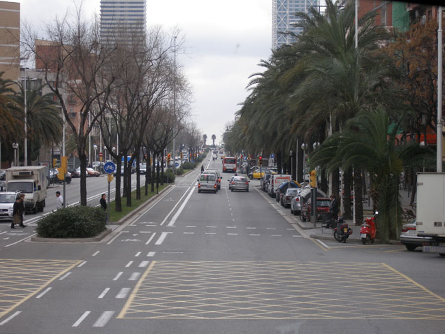
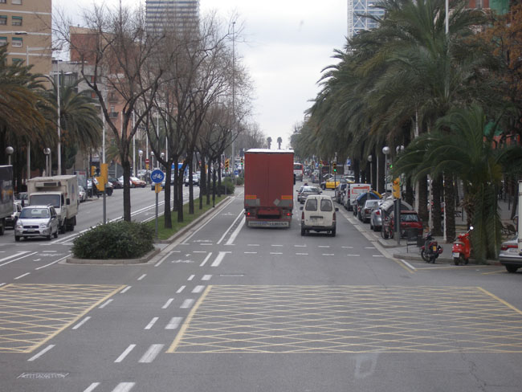
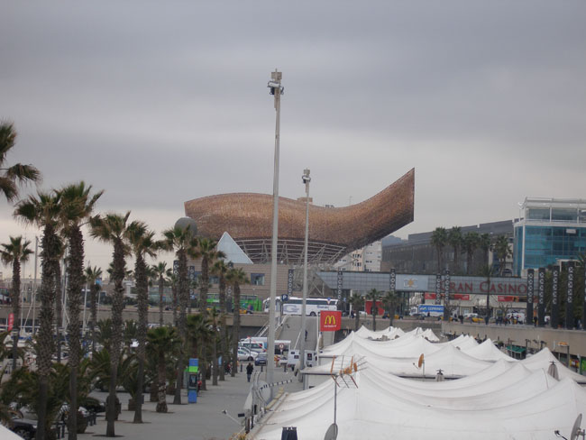
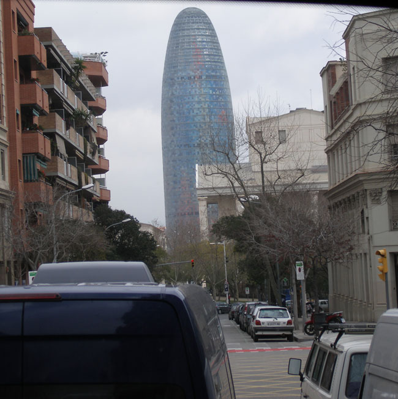
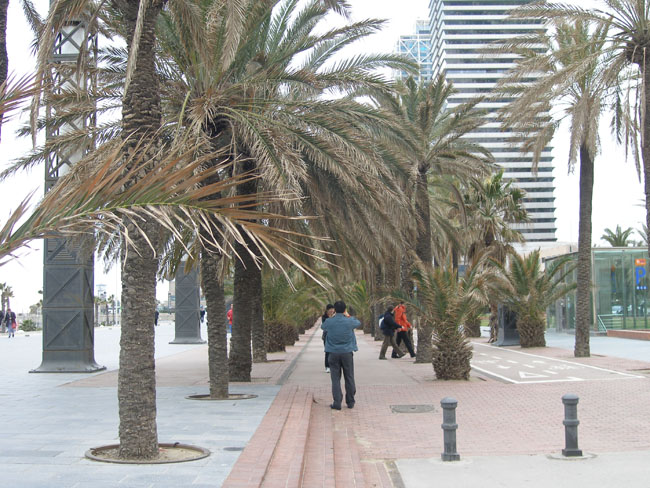
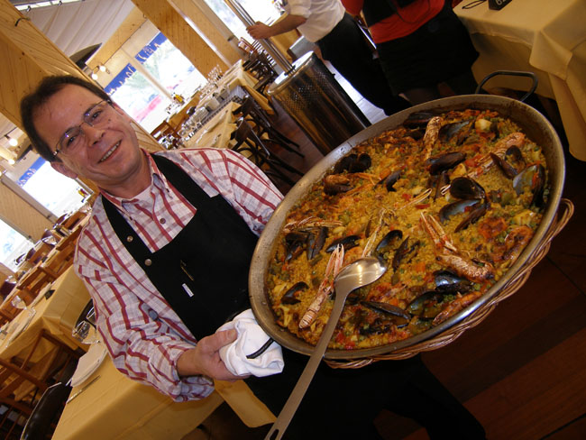
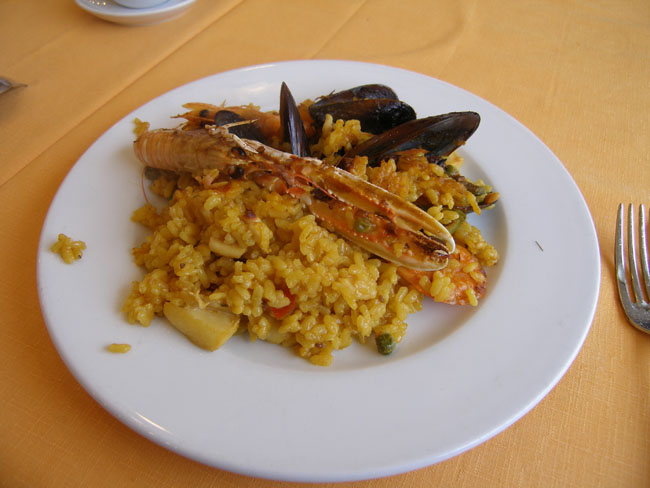
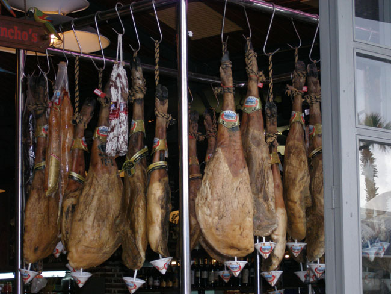

1월 29일 아침 9시. 아침식사를 하자마자 바르셀로나의 맥박을 느끼기 위해 호텔을 나섰다. 28일 밤늦게 포르투갈의 리스본으로부터 비행기로 날아와 1박을 한 까딸루냐 사바델(Catalonia Sabadell) 호텔. 호텔은 좋았으나 휴식을 즐길 여유가 없었다. 스페인에서의 마지막 날, 바르셀로나의 정수를 놓칠 수 없었기 때문이었다.

 공기는 싸늘했으나 햇살은 깨끗했다. 달리는 버스의 차창으로 고풍스런 건물들과 정갈한 거리의 풍경들이 쏟아져 들어왔다. 마이크를 잡은 김은경 선생은 차분한 음성으로 바르셀로나의 핵심을 잘도 짚어 주었다.

 스페인 북동부에 있는 제2의 도시 바르셀로나. 170 만 명의 인구를 갖고 있으며 마드리드와 항상 경쟁관계에 있는 문화와 역사, 그리고 경제 도시 바르셀로나. 바르셀로나는 베소스강과 요브레가트 강 사이의 평야지대에 있으며, 제조업과 관광업 금융업 등으로 스페인 경제의 중심축이었다.

 1992년 이곳에서 개최된 올림픽과 당시 위원장 사마란치를 떠올리게 하는 도시, 몬주익 언덕의 황영조와 FC바르셀로나 같은 축구클럽을 생각나게 하는 스포츠의 도시, 그러나 무엇보다도 상식을 뛰어넘는 건축미로 전 세계인들의 사랑을 받는 안토니오 가우디(Antonio Gaudi, 1852~1926)의 도시, 피카소 미술관이 있고 고딕양식의 건물들이 즐비한 예술의 도시... 바르셀로나는 무엇으로도 한정할 수 없을 만큼 많은 의미와 아름다움을 안고 있는 도시였다.

  
\*사진 위로부터 1, 2, 3은 바르셀로나 시가지. 4는 수도국(아그바르) 건물, 5는 해변길. 6과 7은 점심식사를 한 식당의 요리사와 해물빠에자, 8은 그 식당에 진열되어 있는 하몽.

공유하기

게시글 관리

**백규서옥\_Blog ver.**