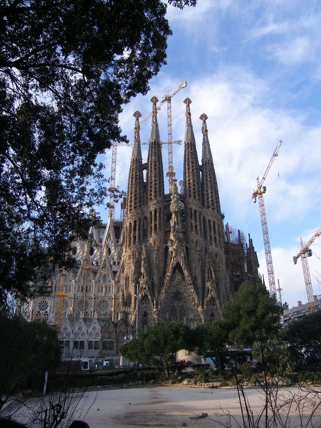
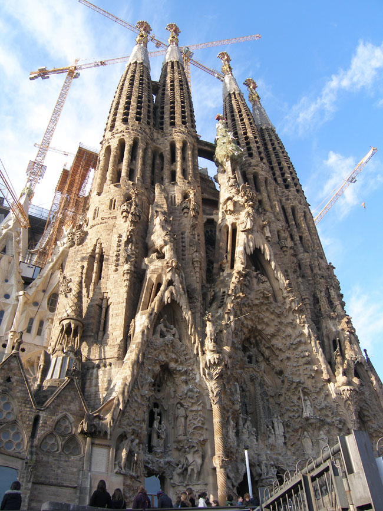
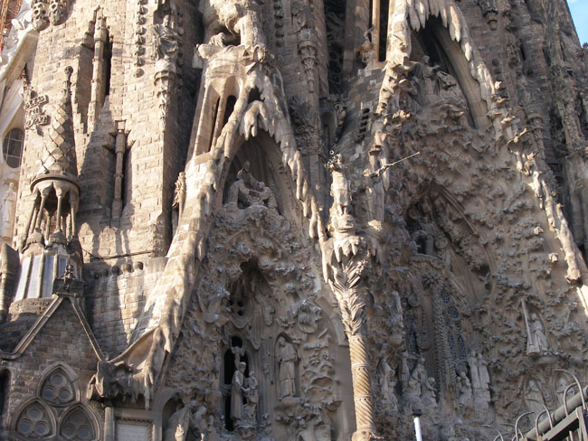
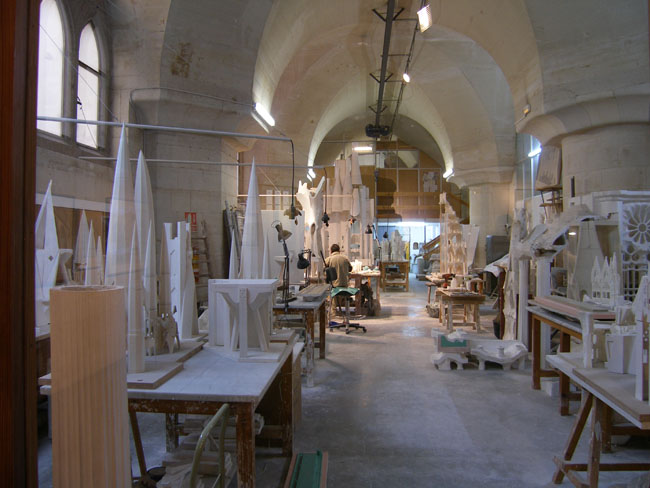
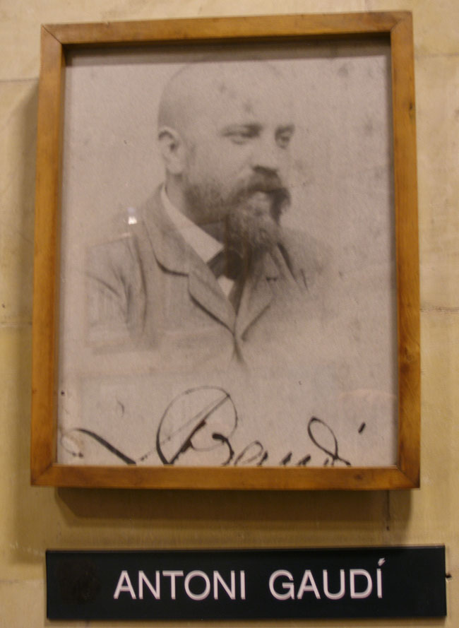
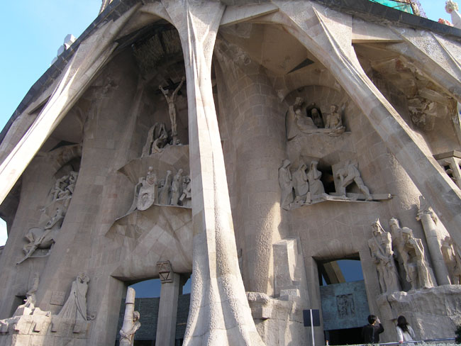
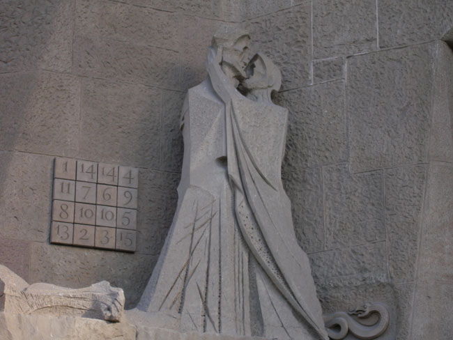
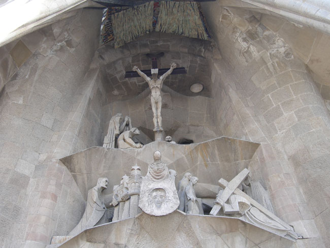
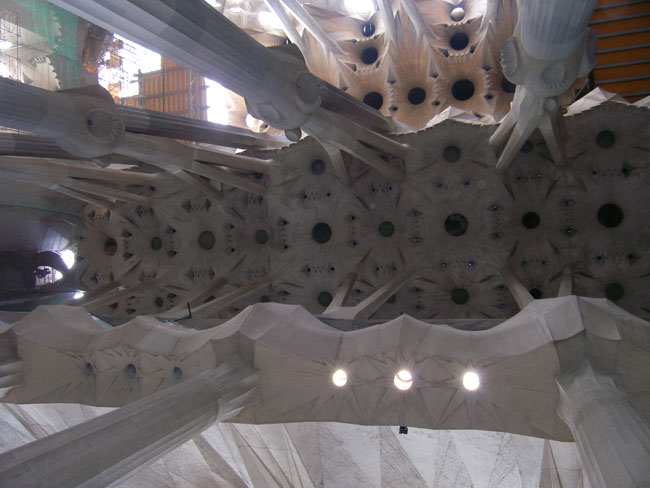
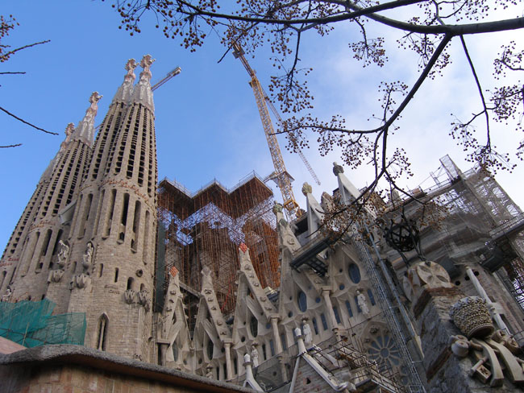

호텔로부터 달려온 버스가 어느 곳엔가에 서고, 길바닥에 내린 우리는 참으로 기묘한 광경과 마주하게 되었다. 길 건너에 아직도 건축 중인 기묘한 건물 하나가 서 있었다. 크기도 크기려니와 버섯 같기도 하고 옥수수자루 같기도 한 첨탑들의 우뚝우뚝한 모습이 경이로웠다.

 사그라다 파밀리아(Sagrada Famiglia), 즉 성가족 성당이 바로 그것이었다. 원명은 ‘속죄의 성가족 대성당(Templo Expiatorio de la Sagrada Famiglia)’이란다. 400년을 목표로 건축 중에 있으며 현재는 100년 남짓 지났을 뿐이니, 완공까지는 앞으로 300년을 더 필요로 할 것이다.

 1883년부터 시작하여 1926년 불의의 교통사고로 죽기까지 가우디는 40여 년 동안 성가족성당의 건축에 몰두했다. 바르셀로나에서 태어난 그의 아버지는 구리 세공사였다. 자연히 예술에 관한 감각은 타고난 셈이었다.

 대학에서 건축학을 공부한 그는 아르누보(Art-Nouvea)의 회원으로서 고딕양식을 자기 식으로 독특하게 해석하여 표현했다. 건축 활동을 통해 얼마간 부를 축적했으나, 아끼던 조카와 친구 구엘의 죽음 등으로 한동안 방황하다가 현세적 욕망의 허망함을 깨닫고 스스로 결단을 내린 그였다. 현실적 이해에 초연하게 된 그는 절대자에 대한 신앙만으로 성가족성당의 건축이라는 대역사에 참여하게 되었다. 그로부터 일생동안 그는 거지같은 차림으로 흡사 수도승 같은 삶을 살았다.

 스페인 내란을 겪으면서 스페인 국민들에게 견딜 수 없는 현실 가운데 하나가 바로 가정의 파괴였다. 성가족 성당의 원래 이름 ‘속죄의 성가족 대성당’은 바로 이러한 당대의 현실이 반영된 결과였다. 성가족 성당에는 예수의 일생 가운데 ‘탄생-수난-영광’을 형상하는 세 개의 파사드(Facade)가 있는데, 가우디는 이 가운데 탄생 부분만 완성할 수 있었다. 누군가에 의해 수난이 완성되었고, 영광은 지금 준비되고 있다는 설명이었다.

 유럽 대부분 지역의 성당들이 마리아를 앳된 처녀의 모습으로 형상한 것과 달리 이곳 ‘성가족’의 성모는 ‘나이 든 여인’으로 그려져 있었다. 더 놀라운 것은 목수 요셉의 자리에 목공일을 하는 청년예수가 앉아 있다는 점이다. 그것은 좀 더 인간적인 모습의 사실성을 부각시키려는 작가의 의도였을 것이다.

 성당의 내부에 가우디가 고안한 숫자의 행렬(行列)이나 스케치는 남아 있으나, 제대로 된 설계도는 남아 있지 않았다. 말하자면 신에 대한 염원이나 깊은 신앙심이 설계도 자체라도 되는 것처럼 가우디는 혼신의 힘을 다 해 성당 건축의 역사(役事)를 밀고 나갔던 것이다.

 \*\*\*

 ‘성당이 미약한 인간의 존재에게 위압적인 건축물이어서는 안된다’는 것이 유럽의 성당들을 돌아보고 난 다음에 내린 내 결론이었다. 대부분의 성당들은 인간의 왜소함이나 불완전성을 전제로 신의 무한한 힘과 영광을 강조하는 구조를 지니고 있었다. 그러나 성가족 성당은 달랐다. 자유 속의 절제나 인간과 함께 하는 신의 영광을 경쾌함과 즐거움으로 조화시키고자 한 데 이 건축물의 특징이 있었다. 더구나 이 건물의 건축비는 익명의 기부자와 방문객들의 헌금, 관광객들의 입장료 등으로 충당되고 있다 하니 그 얼마나 감동적인가.

공유하기

게시글 관리

**백규서옥\_Blog ver.**