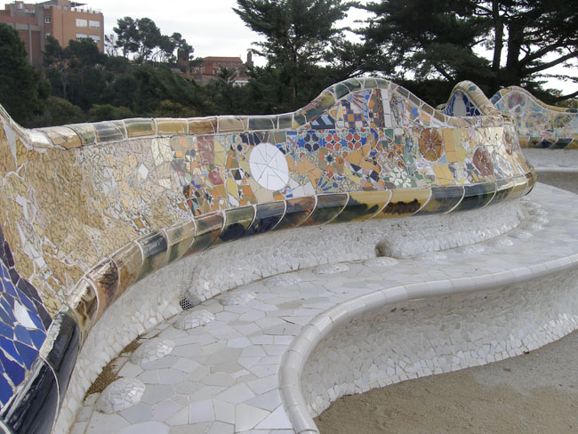
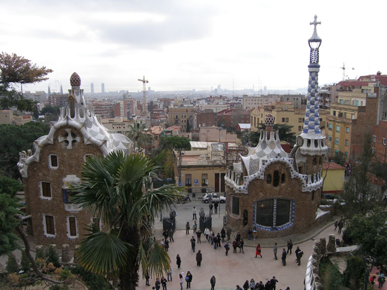
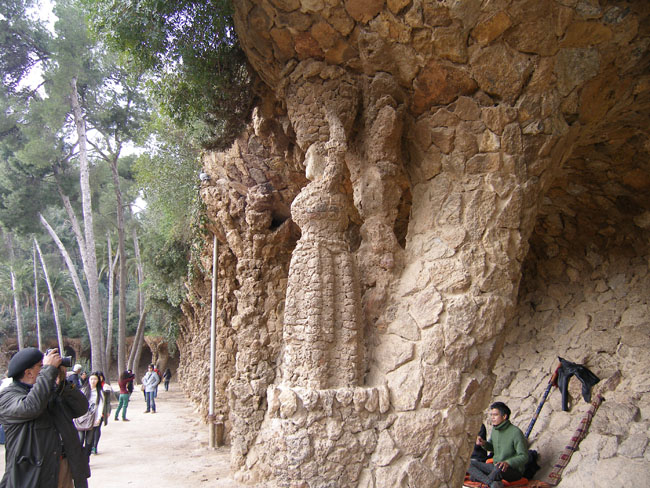
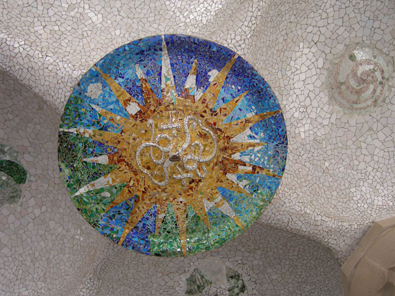
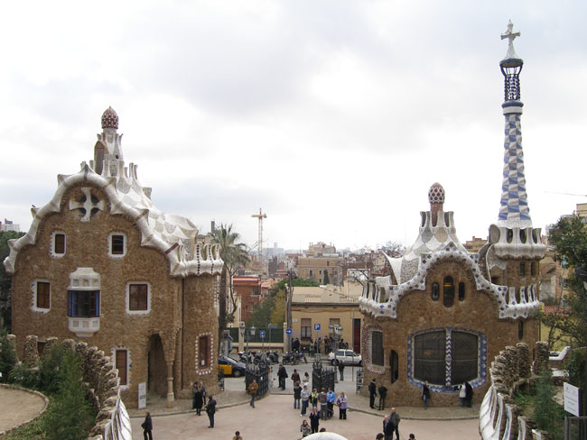
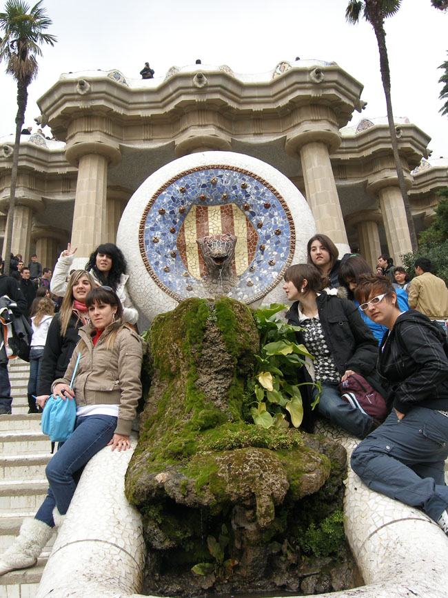
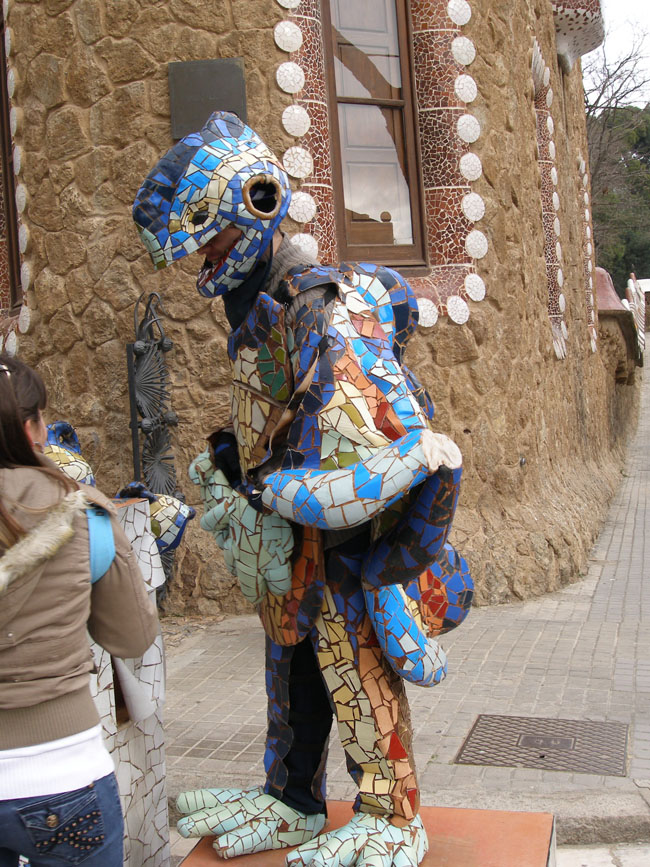
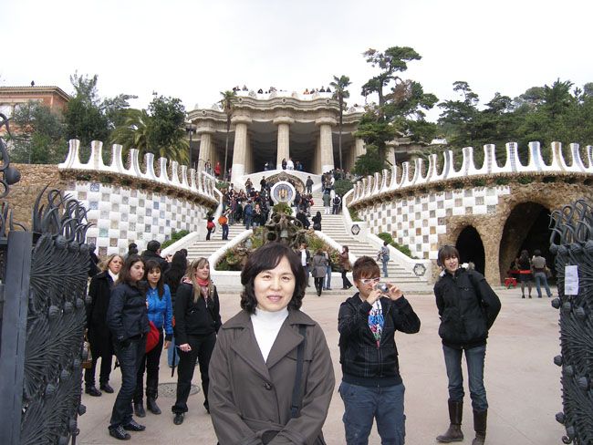

성가족 성당의 감동으로 마음을 적신 다음 찾은 곳은 구엘 공원(Parc Güell)이었다. 산타 테레사 학교를 중심으로 동쪽에 공원은 위치해 있었다. 구엘공원의 컨셉은 전체적으로 동화 나라의 그것이었다. 100년 전 당시 에우세비 구엘(Eusebi Güell)은 영국풍의 조용한 전원도시를 만들려고 했단다. 친구인 가우디에게 15ha 넓이의 부지에 대한 설계를 의뢰했고, 가우디는 자신의 철학에 따라 중앙광장, 도로, 경비실, 관리사무실 등을 설계했다. 도시 재개발 사업의 일환으로 만들어진 이 작은 도시는 원래 기존의 도시가 내려다보이는 곳에 60세대가 살 만한 공동주택을 지으려던 계획 아래 조성되었다. 그러나 그 계획이 무산되면서 가우디는 겨우 두 채의 집만 지을 수 있었다.

 다양한 색상의 부서진 타일들을 활용하여 만든 벤치들이 중앙광장을 에워싸고 있었다. 그 벤치에 앉으니 석양 너머로 바르셀로나의 시가지와 지중해가 보였다. 그 뿐 아니었다. 도마뱀 분수대, 당시 시장으로 쓰려고 했던 건물의 천정 등 환상적인 시설과 공간이 우리의 눈과 마음을 황홀하게 했다. 가우디가 1906~1926년 사이 20년 동안 살았다는 집은 현재 박물관으로 개조되어 있었으며, 그곳에 놓인 가구나 침대 등은 모두 그가 디자인한 것들이었다.

 성가족성당과 구엘공원을 돌아보면서 나는 ‘원래 직선이란 없다’던 가우디의 믿음을 확인할 수 있었다. 그동안 우리가 얼마나 직선의 벽에 갇혀 답답하고 무미건조하게 살아왔는지를 깨달을 수 있었다. 우리 모두는 직선들이 만들어내는 기성관념의 틀 속에서 ‘점점 질식해가는’ 삶을 살아왔다는 점을 알게 되었다. 직선이 만들어내는 이성은 곡선이 만들어내는 감성의 부드러움에 비해 얼마나 상상력을 결여하고 있는가를 비로소 깨닫게 된 것이다.

공유하기

게시글 관리

**백규서옥\_Blog ver.**