아쉬움 속에 구엘공원을 떠난 우리는 길쭉한 수세미 모양의 수도국(아그바르) 건물이 멀리 바라보이는 도로를 달려 몬주익(Montjuïc)에 도착했다. ‘몬주익’이란 원래 ‘유대인들이 살던 언덕’에서 나온 말로 복잡한 역사적 맥락이 얽힌 곳이었다. 동서고금을 막론하고 지명 속에는 역사의 우여곡절이 배어 있기 마련. 이곳에서도 유태인 핍박의 역사가 있었던 모양이나 자세한 건 생략하기로 한다.

 우리는 스페인 광장을 출발, 무역 전시장과 분수대, 카딸루냐 미술관을 거쳐 1992년 바르셀로나 올림픽이 열렸던 주경기장에 도착했다. 주경기장은 산 조르디 스포츠관(Palau d'Esorts Sant Jordi), 기념공원 등과 함께 있었고, 올림픽 기념관은 주경기장 뒤편에 있었다. 주경기장 도로변엔 몬주익의 영웅 황영조의 모습이 석판에 부조되어 있어 감회를 새롭게 했다. 주경기장의 현재 이름은 루이스 콤파니스 올림픽 경기장 (Estadi Olímpic Lluís Companys). 1929년의 엑스포를 대비하여 1927년에 최초로 만들어진 이 경기장은 1936년 하계 올림픽을 위해 보수되었고, 1992년 하계 올림픽의 주경기장으로 사용하기 위해 1989년 재보수되었다. 경기장 수용 인원은 7만명. 체육경기 뿐 아니라 가수들의 콘서트장으로도 사용되었다고 한다. 롤링스톤즈, 티나터너, 마돈나, 본조비 등은 그 대표적인 가수들이다.

 주경기장 뒤쪽으로 걸어 올라간 자리에 몬주익 성이 있는데, 그곳에 들어가자 군사박물관이 있었고, 발 아래로 바르셀로나 시가지가 파노라마처럼 펼쳐졌다. 과연 과거와 현재가 적절히 배합되어 있는 바르셀로나의 모습은 윤택과 풍요 그 자체였다. 스페인에서 가장 부유한 도시, 바르셀로나. 그 속에서 예술과 문화, 전통과 현대를 함께 호흡하고 있는 시민들의 여유가 나그네의 부러움을 자아냈다.

  \*\*\*

 언덕을 내려온 우리는 람불라스 거리(Las Ramblas)를 걸었다. 콜럼버스 기념탑에서부터 까딸루냐 광장에 이르는 널찍한 보도(步道). 플라타너스 가로수가 길 양쪽으로 늘어서 있고, 길바닥엔 돌이 깔려 있었다. 길옆으로 ‘움직이는 동상’이라 불리는, 꽤 많은 수의 거리공연자들이 갖가지 행색으로 나그네의 눈길을 끌었다. 꽃 가게, 신문이나 잡지의 가판대들이 줄지어 있고, 거리 양쪽에는 각종 레스토랑, 숙박시설, 선물가게, 옷 가게 등이 즐비했다. 람블라스를 걷다가 옆의 상가로 들어가니 어물전, 식품점, 적나라한 고깃집, 반찬가게 등이 한 골목 그득했다. 껍질 벗긴 염소머리, 토막 난 생선, 소세지, 각종 야채 등 우리나라 재래시장에서 봄직한 음식의 1차 재료들이 진열대에 수북이 쌓여 있었다.

 람블라스 거리를 부랴부랴 빠져나온 우리는 어둑발이 진 치고 있는 거리를 뚫고 가우디의 또 다른 작품 카사 밀라(Casa Mila)를 찾았다. ‘라 페드레라(La Pedrera, 채석장이란 뜻)’라고도 불리는 이 고품격 맨션은 바르셀로나 중심가인 그라시아의 거리를 마주보고 있었다. 각 층 4 가구, 가구 당 400㎡의 공간을 갖고 있는 이 저택은 가우디의 예의 컨셉대로 꾸불텅거리는 외관을 갖추고 있었다. 지금 보아도 ‘기괴한 미학’이라 할 수 있는데 한 세기 전엔 어떠했을까를 생각하니, 이 작업 후에 한바탕 소동이 일었다는 말도 결코 과장이 아니었으리란 생각이 들었다.

  \*\*\*

 바르셀로나는 넓고 깊었다. 단순히 물리적인 면적이 아니라 문화와 역사, 아름다움이 어울려 빚어내는 도시의 정신적 깊이와 넓이가 그렇다는 것이다. 가우디가 차지하는 면적이 그리 넓지는 않았으나, 가우디와 바르셀로나가 동일시되는 것은 그의 미학이 범상치 않기 때문이었다. 우리가 바르셀로나의 모든 것들을 대충 지나쳤으면서도 가우디의 모든 것을 보기 위해 한사코 애를 쓴 이유도 그 점에 있었다.

 스페인을 정리하기 위해 이제 우리는 마드리드로 돌아간다.

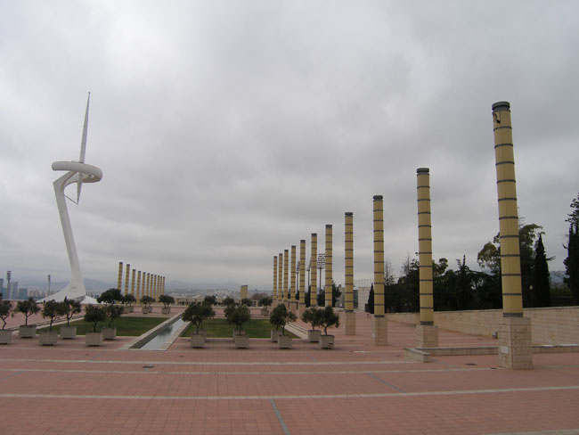

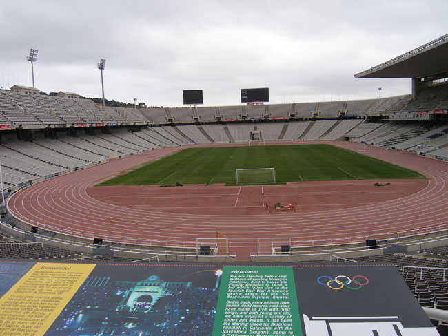

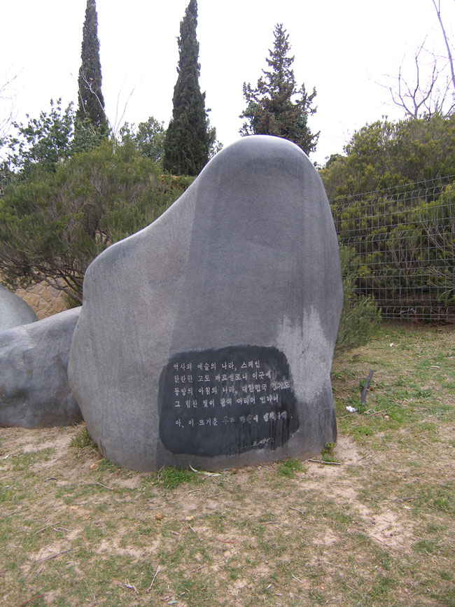

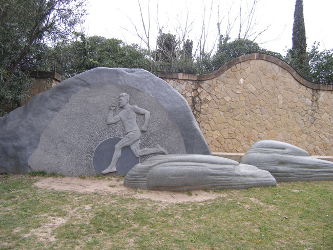

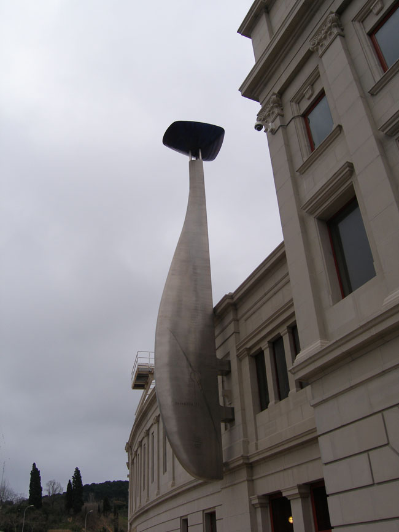

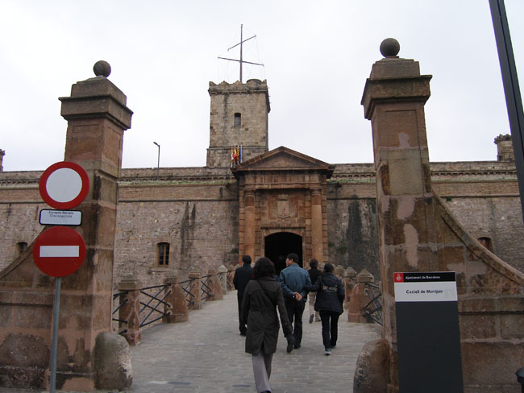

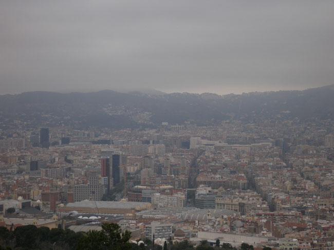

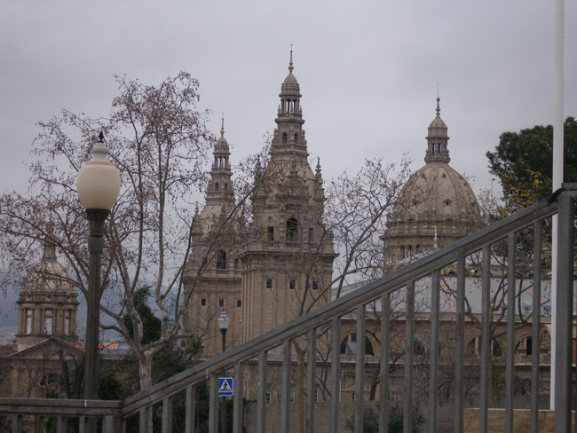

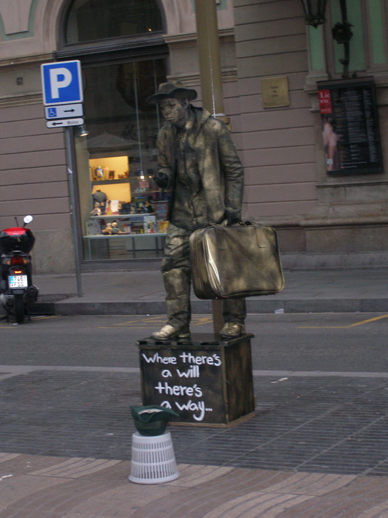

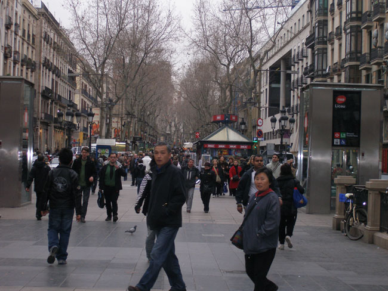

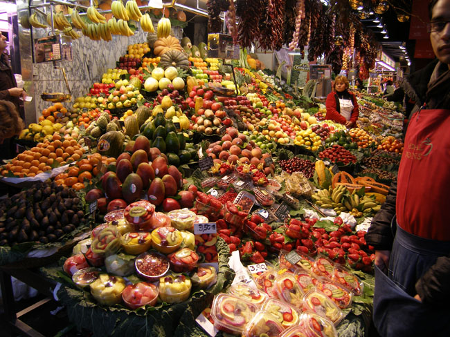

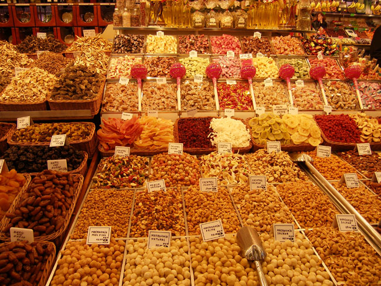

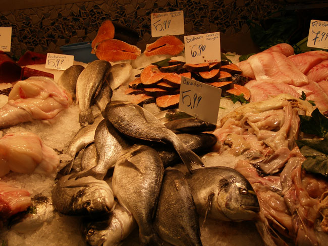

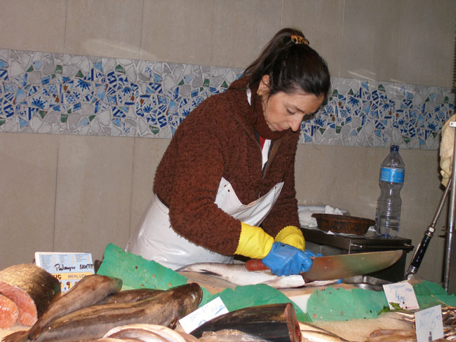

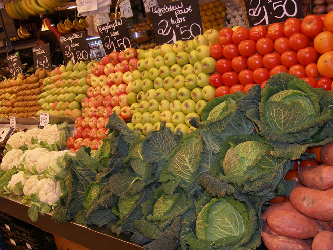

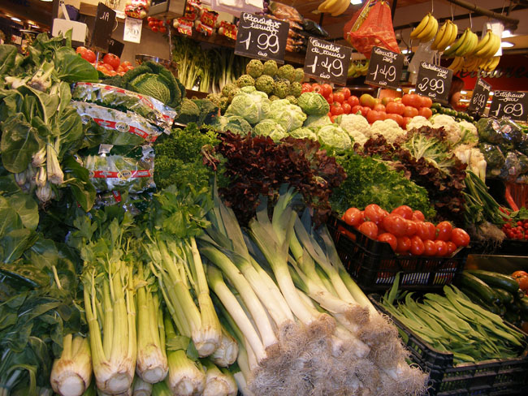

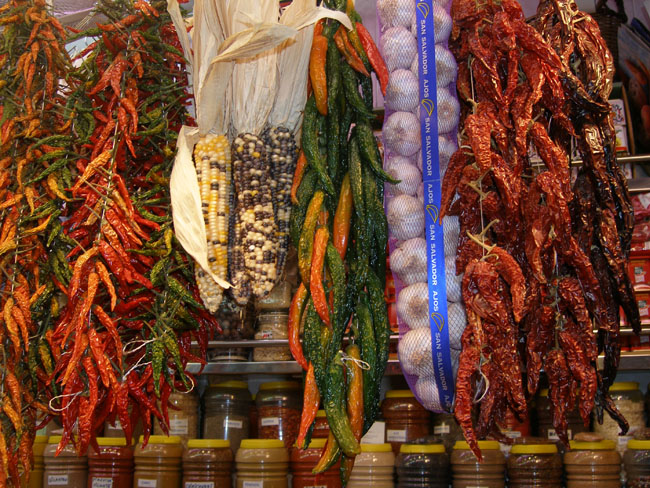

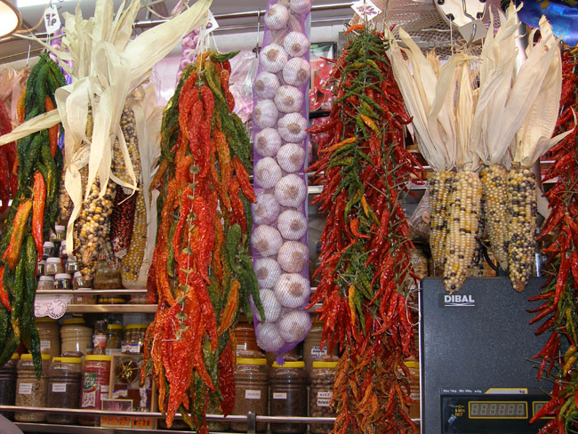

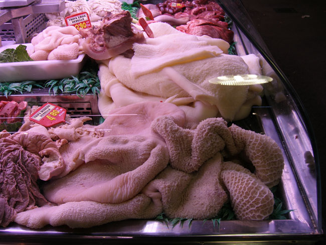

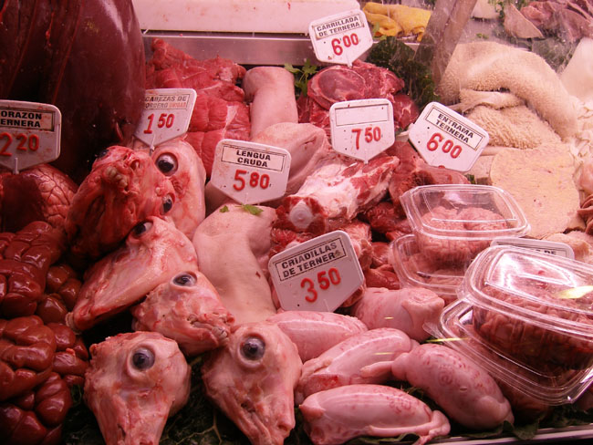

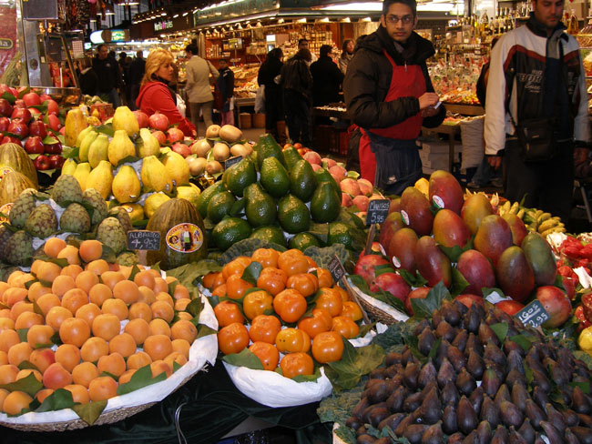

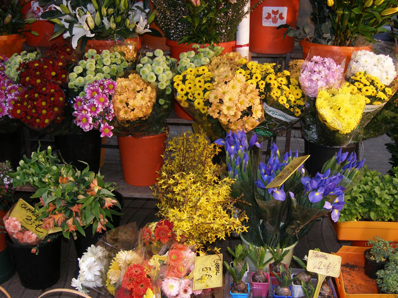

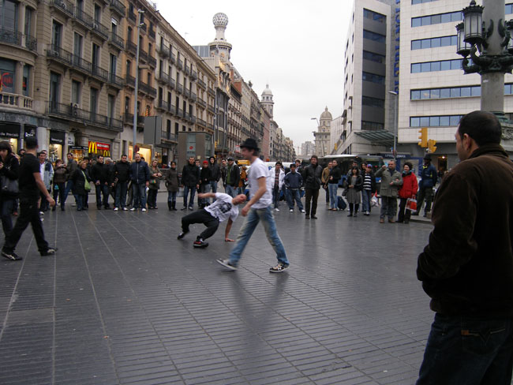

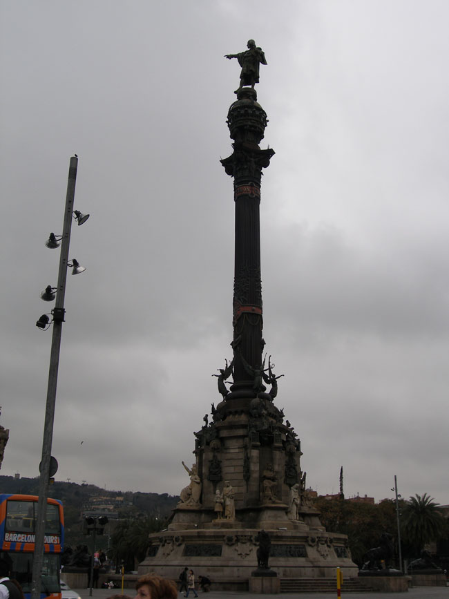

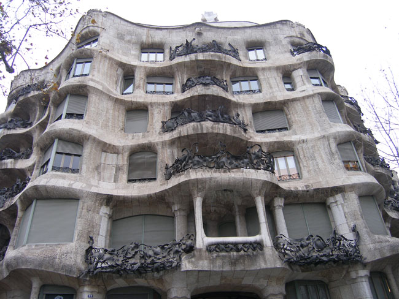

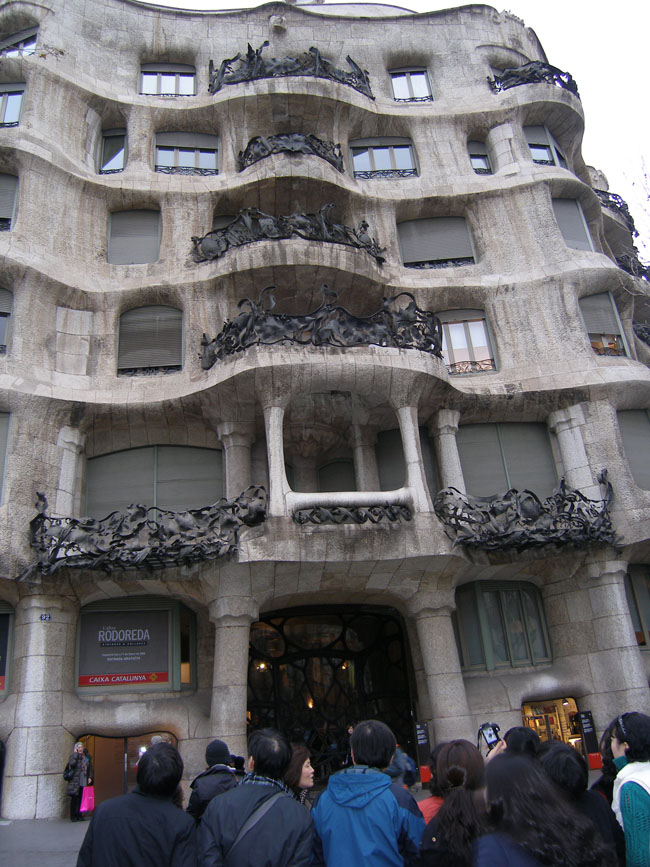

  
\*사진 위로 부터 몬주익 경기장, 몬주익 경기장, 몬주익 경기장 밖 대한민국 기념물, 달리는 황영조, 몬주익 경기장 성화대, 몬주익 경기장 뒤 몬주익 성, 몬주익 성 위에서 바라본 바르셀로나 시내, 몬주익 경기장 옆 고고학박물관

공유하기

게시글 관리

**백규서옥\_Blog ver.**