1월 30일 오전 8시 마드리드의 젬마 호텔을 나섰다. 날씨는 쌀쌀했으나 하늘은 맑았다. 마드리드 인근 세고비아(Segovia)를 찾아가는 길. 설레는 마음 한 구석으로 서운함이 슬며시 찾아들었다. 스페인에서의 마지막 날. 그간 숨겨 두었던 보물, 세고비아로 향하게 된 것이다.

 호텔로부터 1시간 남짓 달렸을까. 거대한 산으로 둘러싸인 분지가 나오고, 그 중심에 그림처럼 아름다운 도시가 참하게 앉아 있었다. 한때 서고트 왕국의 수도였던 해발 1000m 고도(高度)의 고도(古都)였다. 이곳이 양모 산업의 중심이라 하나, 주변에는 밀밭과 보리밭이 드넓게 펼쳐져 있었다.

 맨 처음 찾은 곳은 로마 수도교(水道橋). 유럽 곳곳에 남아있는 수도교들 가운데 가장 아름답다고 평가된다는데, 길이 728m, 높이 28m의 거대한 규모였다. 오늘날처럼 시멘트를 사용하는 대신 화강암 블록만을 2단의 아치형으로 쌓아올려 만든 다리인데, 기원 1세기경 트라야누스 황제시대에 만들었다 하니 그 기술수준의 놀라움은 말로 표현할 수 없다. 멀리 보이는 푸엔프리아 산맥에서 발원되는 아세베타 강물을 이곳 세고비아로 끌어들였으며, 지금도 수로로 이용되고 있다고 한다. 그들의 놀라운 지혜와 기술이여!

 수도교 앞에는 이곳에서 4대째 이어오는 ‘아기 통돼지 찜 요리’로 유명한 식당이 있었다. 이곳 말로 ‘꼬치니조’라 불리는 요리는 하몽, 빠에자, 아세이뚜나(올리브 절임) 등과 함께 스페인에서 맛보아야 할 4대 요리라 한다. 시내의 시외버스 주차장 광장에는 이 집의 창시자가 동상으로 남아 있었다.

 수도교를 구경한 우리는 비좁은 구시가의 골목을 지나 마요르 광장에 도착했다. 마요르 광장 한쪽에는 카테드랄이 우아하면서도 압도적인 자태로 서 있었다. 카테드랄은 1521년 코무네로스의 반란에 의해 크게 파괴되었으나 그로부터 4년 뒤 카를로스 1세가 재건을 시작해 1577년 완공되었다. 후기 고딕양식으로 전면에 걸쳐 우아함이 넘쳐났다. 구시가의 중심가에서는 이 성당 말고도 로마네스크 양식의 산 미안 성당, 산 에스테반 성당 등이 보였는데, 모두 이 도시를 대표하는 건축물들이었다. 산 미안 성당은 12세기 초에 건축된 것으로 초기 로마네스크 양식을 대표하며 산 에스테반 성당은 13세기에 지어진 것으로 로마네스크 양식인 점은 마찬가지였다. 특히 산 에스테반 성당의 경우 높이 53m나 되는 종루가 두드러졌다.

 무엇보다 우리를 감탄하게 만든 것은 알카사르의 아름다움이었다. 디즈니의 <백설공주>에 등장하는 성의 모델이라 할 만큼 세고비아의 알카사르는 빼어나 보였다. 에레스마 강과 클라모레스 강이 합류하는 지점의 우뚝한 바위산에 서 있는 알카사르. 13세기에 축성된 이래 여러 차례의 증․개축이 이루어져 왔다. 원래는 왕실의 중심되는 성으로서 아사벨 여왕의 즉위식과 펠리페 2세의 결혼식이 열리기도 했으며, 후대에 들어와 감옥으로 쓰이기도 하고 무기 제작소로 쓰이기도 했다.

엄청나게 깊은 해자를 건너 알카사르에 들어가니 역대 제왕들의 호화로운 삶이 한 눈에 들어왔다. 언덕 아래의 강물이 아득하게 실낱처럼 보일 정도로 이 성은 전략적 요충이기도 했다. 돈 후안 탑에 오르자 세고비아의 거리와 오고가는 사람들이 또렷이 보이고, 멀리로는 과달라마 산맥이 한눈에 들어오기도 했다.

 멀리 보면 동화 같은 성채가 가까이 다가가 보면 온갖 영화와 우여곡절을 함축한 서사적 문맥으로 인식되는 까닭을 알 수가 없었다. 인간사 모든 것이 ‘보는 거리에 따라’, ‘보는 각도에 따라’ 달라질 수 있다는 사실을 이곳 세고비아의 알카사르에서 비로소 깨닫는다.

  \*\*\*

스페인에서의 마지막 날이기 때문이리라. 모를 때는 그다지 마음 당기지 않던 곳이었으나, 막상 와 보니 매력적인 곳이 스페인이었다. 곳곳에 널려 있는 역사의 흔적들과 문화의 적층(積層)은 유럽의 어느 국가에 비해서도 뒤지지 않았다. 지중해에서 불어오는 온난하고 습윤한 바람 때문인가, 사람들의 마음을 달뜨게 만드는 매력이 물씬 풍겨났다. 따지고 보면 스페인에 대한 갈증 만 키운 며칠이었다. 그런 스페인을 오늘로 이별한다. 피카소를 낳았고, 세르반테스를 낳은 나라. 많은 예술가들과 문학가, 탐험가들을 낳아 키운 나라. 역사의 도정에서 잠재된 정열을 간혹 활화산처럼 무섭게 터뜨려온 나라. 무적함대로 대양을 누비며 세계를 제패했던 나라...

나는 여기서 무엇을 보고 느꼈는가. 스페인에서 찾아낸 우리의 미래를 생각하며 한동안 고민해야 할 것이다. -끝-

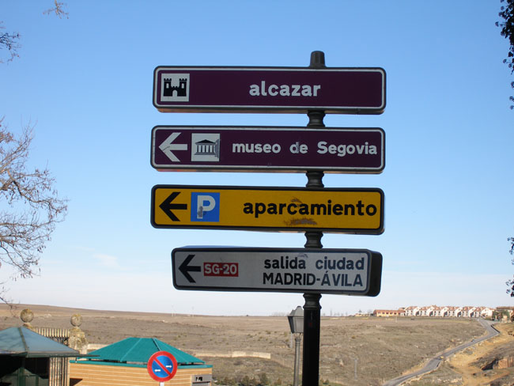

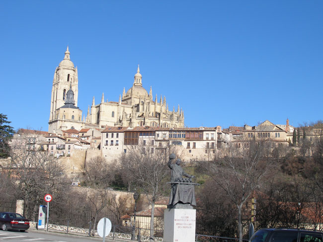

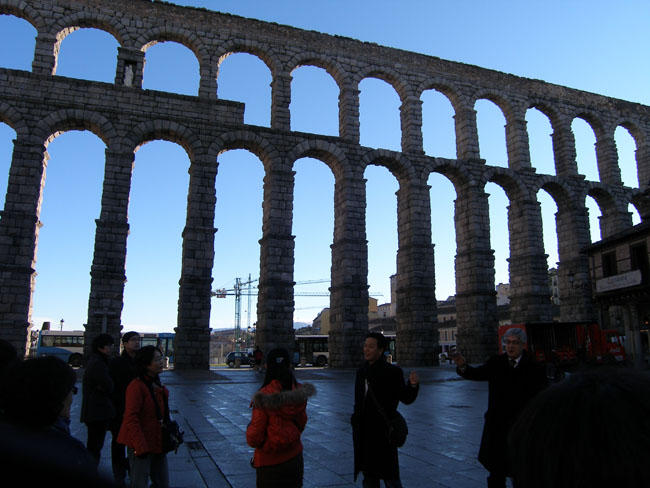

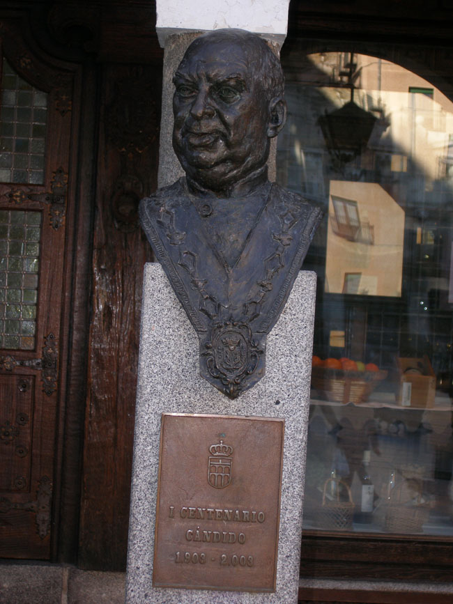

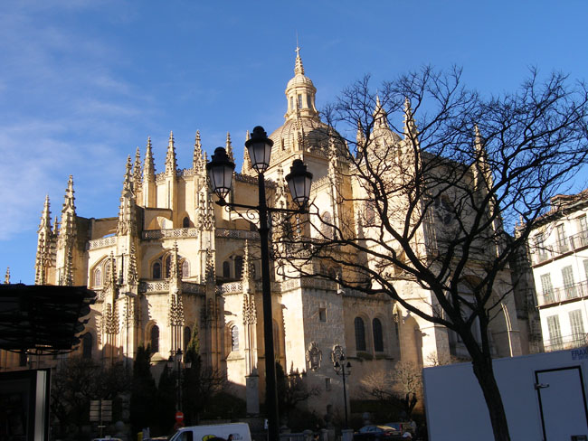

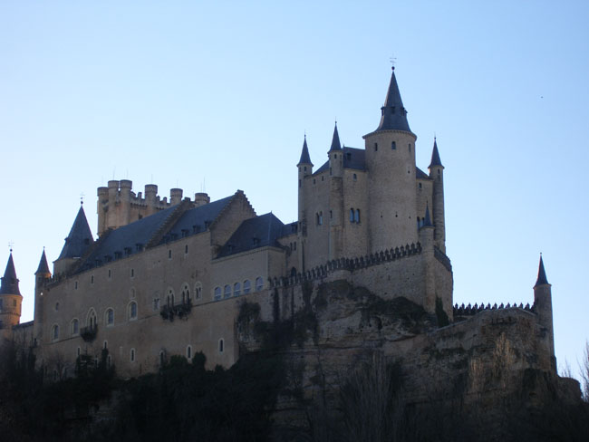

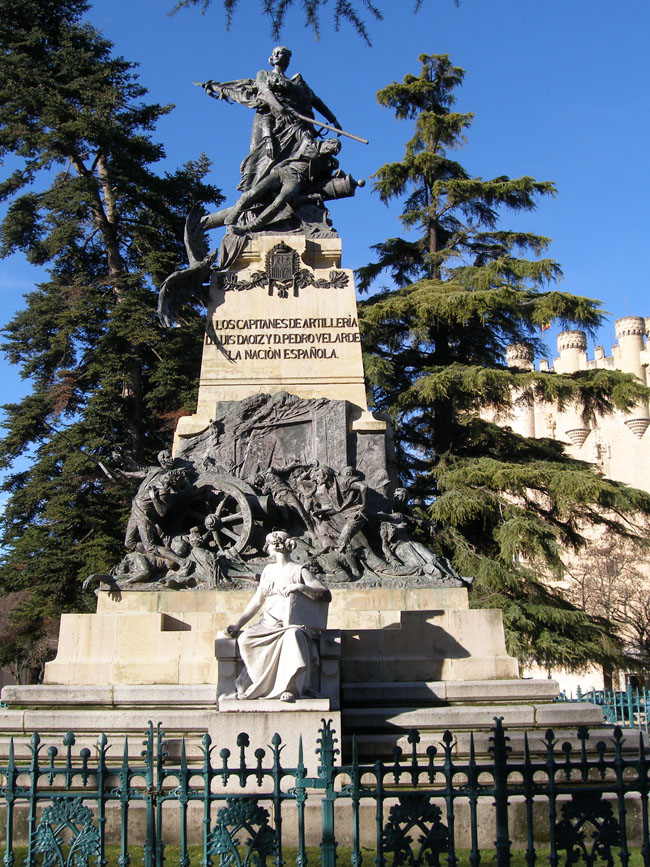

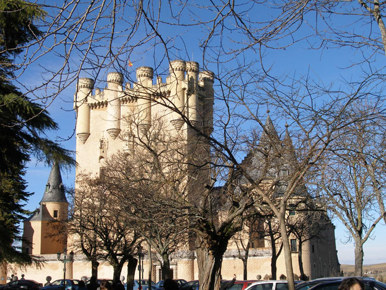

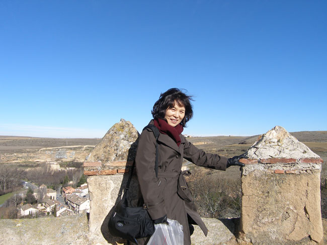

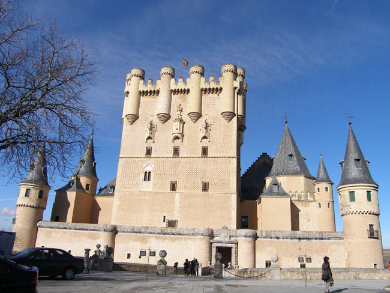

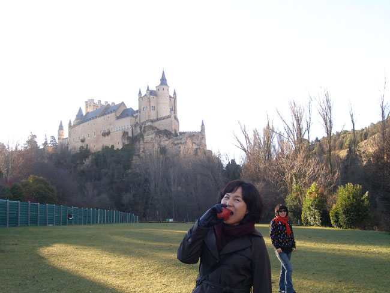

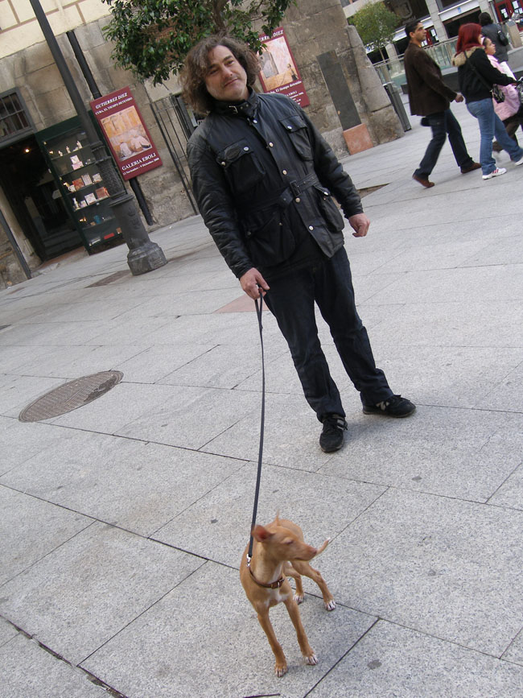

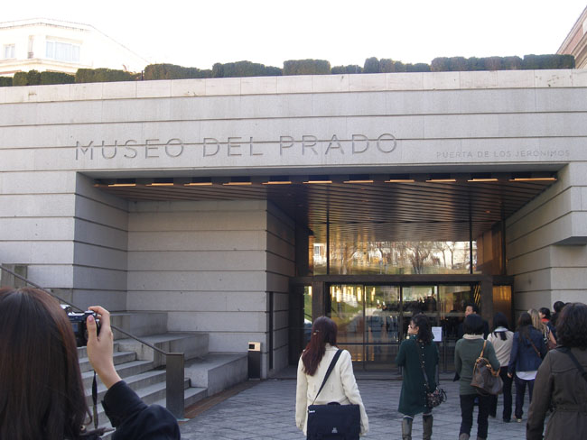

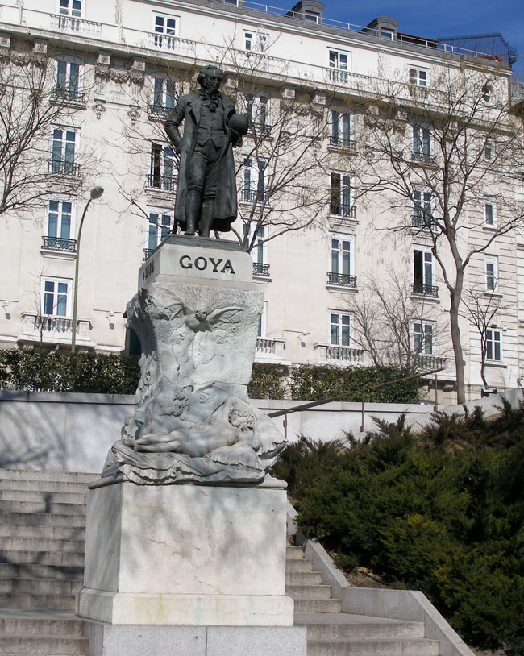

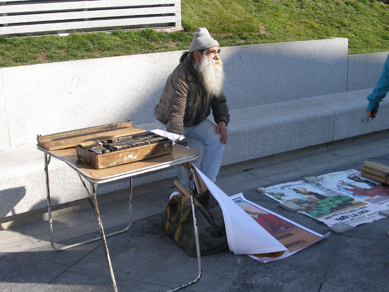

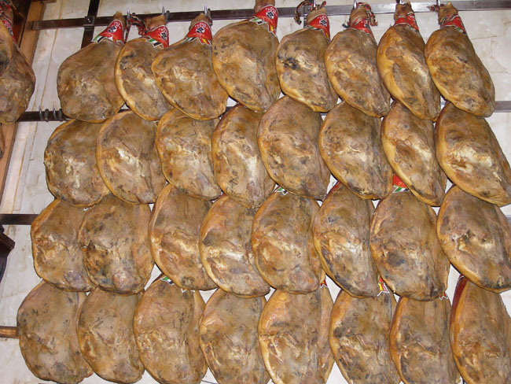

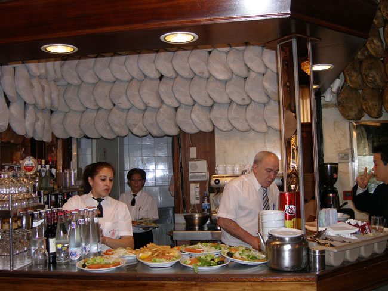

  
\*사진 위로부터 세고비아 시내 이정표, 세고비아 시가지 원경, 세고비아 로마 수도교, 세고비아 꼬치니조(아기 통돼지 찜)의 원조, 세고비아 대성당, 세고비아 알카사르, 알카사르 앞마당의 John 2세 동상, 알카사르, 알카사르 해자 앞에서, 알카사르, 알카사르 아래 쪽에서, 알카사르 아래쪽에서, 마드리드 시내에서 만난 스페인 남자와 강아지, 프라도 박물관, 프라도 박물관의 고야 동상, 프라도 박물관의 노점상, 마드리드 하몽 전문식당, 마드리드 하몽 전문식당에서

공유하기

게시글 관리

**백규서옥\_Blog ver.**