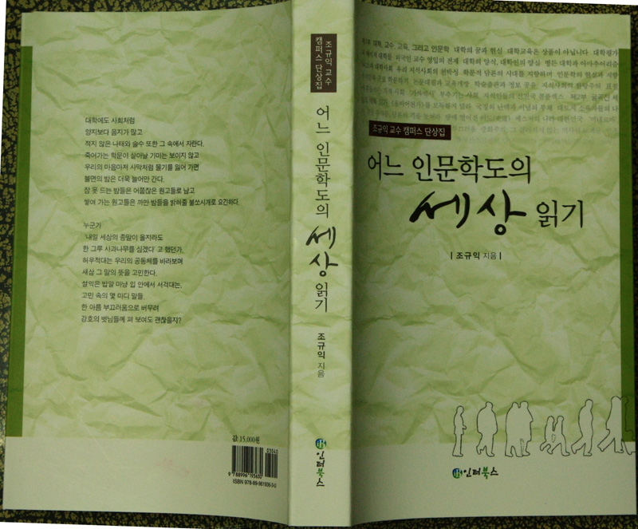

  
그동안 발표한 칼럼과 단상들 가운데 상당 부분을 추려 『어느 인문학도의 세상 읽기』(인터북스 간행)라는 제목의 책을 펴냈습니다. 저는 그간 한국 고전문학과 해외한인문예 등에 관한 다수의 논문과 저서들을 출간해오면서 틈틈이 세상사에 대한 짧은 글들을 발표하기도 했는데, 몇 편을 제외한 이 글들 대부분은 새 정부가 출범하기 이전 시기의 것들입니다.   
 네 부분(1부 : 대학, 교수, 교육, 그리고 인문학/ 2부 : 굴곡진 세상의 맥락 읽기/ 3부 : 내가 읽은 내 마음/ 4부 : 훔쳐 읽은 남의 마음)으로 이루어진 이 책에는 총 88편(1부 : 37편, 2부 : 20편, 3부 : 22편, 4부 : 9편)의 글들이 실려 있습니다. 1부는 주로 대학과 교육, 혹은 인문학을 중심으로 하는 학문에 관한 내용을 주로 하는 글들이고, 2부는 주로 대학 안팎의 지식사회를 배경으로 하는 글들이며, 3부는 생활주변에서 일어나는 자잘한 단상들입니다. 4부는 세계 각지로 여행을 하면서 얻은 글들 가운데 한 부분입니다.   
 저는 대학의 현실에 대하여 날카로운 비판의 메스를 가하기도 하고, 생활 주변에서 부딪치는 갖가지 사상(事象)들을 인간적인 눈으로 바라보기도 했는데, 어떻게들 보실지 약간 걱정입니다. 특히 대학이나 인문학에 대한 비판적 진단을 나름대로 내려보았는데요. 어쩌면 저 자신의 현실적이면서도 이상적인 안목이 나름대로 융합되어 있다고나 할까요? 다음은 각 부분에 실려 있는 글들의 제목이다.   
  
 1부 : 대학, 교수, 교육, 그리고 인문학   
  대학의 꿈과 현실/대학교육은 상품이 아닙니다/대학평가와 메이저 대학들/외국인 교수 영입의 전제/대학의 양식, 대학인의 양심/병든 대학과 아마추어리즘/BK21과 대학사회/우리 지식사회의 천박성/학문적 담론의 시대를 지향하며/인문학의 현실과 지향/우리말과 글로 학문하기/논문대필과 교육개방/학술출판과 정보공유/지식사회의 한탕주의/표절에 흔들리는 지식사회/‘가짜박사’ 부추기는 사회/지식인들의 선진국 콤플렉스/대학교수와 국민의식/교수 임용비리와 우리 사회의 연줄문화/교수와 조교/대학교수와 선비정신/교수의 고통/메이저 대학들부터 스스로 문을 열라/대학사회와 혈통의식/죽은 선비의 사회/‘변하지 않는 것들’에 대한 그리움/전통사회의 파수꾼/영어강의와 학문의 자립성/기말고사 성적평가를 마치고/수능성적ㆍ석차 공개와 대학 신입생 선발 전환의 시대적 요구/국민수탈의 교육산업/부교재 리베이트와 착취 형 교육구조/석학(碩學)이 돈 몇 푼으로 만들어지나/‘인문한국’이나 로스쿨이나.../지방대학의 아픔/살짝 맛본 미국의 대학   
  
2부 : 굴곡진 세상의 맥락 읽기   
  <용비어천가>를 모독하기 말라/국정의 난맥과 이념의 부재/대토지 소유자들의 나라/대선 주자들, 담론의 격을 높여라/땅에 떨어진 이도(吏道)/제스처의 나라 대한민국/‘미네르바’가  가르쳐 준 것/빼앗긴 고문서, 우리의 부끄러움/중화주의, 그 걸러지지 않는 역사의 노폐물/민족적 자존심/민족자존의 정도를 고수하라/빨치산스크에서 만난 고려인/재미한인들과 문학/실미도/문화 제국주의/책 사랑, 나라 사랑/책 이야기/역사의 진화는 완성되었는가/죽음을 모르는 자, 삶을 논하지 말라/내 인생의 책 한 권   
  
 3부 : 내가 읽은 내 마음   
  스승의 날 유감/가을밤, 곰보 스크린, 그리고 가족/공공장소의 유실수들/공부하러 집 떠나는 아들을 보며/나이를 먹는다는 것/늙음의 미학/단옷날/육안(肉眼)을 넘어 심안(心眼)으로/말이 많아 탈도 많은 세상/망둥이의 추억/태안의 절망, 그리고 작은 희망/모정/부정(父情)/버리고 떠나기/소 이야기/원앙소리/영안실에서/촌놈/버려진 아가들, 거두어진 아가들/신화서점화장실에서 만난 중국소년/눈 내린 산길을 걸어서 출근하며/월드컵과 문화, 그리고 종로서적   
    
 4부 : 훔쳐 읽은 남의 마음   
 내 등짝에 죽비를 내려친 유럽/데쓰밸리(Death valley), 그 영원한 삶을 잉태한 죽음이여!/북경에서 만난 천주교/대만에서 만난 무덤들/못 말리는 한국인의 낙서벽(落書癖)/베트남에 사랑의 씨앗을 뿌리고/경박호에 잠긴 발해 역사/조선 통신사와 함께 한 ‘사행 길 1만리’/마왕퇴(馬王堆)의 무덤 속에 잠자고 있는 여인이여!   
  
                    2009. 3. 30. 도서출판 인터북스 출간. 값 15,000원

공유하기

게시글 관리

**백규서옥\_Blog ver.**