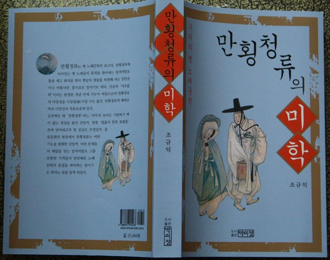

  
  
『만횡청류의 미학』을 도서출판 박이정에서 출간했다. 지금까지 학계에서 ‘사설시조’ 혹은 ‘장시조’로 불려오던 만횡청류는 옛 노래문학의 보고(寶庫)다. 만횡청류에 녹아있는 옛 노래들의 흔적을 찾아내는 일이야말로 돌을 깨고 화석을 찾아 옛날의 생물을 복원해내는 일만큼이나 어렵지만, 흥미로운 일이다. 단순히 ‘시조문학’이라는 한정된 개념 안에 가두어 버림으로써 만횡청류의 다양성을 사상(捨象)시킬 수는 없다. 그러한 다양성과 자유로움이 바로 만횡청류의 매력이다. 그 매력이 바로 만횡청류의 ‘미학’이고, 그 미학을 찾기 위해 만횡청류의 숲을 종횡무진 답사했다. 그 답사기가 바로 이 책이다.

이 책의 목차는 다음과 같다.

xml:namespace prefix = o ns = "urn:schemas-microsoft-com:office:office" /

제1부 문학적 성격

Ⅰ. 문제의 제기

Ⅱ. 「만횡청류」란 무엇인가?

Ⅲ. 김천택과 「만횡청류」

Ⅳ. 내용적 성격

Ⅴ. 미의식

Ⅵ. 표현기법과 이념

Ⅶ. 시어

Ⅷ. 담당층

제2부 작품론

Ⅰ. <호주가>

Ⅱ. <간부가>

Ⅲ. <소외자들의 노래>

Ⅳ. <불굴가>

제3부 기본자료

Ⅰ. 원문/현대어 풀이

Ⅱ. 시어 및 용례 색인

지금까지 고전문학, 그 가운데서 고전시가의 아름다움을 느껴보지 못한 사람들은 이 책을 읽음으로써 우리의 고전시가도 충분히 재미있고 아름답다는 사실을 깨닫게 될 것이다.

도서출판 박이정, 2009. 4. 2. 값 25,000원

**[**만횡청류의 미학 서평\_문숙희 -----> 다운로드**](http://kicho.pe.kr/data/mhcr.pdf)**

공유하기

게시글 관리

**백규서옥\_Blog ver.**