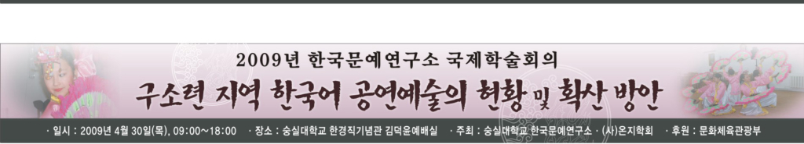
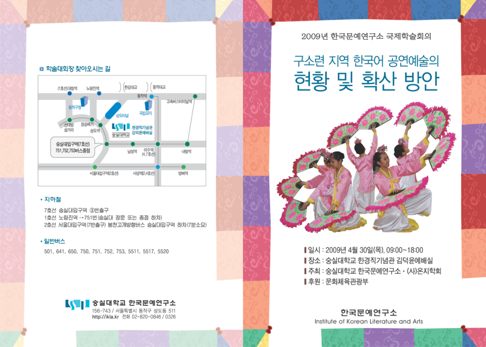

  
2009년 한국문예연구소 국제학술회의   
              
  
구소련 지역 한국어 공연예술의 현황 및 확산 방안  
  
  
일시 : 2009년 4월 30일(목), 09:00~18:00  
장소 : 숭실대학교 한경직기념관 김덕윤예배실  
주최 : 숭실대학교 한국문예연구소, 사단법인 온지학회  
후원 : 문화관광부  
  
숭실대학교 한국문예연구소  
Institute of Korean Literature and Arts  
156-743 / 서울시 동작구 상도동 511  
[http://ikla.kr](http://ikla.kr/) 전화 02-820-0846/0326   
  
  
  
  
모시는 말씀  
  
보이지 않고 밟을 수 없는  
고국의 산천과 하늘,  
망향의 한으로 점철된   
이산(離散)과 유랑(流浪)의 세월.  
  
연해주에서 중앙아시아까지  
동토의 시베리아를 가로질러  
강물 되어 흘러온 아픔의 눈물.  
  
그 세월과 눈물로 빚어 만든   
고려인들의 예술을  
담론하는 자리에   
여러분을 모십니다.   
  
2009. 4. 10.  
  
한국문예연구소 소장 조규익   
  
  
  
순 서  
  
09:30~10:00  등 록                                    
  
제1부                       사회  문숙희(한국문예연구소 연구교수)  
  
10:00~10:05  소장인사             조규익(한국문예연구소 소장)    
10:05~10:15  축   사              김대근(숭실대학교 총장)       
  
  
제2부                       사회 허명숙(한국문예연구소 교육팀장)  
  
발표 1. 1920~30년대 한국 연극의 전개양상   
(10:30~11:10)  발 표 장원재(경기 영어마을 사무총장)  
                토 론 백로라(숭실대 교수)  
발표 2. 고려극장 공연예술의 어제, 오늘, 그리고 내일  
(11:10~11:50)  발 표 이 류보위(카자흐스탄 고려극장 대표)  
                토 론 이복규(서경대 교수)  
  
점심식사(12:00~13:00)  
  
발표 3. 고려극장 공연예술의 목록과 그 의미  
(13:00~13:40) 발 표 최영근(카자흐스탄 고려극장 문예부장)  
                토 론 심정순(숭실대 교수)  
발표 4. 고려극장의 형성과 발전  
(13:40~14:20)  발 표 김보희(한양대 강사)   
               토 론 엄경희(숭실대 교수)  
발표 5. 구소련 소인 예술단의 현황과 과제  
(14:20~15:00)  발 표 김 발레리아(러시아 아리랑 가무단 단장)  
                토 론 반병률(외국어대 교수)  
발표 6. 카자흐스탄 고려인의 한글노래와 디아스포라의 정체  
(15:00~15:40) 발 표 조규익(숭실대 교수)         
               토 론 박정신(숭실대 교수)  
  
휴  식(15:40~16:10)  
  
종합토론(16:10~17:10) 좌장  이명재(중앙대 명예교수)  
  
만찬(17:10~)

공유하기

게시글 관리

**백규서옥\_Blog ver.**