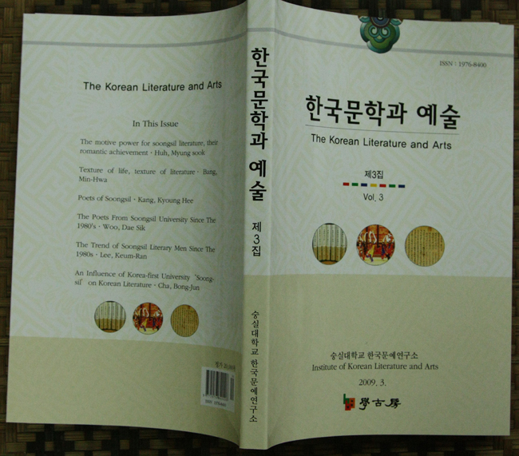

  
  
한국문예연구소 학술지『한국문학과 예술』3집 발간   
  
한국문예연구소에서는 학술지 『한국문학과 예술』3집을 발간했다. 이 학술지는 반 년 간으로 간행되는데, 이번 호에는 허명숙 박사 등 6인의 논문과 정우영 시인 등 4인의 토론문, 송재룡 교수 등 7인의 서평이 실려 있으며, ‘김일근본 거창가’에 대한 조규익 교수의 소개문과 자료 영인이 실려 있다.   
 그 내용은 다음과 같다.   
  
  <논문>   
  1. 숭실문학의 견인차, 그들의 소설적 성취--허명숙   
  2. 삶의 결, 문학의 결-이효석⋅황순원⋅황석영--방민화   
  3. 숭실의 시인들-현실 저항의 시에서 존재론적 시에 이르는 숭실 시문학의 여정-강경희   
  4. 1980년대 이후 숭실의 시인들--우대식   
  5. 1980년대 이후 숭실 문학인의 동향--이금란   
  6. 한국 최초의 대학 ‘숭실’이 한국문학에 남긴 영향--차봉준   
  
  <서평>   
  1. 비판과 성찰적 지성의 기독교적 體化-박정신의 『역사학에 기댄 우리 지성사의 인식』   
    을 읽고- : 송재룡(경희대 교수)   
  2. 인간의 미적 가치와 삶의 본질에 대한 천착-김광명의 『인간에 대한 이해, 예술에 대   
    한 이해』를 읽고- : 김대식(숭실대 강사)   
  3. 조선조 후기 대외정책에 대한 비판적 성찰-하정식의 『태평천국과 조선왕조』를 읽고   
    - : 유장근(경남대 교수)   
  4. 고려인 정체성 찾기의 괄목할 업적-김보희의 『소비에트 시대 고려인 소인예술단의 음   
    악활동』을 읽고- : 이명재(중앙대 명예교수)   
  5. 이효석 문학의 총체성 복원을 위한 시도-숭실대학교 한국문예연구소의 『가산 이효석   
    의 삶과 문학세계』를 읽고- : 정주아(서울대 강사)   
  6. 음악과 문학이 어우러진 가곡의 역사-김영운의 『가곡 연창형식의 역사적 전개양상』   
    을 읽고- : 이윤정(한양대 강사)   
  7. 생존과 실존 사이에 있는 시의식-오정혜의 『중국 조선족 시문학 연구』를 읽고- : 박   
    선영(숭실대 강사)   
  
  <자료소개>   
 김일근 소장 <아림별곡(娥林別曲)>에 대하여 : 조규익(숭실대 교수)   
  
2009. 3. 학고방, 정가 20,000원

공유하기

게시글 관리

**백규서옥\_Blog ver.**