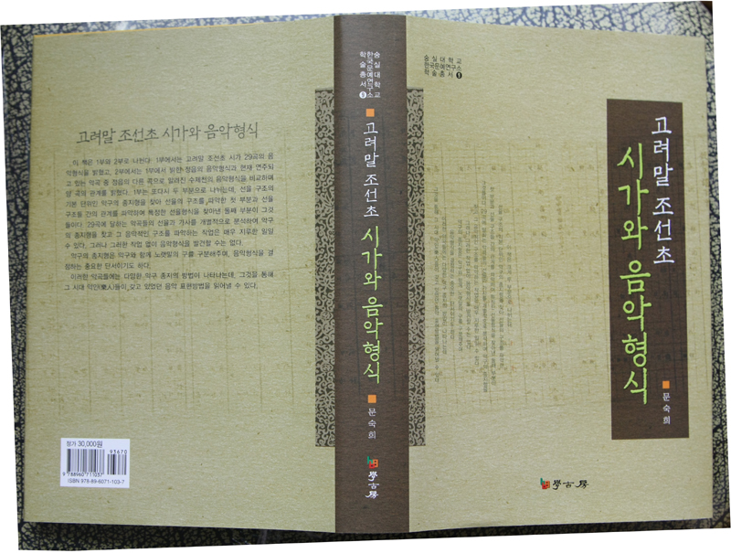

  
한국문예연구소 학술총서 9 출간!

문숙희, 『고려말 조선초 시가와 음악형식』(학고방, 2009)   xml:namespace prefix = o ns = "urn:schemas-microsoft-com:office:office" /

한국문예연구소에서는 학술총서 9로 문숙희 교수의 『고려말 조선초 시가와 음악형식』을 펴냈다. 그동안 한국 전통음악에서 형식은 소홀히 다루어져 왔다. 심지어 우리 전통사회의 음악적 사고에 형식의 개념이 없었을 것으로 추측되기도 하였다. 이것은 고문헌이나 악보에 형식에 대한 자료가 별로 없고, 남아 있는 몇 개의 형식 용어도 그 의미가 분명히 밝혀지지 않았으며, 또 우리 전통음악에는 선율단위의 시작과 끝이 분명하지 않는 일부 악곡들-영산회상, 낙양춘, 보허자 계통의 악곡 등-이 있기 때문이다. 그리고 무엇보다 형식을 찾는데 결정적인 ‘종지형’이 완전히 밝혀지지 않은 것에 기인된 것으로 보인다.

우리 전통음악에도 서양음악과 같이 특정한 음악형식이 분명히 존재하고 있고, 이 책은 그것을 밝혀냈다. 고악보 속에 잠자고 있는 고려말 조선초의 악곡들에는 뚜렷한 성격을 가진 다섯 가지의 음악형식-서경별곡류 형식, 진작류 형식, 봉황음류 형식, 감군은류 형식, 만전춘류 형식-이 있었다. 이 형식들은 각각 고유한 성격을 가지고 있지만 언제나 같은 틀을 고집하지는 않고 변화의 가능성을 열어 놓고 있다. 한 형식 안에는 절대로 변하지 않는 중심되는 부분이 있고 변화의 가능성이 열려져 있는 부분이 있다. 변화되지 않는 중심되는 부분은 <강>으로 명명되어 있고, 변화의 가능성이 열려있는 부분은 <엽>이라고 하며 일정한 규칙 안에서 생략 또는 변화될 수 있게 되어 있다. 이렇게 일정한 형식의 틀 안에서 약간씩 변화될 수 있는 가능성이 열려져 있는 것이 우리 전통 음악형식의 특징이라고 하겠다.

전통 음악사회에서 음악형식은 매우 중요하게 다루어져 왔다. 특정한 작곡자가 없었던 전통사회에서 음악의 레퍼토리는 연주가들에 의해 한 악곡에서 다른 악곡이 파생되는 방법으로 확장되어 왔다. 한 악곡에서 다른 악곡이 파생될 때, 음악형식은 그 중심적인 역할을 감당했다. 새로 파생되는 음악은 모체가 되는 음악에서 선율을 발췌하고 그 형식의 틀에 따라 선율을 변화시키는 방법으로 만들어져 왔다. 그동안 선율적인 근거를 찾지 못했던 수제천도 정읍으로부터 이와 같은 방법에 의해 만들어진 것이라는 것을 이 책에서는 보여주었다.

이 책은 그동안 별로 고려되지 않았던 악구의 종지형을 찾고 그 종지형을 통해 고려말 조선초에 존재했던 음악형식을 찾은 점에 그 의의가 있다고 하겠다. 악구의 종지형은 악구와 함께 노랫말의 구를 구분해주며, 음악형식을 결정하는 중요한 단서이기도 하다. 의미를 분명하게 알 수 없는 고어로 된 가사에서는 악구 종지를 통해 구가 구분되었다. 고려말 조선초의 악곡들에서는 다양한 악구 종지의 방법이 나타나는데, 그것을 통해 그 시대 악인(樂人)들이 갖고 있었던 음악 표현방법을 읽어낼 수 있었다.

이 책은 Ⅰ부와 Ⅱ부로 되어 있다. Ⅰ부에서는 29곡에 달하는 악곡들의 선율과 가사를 일일이 분석하여 선율 구조의 기본 단위인 악구의 종지형을 찾아 선율의 구조를 파악하였고, 그 선율 구조들 간의 관계를 파악하여 특정한 선율형식을 찾아냈다. Ⅱ부에서는 이 악곡들 중 정읍의 음악형식과 현재 연주되고 있는 수제천의 음악형식을 비교하며 양 곡의 음악적인 관계를 살펴보았다. 수제천은 정읍의 다른 곡으로 알려져 있으나, 수제천의 선율이 정읍의 선율과 너무나 달라서 두 곡의 음악적인 관계가 완전히 밝혀지지 않았다. 이 책에서 분석한 악곡들의 제작 시기는 고려 말 조선 초에 해당되며, 그 노랫말들은 오늘날 사용되는 언어와 많은 차이를 보여준다. 지극히 상식적인 몇 작품들을 제외하고 당시의 말로 표기된 어려운 노랫말들을 요즈음 말로 번역하여 붙여놓았다. 그와 함께 정간보에 기보(記譜)되어 있는 각 노래의 선율은 오선보로 역보(譯譜)하여 부록으로 붙여 놓았다.

이 책은 이 분야의 연구자들이 그동안 이루어놓은 업적을 한 단계 상승시킨 의미를 갖는다고 할 수 있다.

2009. 4. 17. 학고방, 30,000원.

공유하기

게시글 관리

**백규서옥\_Blog ver.**