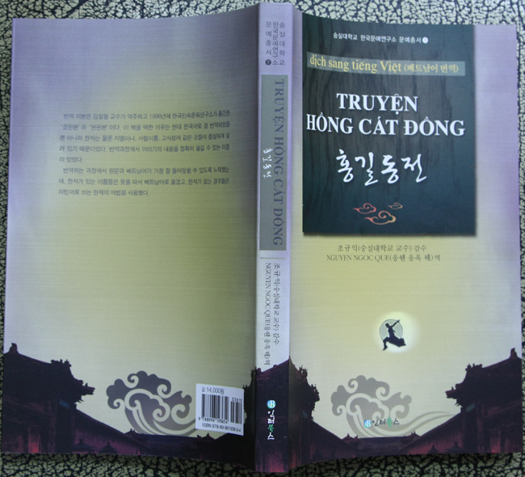

  
  
『홍길동전』의 베트남어 번역판이 한국문예연구소 문예총서 1로 출간되었습니다. 완판본『홍길동전』의 베트남어 번역판이 한국문예연구소 문예총서 1로 출간되었다. 허균(1569~1618)이 지은 『홍길동전』은 『춘향전』과 더불어 현재까지도 가장 대중적 인기도가 높은 고대소설이다. 서자로 태어난 홍길동이 사회적인 천대와 제약에 반발하여 집을 뛰쳐나와 도적의 우두머리가 된 후, 전국을 무대로 의적활동을 벌임으로써 지배층에 경각심을 불러일으키고, 해외로 나가 한나라를 친 후 왕이 되어 그 나라를 이상국으로 만든다는 것이 그 줄거리다. 사건은 크게 보아 가정에서 자객을 죽이고 가출하는 사건, 나라 안에서 의적행위를 벌이는 사건, 그리고 해외에 나가 이상국을 건설하는 사건 등 전 후 세 개의 큰 단락으로 짜여 있다. 사건이 진행될수록 주인공의 활동무대가 넓어지고, 세력이 커지며, 신분이 상승되는 등 단계적으로 발전하는 모습을 보여준다. 번역자는 현재 베트남 달랏대학의 한국어 교수로 있는 응웬응옥 꿰(元玉桂) 선생이다. 이 책은 한국과 베트남 양국의 연구자나 독자들에게 모두 유용하게 읽힐 수 있으며, 특히 한국에 와 있는 베트남인들이 한국의 고전문학을 접할 수 있는 좋은 자료가 될 것이다. 한편 한국문예연구소에서는 학술총서와 문예총서를 발간하는데, 학술총서는 현재 9권이 출간되었고, 홍길동전』을 필두로 문예총서도 속속 출간될 예정이다. 도서출판 인터북스, 2009, 값 14,000원.

공유하기

게시글 관리

**백규서옥\_Blog ver.**