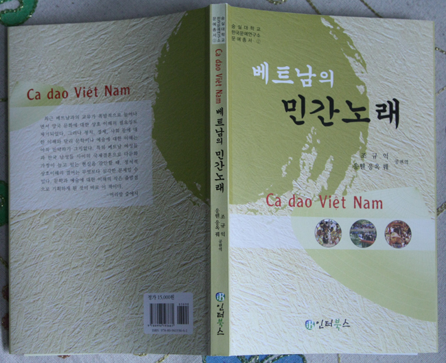

  
베트남 민간노래들의 한국어 번역서 『베트남의 민간노래』(숭실대 한국문예연구소 문예총서 2)출간!

**[연합뉴스 관련기사 클릭](http://news.naver.com/main/read.nhn?mode=LSD&mid=sec&sid1=103&oid=001&aid=0002692758 "[http://news.naver.com/main/read.nhn?mode=LSD&mid=sec&sid1=103&oid=001&aid=0002692758]로 이동합니다.")**xml:namespace prefix = o ns = "urn:schemas-microsoft-com:office:office" /

숭실대 국어국문학과의 조규익 교수와 베트남 달랏대학 한국어과의 응웬 응옥 꿰 교수는 베트남의 민간노래들을 편집⋅번역하여『베트남의 민간노래』라는 책을 펴냈다. 특히 노래 내용과 관련되는 베트남의 생활상을 찍은 사진들을 곁들이고 고유명사나 어려운 말들에 주석까지 붙임으로써 책의 사실성과 가독성(可讀性)을 드높인 점이 두드러진다. 이 책은 베트남에서 2007년에 출판된 응옥 란 씨의 『베트남 가요선』에 실린 노래들의 한 부분을 번역한 것인데, 역자들은 노랫말의 내용에 따라 크게 ‘사람-풍습’, ‘일-노동-문화’ 등 두 부분으로 나누었다. 전자에는 58 작품이 후자에는 103작품의 노래들이 각각 실려 있다.

베트남은 유교문화를 바탕으로 하며, 미작문화권(米作文化圈)에 속해 있는 점이나 한자문화권에 속해 있는 점이 우리나라와 같다. 일상생활이나 삶에 대한 의식의 상당부분이 우리와 겹치게 된 것도 자연스러운 일이다. 근대 이전에는 중국을 매개로 베트남과 우리는 교류를 해왔으며, 최근 베트남 전쟁에 참여함으로써 양국은 뗄 수 없는 관계로 이어지게 되었다. 뿐만 아니라, 오늘 날 베트남의 젊은 여성들이 우리나라에 건너와 많은 남성들과 결혼함으로써 역사상 유례(類例) 없는 이른바 ‘다문화 가정’의 주체로 부상했으며, 많은 수의 젊은 남성들 또한 유학생이나 근로자의 신분으로 우리나라에 들어와 활동하고 있다.

우리와 마찬가지로 베트남에도 전통적으로 노래문화의 유산이 많다. 노래란 ‘정신적인 음식’이라 할 만큼 베트남 사람들에게 삶과 노래는 분리해서 생각할 수 없다. 특히 농촌사람들은 때와 장소를 가리지 않고 노래를 불렀다. 농부들이 농사일을 하면서, 어머니가 아가를 재우면서, 매년 봄 마을 사람들이 함께 어울려 축제를 벌이면서, 젊은 남녀들이 서로 사랑하는 마음을 전할 때는 반드시 노래를 활용했다. 베트남 사람들은 노동가요, 풍속가요, 문화가요 등등 어떤 내용이나 주제도 노래로 소화시킬 만한 능력을 지니고 있다.

이 책의 앞 쪽에는 ‘사람과 풍습’에 관한 노래들이 실려 있다. 이 노래들에는 베트남 사람들의 사고방식과 다양한 축제의 분위기가 녹아 있다. 베트남 사람들에게 매년 음력 설날 후 3월까지는 축제의 계절이다. 전국의 유명한 지역이나 절들은 베트남 전통 문화 축제들이 열리던 현장이었다. 그런 점은 다음과 같은 노래에 잘 나타나 있다.

칠일날은 캄 축제, 팔일날은 저우 축제  
구일날엔 어디 있든 저옹 축제에 돌아와요

저우절과 림 축제가 있는 박닌성은 리 왕조의 고도(古都)였다. 박닌성에서 벌어지는 캄 축제, 저우 축제, 저옹 축제 등은 베트남 전역의 축제들 가운데 대표적인 것들이다.

이 책의 후반에는 일과 노동, 농업문화에 대한 노래들이 실려 있다. 이 노래들에는 직업이나 일에 관한 옛날 베트남 사람들의 관점과 노동의 경험 등이 잘 형상화 되어 있다. 옛날의 베트남 사회에도 조선과 같이 ‘사-농-공-상’ 등 네 계층이 있었으며, 평민들에게는 농업이 무엇보다 우선이었다. 그 점은 다음과 같은 노래에 잘 나타나 있다.

사(士), 농(農), 공(工), 상(商)  
첫째는 사, 둘째는 농이며  
쌀이 없어 돌아갈　땐  
첫째는 농, 둘째는 사이라네.

당시 농업은 평민들을 먹여 살린 유일한 산업이었으며, 그들에게 풍요로운 삶을 보장하던 유일한 방책이기도 했다.

이 책은 한국의 독자들이나 연구자들로 하여금 베트남의 가요를 접할 수 있도록 하기 위해 기획된 첫 단계 작업의 결과다. 앞으로도 새로운 내용과 형식의 노래들을 광범하게 번역함으로써 두 나라 사람들이 서로의 생활감정과 문화를 잘 이해할 수 있도록 하고자 한다.

뜻 있는 분들의 일독을 권한다.

인터북스 , 2009. 값 15,000원   
  
  
=======================================================================

공유하기

게시글 관리

**백규서옥\_Blog ver.**